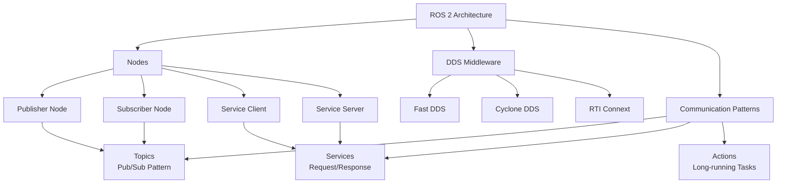

# Chapter 1: Introduction to ROS 2 Architecture

## Learning Outcomes

After completing this chapter, you will be able to:
- Explain the fundamental concepts of ROS 2 architecture
- Identify and describe the main components of the ROS 2 system
- Understand the differences between ROS 1 and ROS 2
- Create a basic ROS 2 workspace and run simple nodes

## Prerequisites Checklist

### Required Software Installed
- [ ] ROS 2 Humble Hawksbill (or newer)
- [ ] Python 3.8+ with pip
- [ ] Git version control
- [ ] Basic Linux command line knowledge

### Required Module Completion
- [ ] Basic Python programming concepts
- [ ] Understanding of distributed systems (recommended)

### Files Needed
- [ ] Completed setup guide from course materials
- [ ] Access to ROS 2 documentation

## Core Concept Explanation

### What is ROS 2?

Robot Operating System 2 (ROS 2) is not an operating system but rather a flexible framework for writing robot software. It provides services designed for a heterogeneous computer cluster such as hardware abstraction, device drivers, libraries, visualizers, message-passing, package management, and more.

### ROS 2 Architecture Overview

ROS 2 uses a distributed architecture based on the Data Distribution Service (DDS) standard. This architecture enables:

1. **Decentralized Communication**: No central master node required
2. **Real-time Capabilities**: Deterministic message delivery
3. **Security**: Built-in security features
4. **Multi-language Support**: Python, C++, and other languages

### Key Components

#### Nodes
A node is a process that performs computation. In ROS 2, nodes are lightweight and can be written in multiple languages. Each node can perform a specific function and communicate with other nodes.

#### Topics
Topics are named buses over which nodes exchange messages. Publishers send messages to topics, and subscribers receive messages from topics using a publish-subscribe communication pattern.

#### Services
Services provide a request-response communication pattern. A client sends a request to a service, and the service sends back a response.

#### Actions
Actions are similar to services but are designed for long-running tasks. They provide feedback during execution and can be canceled.

#### Parameters
Parameters are configuration values that can be set at runtime and accessed by nodes.

### ROS 2 vs ROS 1

| Feature | ROS 1 | ROS 2 |
|---------|-------|-------|
| Communication | Custom middleware | DDS-based |
| Master | Required (roscore) | Optional (DDS discovery) |
| Real-time | Limited | Full support |
| Security | Limited | Built-in security |
| Multi-robot | Complex | Native support |
| Quality of Service | Limited | Advanced QoS policies |

## Diagram or Pipeline



## Runnable Code Example A

Let's create a simple publisher node that publishes messages to a topic:

```python
# publisher_member_function.py
import rclpy
from rclpy.node import Node
from std_msgs.msg import String


class MinimalPublisher(Node):

    def __init__(self):
        super().__init__('minimal_publisher')
        self.publisher_ = self.create_publisher(String, 'topic', 10)
        timer_period = 0.5  # seconds
        self.timer = self.create_timer(timer_period, self.timer_callback)
        self.i = 0

    def timer_callback(self):
        msg = String()
        msg.data = 'Hello World: %d' % self.i
        self.publisher_.publish(msg)
        self.get_logger().info('Publishing: "%s"' % msg.data)
        self.i += 1


def main(args=None):
    rclpy.init(args=args)

    minimal_publisher = MinimalPublisher()

    rclpy.spin(minimal_publisher)

    # Destroy the node explicitly
    minimal_publisher.destroy_node()
    rclpy.shutdown()


if __name__ == '__main__':
    main()
```

**To run this code:**
1. Save it as `publisher_member_function.py`
2. Create a ROS 2 workspace and package if you haven't already
3. Run: `ros2 run <package_name> publisher_member_function`

## Runnable Code Example B

Now let's create a subscriber that listens to the messages from our publisher:

```python
# subscriber_member_function.py
import rclpy
from rclpy.node import Node
from std_msgs.msg import String


class MinimalSubscriber(Node):

    def __init__(self):
        super().__init__('minimal_subscriber')
        self.subscription = self.create_subscription(
            String,
            'topic',
            self.listener_callback,
            10)
        self.subscription  # prevent unused variable warning

    def listener_callback(self, msg):
        self.get_logger().info('I heard: "%s"' % msg.data)


def main(args=None):
    rclpy.init(args=args)

    minimal_subscriber = MinimalSubscriber()

    rclpy.spin(minimal_subscriber)

    # Destroy the node explicitly
    minimal_subscriber.destroy_node()
    rclpy.shutdown()


if __name__ == '__main__':
    main()
```

**To run this code:**
1. Save it as `subscriber_member_function.py`
2. In one terminal, run the publisher: `ros2 run <package_name> publisher_member_function`
3. In another terminal, run the subscriber: `ros2 run <package_name> subscriber_member_function`

## "Try Yourself" Mini Task

Modify the publisher code to publish a counter that increments every second instead of "Hello World". The message should contain the current time and a counter value.

**Hint:** Use `time.time()` for the timestamp and modify the timer period to 1 second.

## Verification Procedure

To verify that your ROS 2 setup and code are working correctly:

### What appears in terminal?
- When running the publisher: You should see messages like "Publishing: 'Hello World: X'" appearing every 0.5 seconds
- When running the subscriber: You should see messages like "I heard: 'Hello World: X'" appearing in sync with the publisher
- When running both together: Both terminals should show synchronized messages

### What changes in simulation?
- If connected to a robot or simulation environment, you might see visual indicators of the communication
- In RViz2, you might see topic visualization
- System monitoring tools like `rqt_graph` would show the node connections

## Checklist for Completion

- [ ] ROS 2 workspace created and sourced
- [ ] Publisher node created and running
- [ ] Subscriber node created and running
- [ ] Both nodes communicating successfully
- [ ] Code modified with timestamp counter (Try Yourself task)
- [ ] Verification steps completed successfully

## Summary

This chapter introduced the fundamental concepts of ROS 2 architecture, including nodes, topics, services, and actions. You learned how ROS 2 differs from ROS 1 and implemented your first publisher-subscriber pair. The publish-subscribe pattern is the backbone of ROS communication, allowing for decoupled and distributed systems.

## References

1. ROS 2 Documentation Team. (2023). *ROS 2 Humble Hawksbill User Documentation*. Retrieved from https://docs.ros.org/en/humble/
2. Quigley, M., Gerkey, B., & Smart, W. D. (2015). *Programming Robots with ROS: A Practical Introduction to the Robot Operating System*. O'Reilly Media. ISBN: 978-1449323899.
3. Open Source Robotics Foundation. (2023). *ROS 2 Design Articles*. Retrieved from https://design.ros2.org/
4. Source 001: Quigley et al. (2015) - Comprehensive coverage of ROS programming fundamentals
5. Source 002: ROS 2 Design Article - Middleware architecture and QoS policies