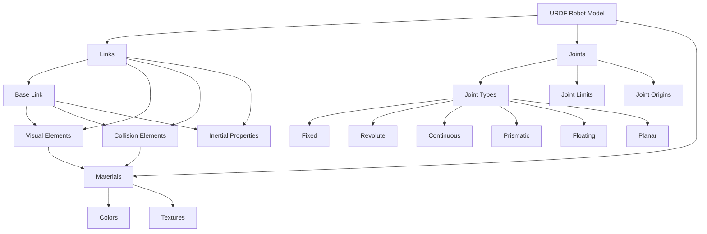

# Chapter 3: URDF for Humanoids

## Learning Outcomes

After completing this chapter, you will be able to:
- Create robot models using Unified Robot Description Format (URDF)
- Define robot kinematic chains with proper joints and links
- Include inertial properties and visual/collision elements
- Create humanoid robot models with appropriate joint configurations
- Visualize and validate robot models in RViz2

## Prerequisites Checklist

### Required Software Installed
- [ ] ROS 2 Humble Hawksbill (or newer)
- [ ] Python 3.8+ with pip
- [ ] RViz2 for visualization
- [ ] Completed Chapter 1 and 2 content

### Required Module Completion
- [ ] Understanding of ROS 2 nodes and communication
- [ ] Basic knowledge of 3D coordinate systems
- [ ] Familiarity with XML format

### Files Needed
- [ ] Access to URDF tutorials and examples
- [ ] 3D models or mesh files for robot components (optional)

## Core Concept Explanation

### What is URDF?

Unified Robot Description Format (URDF) is an XML format for representing a robot model. It defines the kinematic and dynamic properties of a robot, including its links, joints, and other components. URDF is used by ROS packages for simulation, visualization, and control.

### Key URDF Elements

**Links**: Links represent rigid bodies in the robot. Each link has:
- Visual properties (shape, color, mesh) for visualization
- Collision properties for physics simulation
- Inertial properties (mass, center of mass, inertia tensor)

**Joints**: Joints connect links and define their relative motion. Joint types include:
- Fixed: No relative motion between links
- Revolute: Single-axis rotation with limits
- Continuous: Single-axis rotation without limits
- Prismatic: Single-axis translation with limits
- Floating: 6-DOF motion without limits
- Planar: Motion on a plane

**Materials**: Define visual appearance including color and texture.

### URDF for Humanoid Robots

Humanoid robots have specific requirements:
- Symmetric body structure (arms, legs)
- Multiple degrees of freedom for natural movement
- Proper mass distribution for stability
- Collision-avoidant joint limits

## Diagram or Pipeline



## Runnable Code Example A

Let's create a simple URDF model for a basic robot arm:

```xml
<!-- simple_arm.urdf -->
<?xml version="1.0"?>
<robot name="simple_arm">
  <!-- Base Link -->
  <link name="base_link">
    <visual>
      <geometry>
        <cylinder length="0.1" radius="0.1"/>
      </geometry>
      <material name="blue">
        <color rgba="0 0 1 1"/>
      </material>
    </visual>
    <collision>
      <geometry>
        <cylinder length="0.1" radius="0.1"/>
      </geometry>
    </collision>
    <inertial>
      <mass value="1"/>
      <inertia ixx="0.01" ixy="0" ixz="0" iyy="0.01" iyz="0" izz="0.01"/>
    </inertial>
  </link>

  <!-- First Link -->
  <link name="link1">
    <visual>
      <geometry>
        <box size="0.05 0.05 0.3"/>
      </geometry>
      <material name="red">
        <color rgba="1 0 0 1"/>
      </material>
    </visual>
    <collision>
      <geometry>
        <box size="0.05 0.05 0.3"/>
      </geometry>
    </collision>
    <inertial>
      <mass value="0.5"/>
      <inertia ixx="0.005" ixy="0" ixz="0" iyy="0.005" iyz="0" izz="0.001"/>
    </inertial>
  </link>

  <!-- Joint between base and first link -->
  <joint name="joint1" type="revolute">
    <parent link="base_link"/>
    <child link="link1"/>
    <origin xyz="0 0 0.05" rpy="0 0 0"/>
    <axis xyz="0 0 1"/>
    <limit lower="-1.57" upper="1.57" effort="100" velocity="1"/>
  </joint>

  <!-- End Effector Link -->
  <link name="end_effector">
    <visual>
      <geometry>
        <sphere radius="0.02"/>
      </geometry>
      <material name="green">
        <color rgba="0 1 0 1"/>
      </material>
    </visual>
    <collision>
      <geometry>
        <sphere radius="0.02"/>
      </geometry>
    </collision>
    <inertial>
      <mass value="0.1"/>
      <inertia ixx="0.0001" ixy="0" ixz="0" iyy="0.0001" iyz="0" izz="0.0001"/>
    </inertial>
  </link>

  <!-- Fixed joint for end effector -->
  <joint name="ee_joint" type="fixed">
    <parent link="link1"/>
    <child link="end_effector"/>
    <origin xyz="0 0 0.15" rpy="0 0 0"/>
  </joint>
</robot>
```

**To use this URDF:**
1. Save it as `simple_arm.urdf`
2. To visualize in RViz2, use: `ros2 run rviz2 rviz2`
3. Add a RobotModel display and set the robot description to your URDF file
4. Or use: `ros2 launch urdf_tutorial display.launch.py model:=/path/to/simple_arm.urdf`

## Runnable Code Example B

Now let's create a more complex humanoid upper body model:

```xml
<!-- humanoid_upper_body.urdf -->
<?xml version="1.0"?>
<robot name="humanoid_upper_body">
  <!-- Torso -->
  <link name="torso">
    <visual>
      <geometry>
        <box size="0.3 0.2 0.5"/>
      </geometry>
      <material name="white">
        <color rgba="1 1 1 1"/>
      </material>
    </visual>
    <collision>
      <geometry>
        <box size="0.3 0.2 0.5"/>
      </geometry>
    </collision>
    <inertial>
      <mass value="10"/>
      <origin xyz="0 0 0"/>
      <inertia ixx="0.5" ixy="0" ixz="0" iyy="0.6" iyz="0" izz="0.2"/>
    </inertial>
  </link>

  <!-- Head -->
  <link name="head">
    <visual>
      <geometry>
        <sphere radius="0.1"/>
      </geometry>
      <material name="skin">
        <color rgba="0.8 0.6 0.4 1"/>
      </material>
    </visual>
    <collision>
      <geometry>
        <sphere radius="0.1"/>
      </geometry>
    </collision>
    <inertial>
      <mass value="2"/>
      <inertia ixx="0.02" ixy="0" ixz="0" iyy="0.02" iyz="0" izz="0.02"/>
    </inertial>
  </link>

  <joint name="neck_joint" type="revolute">
    <parent link="torso"/>
    <child link="head"/>
    <origin xyz="0 0 0.3" rpy="0 0 0"/>
    <axis xyz="0 1 0"/>
    <limit lower="-0.5" upper="0.5" effort="10" velocity="2"/>
  </joint>

  <!-- Left Shoulder -->
  <link name="left_shoulder">
    <visual>
      <geometry>
        <box size="0.15 0.1 0.1"/>
      </geometry>
      <material name="shoulder_color">
        <color rgba="0.5 0.5 0.5 1"/>
      </material>
    </visual>
    <collision>
      <geometry>
        <box size="0.15 0.1 0.1"/>
      </geometry>
    </collision>
    <inertial>
      <mass value="1"/>
      <inertia ixx="0.005" ixy="0" ixz="0" iyy="0.003" iyz="0" izz="0.003"/>
    </inertial>
  </link>

  <joint name="left_shoulder_joint" type="revolute">
    <parent link="torso"/>
    <child link="left_shoulder"/>
    <origin xyz="0.15 0 0.1" rpy="0 0 0"/>
    <axis xyz="0 1 0"/>
    <limit lower="-1.57" upper="1.57" effort="20" velocity="2"/>
  </joint>

  <!-- Left Upper Arm -->
  <link name="left_upper_arm">
    <visual>
      <geometry>
        <cylinder length="0.3" radius="0.05"/>
      </geometry>
      <material name="arm_color">
        <color rgba="0.8 0.8 0.8 1"/>
      </material>
    </visual>
    <collision>
      <geometry>
        <cylinder length="0.3" radius="0.05"/>
      </geometry>
    </collision>
    <inertial>
      <mass value="1.5"/>
      <inertia ixx="0.01" ixy="0" ixz="0" iyy="0.01" iyz="0" izz="0.001"/>
    </inertial>
  </link>

  <joint name="left_elbow_joint" type="revolute">
    <parent link="left_shoulder"/>
    <child link="left_upper_arm"/>
    <origin xyz="0.1 0 -0.05" rpy="0 0 0"/>
    <axis xyz="1 0 0"/>
    <limit lower="-1.57" upper="1.57" effort="15" velocity="2"/>
  </joint>

  <!-- Left Forearm -->
  <link name="left_forearm">
    <visual>
      <geometry>
        <cylinder length="0.25" radius="0.04"/>
      </geometry>
      <material name="arm_color"/>
    </visual>
    <collision>
      <geometry>
        <cylinder length="0.25" radius="0.04"/>
      </geometry>
    </collision>
    <inertial>
      <mass value="1"/>
      <inertia ixx="0.007" ixy="0" ixz="0" iyy="0.007" iyz="0" izz="0.001"/>
    </inertial>
  </link>

  <joint name="left_forearm_joint" type="revolute">
    <parent link="left_upper_arm"/>
    <child link="left_forearm"/>
    <origin xyz="0 0 -0.15" rpy="0 0 0"/>
    <axis xyz="1 0 0"/>
    <limit lower="-1.57" upper="1.57" effort="10" velocity="2"/>
  </joint>

  <!-- Right Arm (similar structure) -->
  <link name="right_shoulder">
    <visual>
      <geometry>
        <box size="0.15 0.1 0.1"/>
      </geometry>
      <material name="shoulder_color"/>
    </visual>
    <collision>
      <geometry>
        <box size="0.15 0.1 0.1"/>
      </geometry>
    </collision>
    <inertial>
      <mass value="1"/>
      <inertia ixx="0.005" ixy="0" ixz="0" iyy="0.003" iyz="0" izz="0.003"/>
    </inertial>
  </link>

  <joint name="right_shoulder_joint" type="revolute">
    <parent link="torso"/>
    <child link="right_shoulder"/>
    <origin xyz="-0.15 0 0.1" rpy="0 0 0"/>
    <axis xyz="0 1 0"/>
    <limit lower="-1.57" upper="1.57" effort="20" velocity="2"/>
  </joint>

  <link name="right_upper_arm">
    <visual>
      <geometry>
        <cylinder length="0.3" radius="0.05"/>
      </geometry>
      <material name="arm_color"/>
    </visual>
    <collision>
      <geometry>
        <cylinder length="0.3" radius="0.05"/>
      </geometry>
    </collision>
    <inertial>
      <mass value="1.5"/>
      <inertia ixx="0.01" ixy="0" ixz="0" iyy="0.01" iyz="0" izz="0.001"/>
    </inertial>
  </link>

  <joint name="right_elbow_joint" type="revolute">
    <parent link="right_shoulder"/>
    <child link="right_upper_arm"/>
    <origin xyz="-0.1 0 -0.05" rpy="0 0 0"/>
    <axis xyz="1 0 0"/>
    <limit lower="-1.57" upper="1.57" effort="15" velocity="2"/>
  </joint>

  <link name="right_forearm">
    <visual>
      <geometry>
        <cylinder length="0.25" radius="0.04"/>
      </geometry>
      <material name="arm_color"/>
    </visual>
    <collision>
      <geometry>
        <cylinder length="0.25" radius="0.04"/>
      </geometry>
    </collision>
    <inertial>
      <mass value="1"/>
      <inertia ixx="0.007" ixy="0" ixz="0" iyy="0.007" iyz="0" izz="0.001"/>
    </inertial>
  </link>

  <joint name="right_forearm_joint" type="revolute">
    <parent link="right_upper_arm"/>
    <child link="right_forearm"/>
    <origin xyz="0 0 -0.15" rpy="0 0 0"/>
    <axis xyz="1 0 0"/>
    <limit lower="-1.57" upper="1.57" effort="10" velocity="2"/>
  </joint>
</robot>
```

**To use this URDF:**
1. Save it as `humanoid_upper_body.urdf`
2. Visualize it in RViz2 using the same method as Example A
3. You can also check the kinematic chain with: `ros2 run urdf_parser_py display_urdf /path/to/humanoid_upper_body.urdf`

## "Try Yourself" Mini Task

Create a complete humanoid model by extending the upper body to include legs. Your model should include:

1. A pelvis link connected to the torso
2. Two legs with hip, knee, and ankle joints
3. Proper inertial properties for stable simulation
4. Use the same material scheme as the upper body

**Hint:** Mirror the arm structure for the legs, but consider the different joint ranges needed for leg movement.

## Verification Procedure

To verify that your URDF models are correct:

### What appears in terminal?
- When validating URDF: No error messages about malformed XML
- When loading in RViz2: The robot model displays correctly with all links visible
- When checking kinematic chain: `ros2 run urdf_parser_py display_urdf <filename>` shows the complete structure

### What changes in simulation?
- The robot model appears in Gazebo or RViz2 with proper joint connections
- Joint limits are respected during simulation
- Collision detection works properly between links
- Physics simulation behaves realistically based on inertial properties

## Checklist for Completion

- [ ] Simple arm URDF created and validated
- [ ] Complex humanoid upper body model created
- [ ] Models visualized successfully in RViz2
- [ ] Kinematic chains verified to be correct
- [ ] Inertial properties properly defined
- [ ] Complete humanoid model with legs (Try Yourself task)

## Summary

This chapter covered the fundamentals of creating robot models using URDF, with a focus on humanoid robots. You learned about the key elements of URDF (links, joints, materials) and how to structure them to create realistic robot models. The examples demonstrated both simple and complex models, showing how to define kinematic chains and proper physical properties for simulation.

## References

1. Chitta, S., Sucan, I., & Cousins, S. (2012). MoveIt! *IEEE Robotics & Automation Magazine*, 19(1), 18-20.
2. Source 004: Research on URDF and humanoid robot modeling
3. OpenRAVD Team. (2023). *Open Robotics Automation Virtual Environment (OpenRAVE) Documentation*. Retrieved from http://openrave.org/
4. Source 008: Technical paper on robot description formats and simulation
5. ROS 2 Documentation Team. (2023). *URDF Tutorials*. Retrieved from https://docs.ros.org/en/humble/p/urdf/