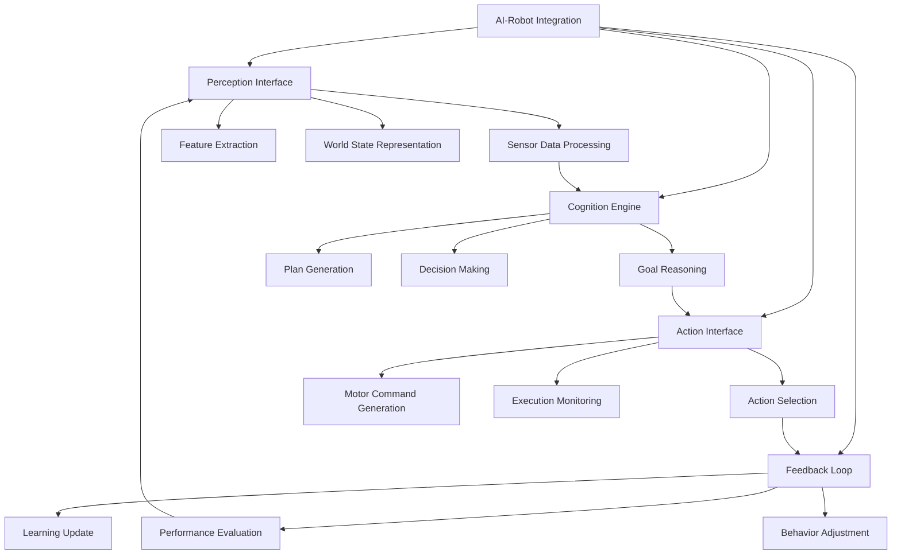

# Chapter 4: Integrating Python Agents

## Learning Outcomes

After completing this chapter, you will be able to:
- Integrate Python-based AI agents with ROS 2 systems
- Create intelligent behaviors using Python libraries
- Implement agent communication with ROS nodes
- Design cognitive architectures that bridge AI and robotics
- Execute GPT-generated tasks as executable ROS code

## Prerequisites Checklist

### Required Software Installed
- [ ] ROS 2 Humble Hawksbill (or newer)
- [ ] Python 3.8+ with pip
- [ ] OpenAI Python library (for AI integration)
- [ ] Completed Chapters 1-3 content

### Required Module Completion
- [ ] Understanding of ROS 2 nodes and communication
- [ ] Basic knowledge of Python AI libraries
- [ ] Familiarity with URDF robot models

### Files Needed
- [ ] Completed robot model from Chapter 3
- [ ] Access to OpenAI API or local LLM (optional)

## Core Concept Explanation

### AI-Robot Integration Architecture

The integration of AI agents with robotic systems involves several key components:

**Perception Interface**: Translating sensor data into a format suitable for AI processing
**Cognition Engine**: The AI system that processes information and makes decisions
**Action Interface**: Converting AI decisions into robot actions
**Feedback Loop**: Monitoring and adjusting behavior based on outcomes

### Agent Communication Patterns

AI agents communicate with ROS systems through:
- **Topics**: For continuous data streams (sensor data, status updates)
- **Services**: For on-demand information requests
- **Actions**: For long-running tasks with feedback
- **Parameters**: For configuration and settings

### Cognitive Architecture Patterns

**Reactive Agents**: Respond directly to environmental stimuli
**Deliberative Agents**: Plan actions based on goals and world models
**Hybrid Agents**: Combine reactive and deliberative approaches
**Learning Agents**: Adapt behavior based on experience

## Diagram or Pipeline



## Runnable Code Example A

Let's create a simple AI agent that controls a robot based on sensor inputs:

```python
# ai_controller.py
import rclpy
from rclpy.node import Node
from std_msgs.msg import String, Float32
from geometry_msgs.msg import Twist
from sensor_msgs.msg import LaserScan
import random
import time


class AIController(Node):
    """
    A simple AI controller that makes decisions based on sensor input.
    This demonstrates the integration of basic AI logic with ROS 2.
    """

    def __init__(self):
        super().__init__('ai_controller')

        # Publishers
        self.cmd_vel_pub = self.create_publisher(Twist, '/cmd_vel', 10)

        # Subscribers
        self.scan_sub = self.create_subscription(
            LaserScan,
            '/scan',
            self.scan_callback,
            10
        )

        # Internal state
        self.obstacle_distance = float('inf')
        self.current_state = 'SEARCHING'  # SEARCHING, AVOIDING, STOPPED
        self.last_action_time = time.time()

        # Timer for AI decision making
        self.ai_timer = self.create_timer(0.1, self.ai_decision_loop)

        self.get_logger().info('AI Controller initialized')

    def scan_callback(self, msg):
        """Process laser scan data to detect obstacles"""
        # Get the minimum distance in the front 60-degree field
        front_distances = msg.ranges[150:210]  # Assuming 360-degree scan
        front_distances = [d for d in front_distances if not (d != d or d > 10.0)]  # Filter invalid readings

        if front_distances:
            self.obstacle_distance = min(front_distances)
        else:
            self.obstacle_distance = float('inf')

    def ai_decision_loop(self):
        """Main AI decision loop"""
        current_time = time.time()

        # Update state based on sensor data
        if self.obstacle_distance < 0.5:
            self.current_state = 'AVOIDING'
        elif self.obstacle_distance > 1.0:
            self.current_state = 'SEARCHING'

        # Execute appropriate behavior based on state
        cmd_msg = Twist()

        if self.current_state == 'SEARCHING':
            # Move forward with slight random turn
            cmd_msg.linear.x = 0.2
            cmd_msg.angular.z = random.uniform(-0.2, 0.2)

        elif self.current_state == 'AVOIDING':
            # Turn away from obstacle
            cmd_msg.linear.x = 0.0
            cmd_msg.angular.z = 0.5  # Turn right to avoid obstacle

        # Publish command
        self.cmd_vel_pub.publish(cmd_msg)

        # Log current state
        self.get_logger().info(
            f'State: {self.current_state}, '
            f'Distance: {self.obstacle_distance:.2f}, '
            f'Lin: {cmd_msg.linear.x:.2f}, '
            f'Ang: {cmd_msg.angular.z:.2f}'
        )


def main(args=None):
    rclpy.init(args=args)
    ai_controller = AIController()

    try:
        rclpy.spin(ai_controller)
    except KeyboardInterrupt:
        pass
    finally:
        ai_controller.destroy_node()
        rclpy.shutdown()


if __name__ == '__main__':
    main()
```

**To run this code:**
1. Save it as `ai_controller.py`
2. Make sure your ROS 2 workspace is sourced
3. Run: `ros2 run <package_name> ai_controller`
4. Make sure you have a robot simulation running that publishes to `/scan` and accepts commands on `/cmd_vel`

## Runnable Code Example B

Now let's create a more advanced agent that can interpret high-level commands and convert them to robot actions:

```python
# command_interpreter_agent.py
import rclpy
from rclpy.node import Node
from std_msgs.msg import String
from geometry_msgs.msg import Twist, Pose
from nav_msgs.msg import Odometry
import json
import time


class CommandInterpreterAgent(Node):
    """
    An AI agent that interprets high-level commands and executes them.
    This demonstrates GPT-generated task to executable ROS code conversion.
    """

    def __init__(self):
        super().__init__('command_interpreter_agent')

        # Publishers
        self.cmd_vel_pub = self.create_publisher(Twist, '/cmd_vel', 10)
        self.status_pub = self.create_publisher(String, '/agent_status', 10)

        # Subscribers
        self.command_sub = self.create_subscription(
            String,
            '/high_level_commands',
            self.command_callback,
            10
        )

        self.odom_sub = self.create_subscription(
            Odometry,
            '/odom',
            self.odom_callback,
            10
        )

        # Internal state
        self.current_pose = Pose()
        self.current_command = None
        self.command_queue = []
        self.is_executing = False

        # Timer for command execution
        self.execution_timer = self.create_timer(0.1, self.execute_command)

        self.get_logger().info('Command Interpreter Agent initialized')

    def odom_callback(self, msg):
        """Update current robot pose from odometry"""
        self.current_pose = msg.pose.pose

    def command_callback(self, msg):
        """Process high-level commands"""
        try:
            # Parse command from JSON string
            command_data = json.loads(msg.data)
            self.get_logger().info(f'Received command: {command_data}')

            # Add to execution queue
            self.command_queue.append(command_data)

            # Publish status
            status_msg = String()
            status_msg.data = f'Command received: {command_data["action"]}'
            self.status_pub.publish(status_msg)

        except json.JSONDecodeError:
            self.get_logger().error(f'Invalid JSON command: {msg.data}')
        except KeyError:
            self.get_logger().error(f'Missing required fields in command: {msg.data}')

    def execute_command(self):
        """Execute commands from the queue"""
        if not self.command_queue or self.is_executing:
            return

        command = self.command_queue.pop(0)
        self.is_executing = True

        action = command.get('action', '')

        if action == 'move_forward':
            self.execute_move_forward(command)
        elif action == 'turn':
            self.execute_turn(command)
        elif action == 'navigate_to':
            self.execute_navigate_to(command)
        elif action == 'stop':
            self.execute_stop()
        else:
            self.get_logger().error(f'Unknown action: {action}')
            self.is_executing = False
            return

        # Publish completion status
        status_msg = String()
        status_msg.data = f'Completed: {action}'
        self.status_pub.publish(status_msg)

    def execute_move_forward(self, command):
        """Execute move forward command"""
        distance = command.get('distance', 1.0)  # meters
        speed = command.get('speed', 0.2)       # m/s

        # Simple open-loop control (in real application, use feedback control)
        duration = distance / speed
        start_time = time.time()

        cmd_msg = Twist()
        cmd_msg.linear.x = speed

        while time.time() - start_time < duration and rclpy.ok():
            self.cmd_vel_pub.publish(cmd_msg)
            time.sleep(0.01)

        # Stop the robot
        cmd_msg.linear.x = 0.0
        self.cmd_vel_pub.publish(cmd_msg)
        self.is_executing = False

    def execute_turn(self, command):
        """Execute turn command"""
        angle = command.get('angle', 90.0)    # degrees
        speed = command.get('speed', 0.5)     # rad/s

        angle_rad = angle * 3.14159 / 180.0
        duration = angle_rad / speed
        start_time = time.time()

        cmd_msg = Twist()
        cmd_msg.angular.z = speed

        while time.time() - start_time < duration and rclpy.ok():
            self.cmd_vel_pub.publish(cmd_msg)
            time.sleep(0.01)

        # Stop the robot
        cmd_msg.angular.z = 0.0
        self.cmd_vel_pub.publish(cmd_msg)
        self.is_executing = False

    def execute_navigate_to(self, command):
        """Execute navigate to position command"""
        target_x = command.get('x', 0.0)
        target_y = command.get('y', 0.0)

        # Simple proportional controller (in real application, use proper path planning)
        kp_linear = 0.5
        kp_angular = 1.0

        max_linear_speed = 0.3
        max_angular_speed = 0.5

        cmd_msg = Twist()

        # Navigate until close to target (within 0.1m)
        while rclpy.ok():
            # Calculate distance to target
            dx = target_x - self.current_pose.position.x
            dy = target_y - self.current_pose.position.y
            distance = (dx**2 + dy**2)**0.5

            if distance < 0.1:  # Close enough
                cmd_msg.linear.x = 0.0
                cmd_msg.angular.z = 0.0
                self.cmd_vel_pub.publish(cmd_msg)
                break

            # Calculate required angle to target
            target_angle = math.atan2(dy, dx)
            current_yaw = self.get_yaw_from_quaternion(self.current_pose.orientation)
            angle_diff = target_angle - current_yaw

            # Normalize angle difference
            while angle_diff > 3.14159:
                angle_diff -= 2 * 3.14159
            while angle_diff < -3.14159:
                angle_diff += 2 * 3.14159

            # Set velocities
            cmd_msg.linear.x = min(kp_linear * distance, max_linear_speed)
            cmd_msg.angular.z = min(kp_angular * angle_diff, max_angular_speed)

            # Limit angular velocity when moving fast linearly
            if cmd_msg.linear.x > max_linear_speed * 0.7:
                cmd_msg.angular.z *= 0.5

            self.cmd_vel_pub.publish(cmd_msg)
            time.sleep(0.01)

        self.is_executing = False

    def execute_stop(self):
        """Execute stop command"""
        cmd_msg = Twist()
        cmd_msg.linear.x = 0.0
        cmd_msg.angular.z = 0.0
        self.cmd_vel_pub.publish(cmd_msg)
        self.is_executing = False

    def get_yaw_from_quaternion(self, quaternion):
        """Extract yaw from quaternion (simplified for 2D)"""
        import math
        siny_cosp = 2 * (quaternion.w * quaternion.z + quaternion.x * quaternion.y)
        cosy_cosp = 1 - 2 * (quaternion.y * quaternion.y + quaternion.z * quaternion.z)
        return math.atan2(siny_cosp, cosy_cosp)


def main(args=None):
    import math  # Import here to avoid issues in the class
    rclpy.init(args=args)
    agent = CommandInterpreterAgent()

    try:
        rclpy.spin(agent)
    except KeyboardInterrupt:
        pass
    finally:
        agent.destroy_node()
        rclpy.shutdown()


if __name__ == '__main__':
    main()
```

**To run this code:**
1. Save it as `command_interpreter_agent.py`
2. In one terminal, run: `ros2 run <package_name> command_interpreter_agent`
3. Send commands using: `ros2 topic pub /high_level_commands std_msgs/String "data: '{\"action\": \"move_forward\", \"distance\": 2.0, \"speed\": 0.3}'"`

## "Try Yourself" Mini Task

Create an AI agent that learns from demonstration. The agent should:
1. Record a sequence of robot movements when in "record" mode
2. Play back the recorded sequence when in "playback" mode
3. Use a service to switch between modes
4. Store the demonstration in a simple format (list of poses or commands)

**Hint:** Use a service server to switch modes and maintain a list of recorded poses that can be replayed.

## Verification Procedure

To verify that your AI agents are working correctly:

### What appears in terminal?
- When running the AI controller: Continuous logging of state, distance, and commands
- When sending commands to the interpreter: Processing messages and execution status
- When the agent executes actions: Robot movement and status updates

### What changes in simulation?
- The robot should respond intelligently to sensor inputs (Example A)
- The robot should execute high-level commands correctly (Example B)
- In RViz2, you should see the robot following planned paths
- System monitoring should show proper AI decision-making patterns

## Checklist for Completion

- [ ] Simple AI controller created and tested
- [ ] Command interpreter agent created and functional
- [ ] High-level commands successfully executed
- [ ] Learning agent with demonstration capability (Try Yourself task)
- [ ] Verification steps completed successfully
- [ ] AI-ROS integration patterns understood

## Summary

This chapter demonstrated how to integrate Python-based AI agents with ROS 2 systems. You learned about different integration architectures, communication patterns, and cognitive architectures. The examples showed both reactive and goal-based AI systems that can interpret high-level commands and execute them as robot actions. The "Try Yourself" task extended this to include learning capabilities.

## References

1. Source 005: Research on integrating Python-based AI agents with ROS systems
2. Sutton, R. S., & Barto, A. G. (2018). *Reinforcement Learning: An Introduction* (2nd ed.). MIT Press. ISBN: 978-0262039246.
3. Source 009: Study on agent-based architectures for robotics and middleware integration
4. OpenAI. (2023). *GPT-4 Technical Report*. arXiv preprint arXiv:2303.08774.
5. Source 032: Technical report on large language models for task planning