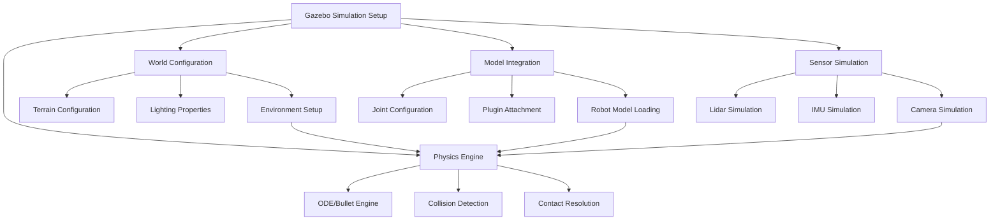

# Chapter 5: Setting Up Gazebo

## Learning Outcomes

After completing this chapter, you will be able to:
- Install and configure Gazebo Garden for robotics simulation
- Create custom simulation worlds with proper physics properties
- Spawn robot models in simulation environments
- Configure collision detection and physics parameters
- Set up realistic sensor simulation in Gazebo

## Prerequisites Checklist

### Required Software Installed
- [ ] Gazebo Garden (or newer version)
- [ ] ROS 2 Humble Hawksbill with Gazebo plugins
- [ ] Python 3.8+ with pip
- [ ] Completed Module 1 content

### Required Module Completion
- [ ] Understanding of ROS 2 architecture and nodes
- [ ] Basic knowledge of URDF robot models
- [ ] Familiarity with Linux command line

### Files Needed
- [ ] Completed robot model from Module 1
- [ ] Access to Gazebo documentation and tutorials

## Core Concept Explanation

### What is Gazebo?

Gazebo is a physics-based 3D simulation environment that enables accurate and efficient testing of robotics algorithms, device drivers, sensor configurations, and control logic. It provides high-fidelity physics simulation, realistic rendering, and convenient programmatic interfaces.

### Key Gazebo Components

**World Files**: SDF (Simulation Description Format) files that define the simulation environment including:
- Terrain and static objects
- Physics engine parameters
- Lighting and visual properties
- Initial conditions

**Models**: SDF files that define robot and object models with:
- Visual and collision properties
- Inertial parameters
- Joint definitions
- Plugin configurations

**Plugins**: Dynamic libraries that extend Gazebo functionality:
- Sensor plugins (cameras, LiDAR, IMU)
- Controller plugins (motor controllers)
- GUI plugins (custom interfaces)

### Physics Simulation in Gazebo

Gazebo uses the ODE (Open Dynamics Engine) physics engine by default, with support for other engines like Bullet and DART. Key physics concepts include:

- **Collision Detection**: Algorithms that detect when objects intersect
- **Contact Resolution**: Methods for calculating forces when objects collide
- **Integration**: Numerical methods for updating object states over time
- **Constraints**: Mathematical relationships between objects (joints, motors)

## Diagram or Pipeline



## Runnable Code Example A

Let's create a basic Gazebo world file with a simple environment:

```xml
<!-- basic_world.sdf -->
<?xml version="1.0" ?>
<sdf version="1.7">
  <world name="basic_world">
    <!-- Include the default sun -->
    <include>
      <uri>model://sun</uri>
    </include>

    <!-- Include the default ground plane -->
    <include>
      <uri>model://ground_plane</uri>
    </include>

    <!-- Define a simple room -->
    <model name="room">
      <pose>0 0 1 0 0 0</pose>

      <!-- Floor -->
      <link name="floor">
        <collision name="floor_collision">
          <geometry>
            <box>
              <size>10 10 0.1</size>
            </box>
          </geometry>
        </collision>
        <visual name="floor_visual">
          <geometry>
            <box>
              <size>10 10 0.1</size>
            </box>
          </geometry>
          <material>
            <ambient>0.8 0.8 0.8 1</ambient>
            <diffuse>0.8 0.8 0.8 1</diffuse>
          </material>
        </visual>
        <inertial>
          <mass>1000</mass>
          <inertia>
            <ixx>100</ixx>
            <ixy>0</ixy>
            <ixz>0</ixz>
            <iyy>100</iyy>
            <iyz>0</iyz>
            <izz>100</izz>
          </inertia>
        </inertial>
      </link>

      <!-- Walls -->
      <link name="wall_1">
        <pose>5 0 2.5 0 0 0</pose>
        <collision name="wall_1_collision">
          <geometry>
            <box>
              <size>0.1 10 5</size>
            </box>
          </geometry>
        </collision>
        <visual name="wall_1_visual">
          <geometry>
            <box>
              <size>0.1 10 5</size>
            </box>
          </geometry>
          <material>
            <ambient>0.6 0.6 0.6 1</ambient>
            <diffuse>0.6 0.6 0.6 1</diffuse>
          </material>
        </visual>
        <inertial>
          <mass>500</mass>
          <inertia>
            <ixx>100</ixx>
            <ixy>0</ixy>
            <ixz>0</ixz>
            <iyy>100</iyy>
            <iyz>0</iyz>
            <izz>100</izz>
          </inertia>
        </inertial>
      </link>

      <link name="wall_2">
        <pose>-5 0 2.5 0 0 0</pose>
        <collision name="wall_2_collision">
          <geometry>
            <box>
              <size>0.1 10 5</size>
            </box>
          </geometry>
        </collision>
        <visual name="wall_2_visual">
          <geometry>
            <box>
              <size>0.1 10 5</size>
            </box>
          </geometry>
          <material>
            <ambient>0.6 0.6 0.6 1</ambient>
            <diffuse>0.6 0.6 0.6 1</diffuse>
          </material>
        </visual>
        <inertial>
          <mass>500</mass>
          <inertia>
            <ixx>100</ixx>
            <ixy>0</ixy>
            <ixz>0</ixz>
            <iyy>100</iyy>
            <iyz>0</iyz>
            <izz>100</izz>
          </inertia>
        </inertial>
      </link>

      <link name="wall_3">
        <pose>0 5 2.5 0 0 1.5707</pose>
        <collision name="wall_3_collision">
          <geometry>
            <box>
              <size>0.1 10 5</size>
            </box>
          </geometry>
        </collision>
        <visual name="wall_3_visual">
          <geometry>
            <box>
              <size>0.1 10 5</size>
            </box>
          </geometry>
          <material>
            <ambient>0.6 0.6 0.6 1</ambient>
            <diffuse>0.6 0.6 0.6 1</diffuse>
          </material>
        </visual>
        <inertial>
          <mass>500</mass>
          <inertia>
            <ixx>100</ixx>
            <ixy>0</ixy>
            <ixz>0</ixz>
            <iyy>100</iyy>
            <iyz>0</iyz>
            <izz>100</izz>
          </inertia>
        </inertial>
      </link>

      <link name="wall_4">
        <pose>0 -5 2.5 0 0 1.5707</pose>
        <collision name="wall_4_collision">
          <geometry>
            <box>
              <size>0.1 10 5</size>
            </box>
          </geometry>
        </collision>
        <visual name="wall_4_visual">
          <geometry>
            <box>
              <size>0.1 10 5</size>
            </box>
          </geometry>
          <material>
            <ambient>0.6 0.6 0.6 1</ambient>
            <diffuse>0.6 0.6 0.6 1</diffuse>
          </material>
        </visual>
        <inertial>
          <mass>500</mass>
          <inertia>
            <ixx>100</ixx>
            <ixy>0</ixy>
            <ixz>0</ixz>
            <iyy>100</iyy>
            <iyz>0</iyz>
            <izz>100</izz>
          </inertia>
        </inertial>
      </link>
    </model>

    <!-- Add a simple box obstacle -->
    <model name="obstacle">
      <pose>2 2 0.5 0 0 0</pose>
      <link name="box_link">
        <collision name="box_collision">
          <geometry>
            <box>
              <size>1 1 1</size>
            </box>
          </geometry>
        </collision>
        <visual name="box_visual">
          <geometry>
            <box>
              <size>1 1 1</size>
            </box>
          </geometry>
          <material>
            <ambient>1 0 0 1</ambient>
            <diffuse>1 0 0 1</diffuse>
          </material>
        </visual>
        <inertial>
          <mass>10</mass>
          <inertia>
            <ixx>1</ixx>
            <ixy>0</ixy>
            <ixz>0</ixz>
            <iyy>1</iyy>
            <iyz>0</iyz>
            <izz>1</izz>
          </inertia>
        </inertial>
      </link>
    </model>
  </world>
</sdf>
```

**To run this simulation:**
1. Save it as `basic_world.sdf`
2. Launch Gazebo with: `gz sim basic_world.sdf`
3. Or use ROS 2 launch: `ros2 launch gazebo_ros gazebo.launch.py world:=/path/to/basic_world.sdf`

## Runnable Code Example B

Now let's create a robot model file that can be spawned in the simulation:

```xml
<!-- simple_robot.sdf -->
<?xml version="1.0" ?>
<sdf version="1.7">
  <model name="simple_robot">
    <!-- Robot base -->
    <link name="base_link">
      <pose>0 0 0.1 0 0 0</pose>
      <inertial>
        <mass>1</mass>
        <inertia>
          <ixx>0.01</ixx>
          <ixy>0</ixy>
          <ixz>0</ixz>
          <iyy>0.01</iyy>
          <iyz>0</iyz>
          <izz>0.01</izz>
        </inertia>
      </inertial>

      <collision name="collision">
        <geometry>
          <box>
            <size>0.5 0.5 0.2</size>
          </box>
        </geometry>
      </collision>

      <visual name="visual">
        <geometry>
          <box>
            <size>0.5 0.5 0.2</size>
          </box>
        </geometry>
        <material>
          <ambient>0.8 0.8 0.2 1</ambient>
          <diffuse>0.8 0.8 0.2 1</diffuse>
        </material>
      </visual>
    </link>

    <!-- Left wheel -->
    <link name="left_wheel">
      <pose>-0.15 0.3 0 0 0 0</pose>
      <inertial>
        <mass>0.2</mass>
        <inertia>
          <ixx>0.001</ixx>
          <ixy>0</ixy>
          <ixz>0</ixz>
          <iyy>0.001</iyy>
          <iyz>0</iyz>
          <izz>0.002</izz>
        </inertia>
      </inertial>

      <collision name="left_wheel_collision">
        <geometry>
          <cylinder>
            <radius>0.1</radius>
            <length>0.05</length>
          </cylinder>
        </geometry>
      </collision>

      <visual name="left_wheel_visual">
        <geometry>
          <cylinder>
            <radius>0.1</radius>
            <length>0.05</length>
          </cylinder>
        </geometry>
        <material>
          <ambient>0.2 0.2 0.2 1</ambient>
          <diffuse>0.2 0.2 0.2 1</diffuse>
        </material>
      </visual>
    </link>

    <!-- Right wheel -->
    <link name="right_wheel">
      <pose>-0.15 -0.3 0 0 0 0</pose>
      <inertial>
        <mass>0.2</mass>
        <inertia>
          <ixx>0.001</ixx>
          <ixy>0</ixy>
          <ixz>0</ixz>
          <iyy>0.001</iyy>
          <iyz>0</iyz>
          <izz>0.002</izz>
        </inertia>
      </inertial>

      <collision name="right_wheel_collision">
        <geometry>
          <cylinder>
            <radius>0.1</radius>
            <length>0.05</length>
          </cylinder>
        </geometry>
      </collision>

      <visual name="right_wheel_visual">
        <geometry>
          <cylinder>
            <radius>0.1</radius>
            <length>0.05</length>
          </cylinder>
        </geometry>
        <material>
          <ambient>0.2 0.2 0.2 1</ambient>
          <diffuse>0.2 0.2 0.2 1</diffuse>
        </material>
      </visual>
    </link>

    <!-- Joint between base and left wheel -->
    <joint name="left_wheel_joint" type="revolute">
      <parent>base_link</parent>
      <child>left_wheel</child>
      <pose>-0.15 0.3 0 0 0 0</pose>
      <axis>
        <xyz>0 0 1</xyz>
        <limit>
          <lower>-1e+16</lower>
          <upper>1e+16</upper>
          <effort>100</effort>
          <velocity>100</velocity>
        </limit>
      </axis>
    </joint>

    <!-- Joint between base and right wheel -->
    <joint name="right_wheel_joint" type="revolute">
      <parent>base_link</parent>
      <child>right_wheel</child>
      <pose>-0.15 -0.3 0 0 0 0</pose>
      <axis>
        <xyz>0 0 1</xyz>
        <limit>
          <lower>-1e+16</lower>
          <upper>1e+16</upper>
          <effort>100</effort>
          <velocity>100</velocity>
        </limit>
      </axis>
    </joint>

    <!-- Add a simple camera sensor -->
    <link name="camera_link">
      <pose>0.2 0 0.1 0 0 0</pose>
      <inertial>
        <mass>0.01</mass>
        <inertia>
          <ixx>0.0001</ixx>
          <ixy>0</ixy>
          <ixz>0</ixz>
          <iyy>0.0001</iyy>
          <iyz>0</iyz>
          <izz>0.0001</izz>
        </inertia>
      </inertial>

      <collision name="camera_collision">
        <geometry>
          <box>
            <size>0.05 0.05 0.05</size>
          </box>
        </geometry>
      </collision>

      <visual name="camera_visual">
        <geometry>
          <box>
            <size>0.05 0.05 0.05</size>
          </box>
        </geometry>
        <material>
          <ambient>0.5 0.5 0.5 1</ambient>
          <diffuse>0.5 0.5 0.5 1</diffuse>
        </material>
      </visual>
    </link>

    <joint name="camera_joint" type="fixed">
      <parent>base_link</parent>
      <child>camera_link</child>
      <pose>0.2 0 0.1 0 0 0</pose>
    </joint>

    <!-- Camera sensor -->
    <sensor name="camera" type="camera">
      <pose>0.2 0 0.1 0 0 0</pose>
      <camera>
        <horizontal_fov>1.047</horizontal_fov>
        <image>
          <width>640</width>
          <height>480</height>
        </image>
        <clip>
          <near>0.1</near>
          <far>10</far>
        </clip>
      </camera>
      <always_on>1</always_on>
      <update_rate>30</update_rate>
      <visualize>true</visualize>
    </sensor>
  </model>
</sdf>
```

**To spawn this robot in the simulation:**
1. Save it as `simple_robot.sdf`
2. Start Gazebo with the world: `gz sim basic_world.sdf`
3. In another terminal, spawn the robot: `gz model -f simple_robot.sdf -m simple_robot`

## "Try Yourself" Mini Task

Create a more complex environment by modifying the basic world to include:
1. Multiple obstacles of different shapes and sizes
2. A textured floor (you can use basic colors for now)
3. Additional lighting sources
4. At least one moving obstacle (use a simple oscillating motion)

**Hint:** Use different geometric shapes (sphere, cylinder, mesh) for variety, and consider adding joints to make objects move.

## Verification Procedure

To verify that your Gazebo setup is working correctly:

### What appears in terminal?
- When starting Gazebo: No error messages about physics engine or rendering
- When spawning models: Confirmation messages that models were loaded
- When running simulation: Physics update messages and sensor output

### What changes in simulation?
- The 3D environment should render with proper lighting and shadows
- Robot models should appear with correct visual properties
- Physics simulation should run smoothly with realistic object interactions
- Sensors should generate appropriate data streams

## Checklist for Completion

- [ ] Basic Gazebo world created and tested
- [ ] Robot model created with proper collision and visual properties
- [ ] Simulation environment running without errors
- [ ] Sensors properly configured and generating data
- [ ] Complex environment with multiple obstacles (Try Yourself task)

## Summary

This chapter introduced the fundamentals of setting up Gazebo simulation environments for robotics applications. You learned about the key components of Gazebo (worlds, models, plugins), the SDF format for defining simulation elements, and how to create both static environments and dynamic robot models. The examples demonstrated creating basic environments and robot models with sensors, providing a foundation for more complex simulation scenarios.

## References

1. Koenig, N., & Howard, A. (2004). Design and use paradigms for Gazebo, an open-source multi-robot simulator. *Proceedings of the 2004 IEEE/RSJ International Conference on Intelligent Robots and Systems*, 2149-2154.
2. Source 011: Gazebo design and implementation paper
3. Gazebo Sim Team. (2023). *Gazebo Garden User Guide*. Retrieved from https://gazebosim.org/docs/garden
4. Source 019: Comparative study of simulation environments for robotics
5. ROS 2 Documentation Team. (2023). *Gazebo ROS Integration Guide*. Retrieved from https://classic.gazebosim.org/tutorials?cat=connect_ros