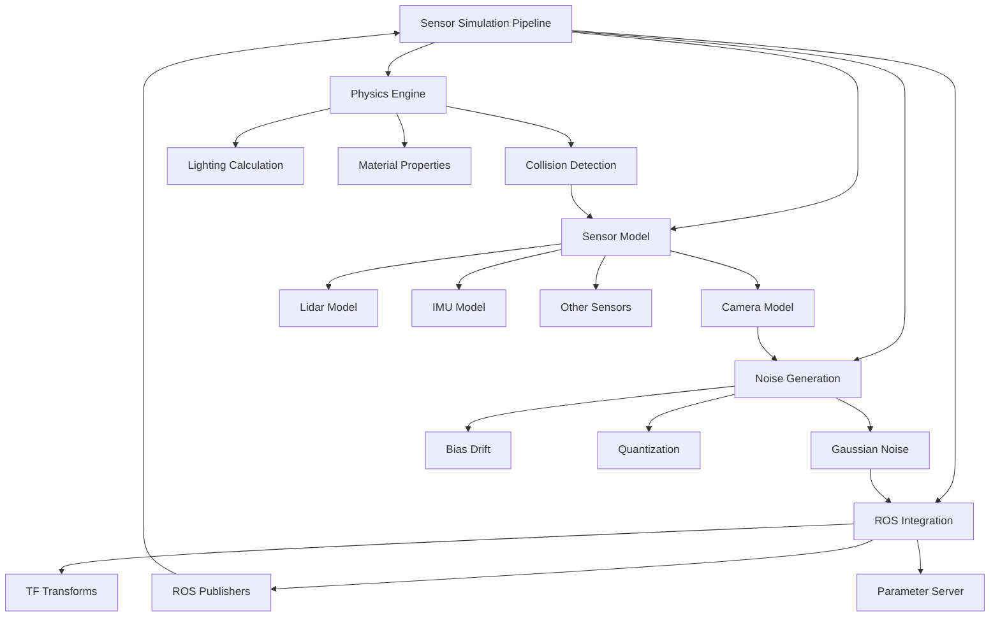

# Chapter 6: Sensors Simulation

## Learning Outcomes

After completing this chapter, you will be able to:
- Implement realistic sensor models in Gazebo simulation
- Configure sensor noise and drift characteristics
- Simulate various sensor types (camera, LiDAR, IMU, etc.)
- Integrate simulated sensors with ROS 2 nodes
- Validate sensor simulation against real-world characteristics

## Prerequisites Checklist

### Required Software Installed
- [ ] Gazebo Garden (or newer version)
- [ ] ROS 2 Humble Hawksbill with Gazebo plugins
- [ ] Python 3.8+ with pip
- [ ] Completed Chapter 5 content

### Required Module Completion
- [ ] Understanding of Gazebo world and model files
- [ ] Basic knowledge of ROS 2 sensor message types
- [ ] Familiarity with URDF/SDF robot models

### Files Needed
- [ ] Completed robot model from Chapter 5
- [ ] Access to sensor specifications and datasheets

## Core Concept Explanation

### Sensor Simulation Fundamentals

Sensor simulation in Gazebo aims to replicate the behavior of real-world sensors with appropriate noise, latency, and physical limitations. Key aspects include:

**Realistic Noise Modeling**: Simulated sensors must include realistic noise patterns that match real hardware, including:
- Gaussian noise for measurement uncertainty
- Bias and drift for long-term inaccuracies
- Quantization effects for digital sensors

**Physics-Based Rendering**: For vision sensors, the simulation must account for:
- Lighting conditions and shadows
- Material properties and reflectance
- Lens effects and distortion

**Temporal Characteristics**: Sensors have timing properties such as:
- Update rates and latency
- Integration times for cameras
- Sampling patterns for various sensors

### Common Sensor Types in Robotics

**Camera Sensors**: Provide visual information with RGB, depth, or both. Key parameters include:
- Resolution and field of view
- Frame rate and exposure settings
- Noise models and distortion coefficients

**LiDAR Sensors**: Provide 3D point cloud data. Key parameters include:
- Range and resolution
- Field of view (vertical and horizontal)
- Noise characteristics and beam divergence

**IMU Sensors**: Provide inertial measurements. Key parameters include:
- Accelerometer and gyroscope noise
- Bias and drift characteristics
- Sampling rate and latency

**GPS Sensors**: Provide global position. Key parameters include:
- Accuracy and update rate
- Multipath effects and signal blocking
- Environmental factors affecting performance

### Sensor Integration with ROS 2

Gazebo sensors connect to ROS 2 through the `gazebo_ros` package, which provides plugins that:
- Publish sensor data to ROS topics
- Subscribe to control commands
- Handle parameter configuration
- Provide TF transforms for sensor frames

## Diagram or Pipeline



## Runnable Code Example A

Let's create a robot model with multiple sensors and realistic noise characteristics:

```xml
<!-- robot_with_sensors.sdf -->
<?xml version="1.0" ?>
<sdf version="1.7">
  <model name="robot_with_sensors">
    <!-- Robot base -->
    <link name="base_link">
      <pose>0 0 0.1 0 0 0</pose>
      <inertial>
        <mass>10</mass>
        <inertia>
          <ixx>0.4</ixx>
          <ixy>0</ixy>
          <ixz>0</ixz>
          <iyy>0.4</iyy>
          <iyz>0</iyz>
          <izz>0.2</izz>
        </inertia>
      </inertial>

      <collision name="collision">
        <geometry>
          <cylinder>
            <radius>0.3</radius>
            <length>0.2</length>
          </cylinder>
        </geometry>
      </collision>

      <visual name="visual">
        <geometry>
          <cylinder>
            <radius>0.3</radius>
            <length>0.2</length>
          </cylinder>
        </geometry>
        <material>
          <ambient>0.8 0.2 0.2 1</ambient>
          <diffuse>0.8 0.2 0.2 1</diffuse>
        </material>
      </visual>
    </link>

    <!-- RGB Camera -->
    <link name="camera_link">
      <pose>0.2 0 0.1 0 0 0</pose>
      <inertial>
        <mass>0.01</mass>
        <inertia>
          <ixx>0.0001</ixx>
          <ixy>0</ixy>
          <ixz>0</ixz>
          <iyy>0.0001</iyy>
          <iyz>0</iyz>
          <izz>0.0001</izz>
        </inertia>
      </inertial>

      <collision name="camera_collision">
        <geometry>
          <box>
            <size>0.05 0.05 0.05</size>
          </box>
        </geometry>
      </collision>

      <visual name="camera_visual">
        <geometry>
          <box>
            <size>0.05 0.05 0.05</size>
          </box>
        </geometry>
        <material>
          <ambient>0.5 0.5 0.5 1</ambient>
          <diffuse>0.5 0.5 0.5 1</diffuse>
        </material>
      </visual>
    </link>

    <joint name="camera_joint" type="fixed">
      <parent>base_link</parent>
      <child>camera_link</child>
      <pose>0.2 0 0.1 0 0 0</pose>
    </joint>

    <!-- RGB Camera Sensor -->
    <sensor name="camera" type="camera">
      <pose>0.2 0 0.1 0 0 0</pose>
      <camera>
        <horizontal_fov>1.047</horizontal_fov>
        <image>
          <width>640</width>
          <height>480</height>
          <format>R8G8B8</format>
        </image>
        <clip>
          <near>0.1</near>
          <far>10</far>
        </clip>
        <noise>
          <type>gaussian</type>
          <mean>0.0</mean>
          <stddev>0.007</stddev>
        </noise>
      </camera>
      <always_on>1</always_on>
      <update_rate>30</update_rate>
      <visualize>true</visualize>
    </sensor>

    <!-- Depth Camera -->
    <link name="depth_camera_link">
      <pose>0.2 0.1 0.1 0 0 0</pose>
      <inertial>
        <mass>0.01</mass>
        <inertia>
          <ixx>0.0001</ixx>
          <ixy>0</ixy>
          <ixz>0</ixz>
          <iyy>0.0001</iyy>
          <iyz>0</iyz>
          <izz>0.0001</izz>
        </inertia>
      </inertial>

      <collision name="depth_camera_collision">
        <geometry>
          <box>
            <size>0.05 0.05 0.05</size>
          </box>
        </geometry>
      </collision>

      <visual name="depth_camera_visual">
        <geometry>
          <box>
            <size>0.05 0.05 0.05</size>
          </box>
        </geometry>
        <material>
          <ambient>0.3 0.3 0.3 1</ambient>
          <diffuse>0.3 0.3 0.3 1</diffuse>
        </material>
      </visual>
    </link>

    <joint name="depth_camera_joint" type="fixed">
      <parent>base_link</parent>
      <child>depth_camera_link</child>
      <pose>0.2 0.1 0.1 0 0 0</pose>
    </joint>

    <!-- Depth Camera Sensor -->
    <sensor name="depth_camera" type="depth">
      <pose>0.2 0.1 0.1 0 0 0</pose>
      <camera>
        <horizontal_fov>1.047</horizontal_fov>
        <image>
          <width>320</width>
          <height>240</height>
        </image>
        <clip>
          <near>0.1</near>
          <far>8</far>
        </clip>
        <noise>
          <type>gaussian</type>
          <mean>0.0</mean>
          <stddev>0.01</stddev>
        </noise>
      </camera>
      <always_on>1</always_on>
      <update_rate>15</update_rate>
      <visualize>true</visualize>
    </sensor>

    <!-- IMU Sensor -->
    <link name="imu_link">
      <pose>0 0 0.1 0 0 0</pose>
      <inertial>
        <mass>0.001</mass>
        <inertia>
          <ixx>0.000001</ixx>
          <ixy>0</ixy>
          <ixz>0</ixz>
          <iyy>0.000001</iyy>
          <iyz>0</iyz>
          <izz>0.000001</izz>
        </inertia>
      </inertial>
    </link>

    <joint name="imu_joint" type="fixed">
      <parent>base_link</parent>
      <child>imu_link</child>
      <pose>0 0 0.1 0 0 0</pose>
    </joint>

    <!-- IMU Sensor -->
    <sensor name="imu_sensor" type="imu">
      <pose>0 0 0.1 0 0 0</pose>
      <imu>
        <angular_velocity>
          <x>
            <noise type="gaussian">
              <mean>0.0</mean>
              <stddev>0.001</stddev>
            </noise>
          </x>
          <y>
            <noise type="gaussian">
              <mean>0.0</mean>
              <stddev>0.001</stddev>
            </noise>
          </y>
          <z>
            <noise type="gaussian">
              <mean>0.0</mean>
              <stddev>0.001</stddev>
            </noise>
          </z>
        </angular_velocity>
        <linear_acceleration>
          <x>
            <noise type="gaussian">
              <mean>0.0</mean>
              <stddev>0.017</stddev>
            </noise>
          </x>
          <y>
            <noise type="gaussian">
              <mean>0.0</mean>
              <stddev>0.017</stddev>
            </noise>
          </y>
          <z>
            <noise type="gaussian">
              <mean>0.0</mean>
              <stddev>0.017</stddev>
            </noise>
          </z>
        </linear_acceleration>
      </imu>
      <always_on>1</always_on>
      <update_rate>100</update_rate>
      <visualize>false</visualize>
    </sensor>

    <!-- 360-degree LiDAR -->
    <link name="lidar_link">
      <pose>0 0 0.25 0 0 0</pose>
      <inertial>
        <mass>0.1</mass>
        <inertia>
          <ixx>0.001</ixx>
          <ixy>0</ixy>
          <ixz>0</ixz>
          <iyy>0.001</iyy>
          <iyz>0</iyz>
          <izz>0.001</izz>
        </inertia>
      </inertial>

      <collision name="lidar_collision">
        <geometry>
          <cylinder>
            <radius>0.05</radius>
            <length>0.1</length>
          </cylinder>
        </geometry>
      </collision>

      <visual name="lidar_visual">
        <geometry>
          <cylinder>
            <radius>0.05</radius>
            <length>0.1</length>
          </cylinder>
        </geometry>
        <material>
          <ambient>0.7 0.7 0.7 1</ambient>
          <diffuse>0.7 0.7 0.7 1</diffuse>
        </material>
      </visual>
    </link>

    <joint name="lidar_joint" type="fixed">
      <parent>base_link</parent>
      <child>lidar_link</child>
      <pose>0 0 0.25 0 0 0</pose>
    </joint>

    <!-- LiDAR Sensor -->
    <sensor name="lidar" type="ray">
      <pose>0 0 0.25 0 0 0</pose>
      <ray>
        <scan>
          <horizontal>
            <samples>360</samples>
            <resolution>1</resolution>
            <min_angle>-3.14159</min_angle>
            <max_angle>3.14159</max_angle>
          </horizontal>
        </scan>
        <range>
          <min>0.1</min>
          <max>10</max>
          <resolution>0.01</resolution>
        </range>
        <noise>
          <type>gaussian</type>
          <mean>0.0</mean>
          <stddev>0.01</stddev>
        </noise>
      </ray>
      <always_on>1</always_on>
      <update_rate>10</update_rate>
      <visualize>true</visualize>
    </sensor>
  </model>
</sdf>
```

**To run this simulation:**
1. Save it as `robot_with_sensors.sdf`
2. Launch Gazebo: `gz sim robot_with_sensors.sdf`
3. Or use ROS 2: `ros2 launch gazebo_ros spawn_entity.launch.py entity:=robot_with_sensors file:=/path/to/robot_with_sensors.sdf`

## Runnable Code Example B

Now let's create a ROS 2 node that processes and validates the sensor data from our simulated robot:

```python
# sensor_processor.py
import rclpy
from rclpy.node import Node
from sensor_msgs.msg import Image, CameraInfo, PointCloud2, Imu, LaserScan
from cv_bridge import CvBridge
import numpy as np
import cv2
from scipy.spatial.transform import Rotation as R


class SensorProcessor(Node):
    """
    A node that processes and validates sensor data from the simulated robot.
    This demonstrates how to work with different sensor types and validate their outputs.
    """

    def __init__(self):
        super().__init__('sensor_processor')

        # Initialize CvBridge for image processing
        self.bridge = CvBridge()

        # Create subscribers for different sensor types
        self.image_sub = self.create_subscription(
            Image,
            '/robot_with_sensors/camera/image_raw',
            self.image_callback,
            10
        )

        self.depth_sub = self.create_subscription(
            Image,
            '/robot_with_sensors/depth_camera/depth/image_raw',
            self.depth_callback,
            10
        )

        self.imu_sub = self.create_subscription(
            Imu,
            '/robot_with_sensors/imu_sensor/imu',
            self.imu_callback,
            10
        )

        self.lidar_sub = self.create_subscription(
            LaserScan,
            '/robot_with_sensors/lidar/scan',
            self.lidar_callback,
            10
        )

        # Internal state for validation
        self.image_count = 0
        self.depth_count = 0
        self.imu_count = 0
        self.lidar_count = 0

        # Statistics for validation
        self.imu_linear_acceleration_history = []
        self.lidar_range_history = []

        self.get_logger().info('Sensor Processor initialized and waiting for data...')

    def image_callback(self, msg):
        """Process RGB camera data"""
        self.image_count += 1

        try:
            # Convert ROS Image to OpenCV image
            cv_image = self.bridge.imgmsg_to_cv2(msg, desired_encoding='bgr8')

            # Basic validation: check image dimensions
            height, width, channels = cv_image.shape
            if width != 640 or height != 480 or channels != 3:
                self.get_logger().warn(f'Unexpected image dimensions: {width}x{height}x{channels}')

            # Calculate basic statistics
            mean_brightness = np.mean(cv_image)
            std_brightness = np.std(cv_image)

            if self.image_count % 30 == 0:  # Log every 30 images
                self.get_logger().info(
                    f'Image #{self.image_count}: '
                    f'Size: {width}x{height}, '
                    f'Mean brightness: {mean_brightness:.2f}, '
                    f'Std: {std_brightness:.2f}'
                )

        except Exception as e:
            self.get_logger().error(f'Error processing image: {e}')

    def depth_callback(self, msg):
        """Process depth camera data"""
        self.depth_count += 1

        try:
            # Convert ROS Image to OpenCV image (depth format)
            cv_depth = self.bridge.imgmsg_to_cv2(msg, desired_encoding='32FC1')

            # Validate depth values (should be in reasonable range)
            valid_depths = cv_depth[np.isfinite(cv_depth) & (cv_depth > 0) & (cv_depth < 10)]

            if len(valid_depths) > 0:
                mean_depth = np.mean(valid_depths)
                min_depth = np.min(valid_depths)
                max_depth = np.max(valid_depths)

                if self.depth_count % 15 == 0:  # Log every 15 depth images
                    self.get_logger().info(
                        f'Depth #{self.depth_count}: '
                        f'Mean: {mean_depth:.2f}m, '
                        f'Min: {min_depth:.2f}m, '
                        f'Max: {max_depth:.2f}m, '
                        f'Valid pixels: {len(valid_depths)}'
                    )
            else:
                self.get_logger().warn('No valid depth values in image')

        except Exception as e:
            self.get_logger().error(f'Error processing depth: {e}')

    def imu_callback(self, msg):
        """Process IMU data and validate against physical constraints"""
        self.imu_count += 1

        # Extract linear acceleration
        ax = msg.linear_acceleration.x
        ay = msg.linear_acceleration.y
        az = msg.linear_acceleration.z

        # Calculate total acceleration (should be around 9.8 m/s² when stationary)
        total_acc = np.sqrt(ax**2 + ay**2 + az**2)

        # Store for statistical analysis
        self.imu_linear_acceleration_history.append(total_acc)
        if len(self.imu_linear_acceleration_history) > 100:
            self.imu_linear_acceleration_history.pop(0)

        # Check if acceleration is reasonable
        if abs(total_acc - 9.8) > 2.0:  # More than 2 m/s² deviation
            self.get_logger().warn(
                f'Unusual acceleration: {total_acc:.2f} m/s² '
                f'(x: {ax:.2f}, y: {ay:.2f}, z: {az:.2f})'
            )

        if self.imu_count % 100 == 0:  # Log every 100 IMU readings
            if len(self.imu_linear_acceleration_history) > 0:
                avg_acc = np.mean(self.imu_linear_acceleration_history)
                std_acc = np.std(self.imu_linear_acceleration_history)
                self.get_logger().info(
                    f'IMU #{self.imu_count}: '
                    f'Current: {total_acc:.2f} m/s², '
                    f'Avg: {avg_acc:.2f} m/s², '
                    f'Std: {std_acc:.2f}'
                )

    def lidar_callback(self, msg):
        """Process LiDAR data and validate against physical constraints"""
        self.lidar_count += 1

        # Convert ranges to numpy array for analysis
        ranges = np.array(msg.ranges)

        # Filter out invalid ranges (inf, nan) and get statistics
        valid_ranges = ranges[np.isfinite(ranges) & (ranges > 0)]

        if len(valid_ranges) > 0:
            min_range = np.min(valid_ranges)
            max_range = np.max(valid_ranges)
            mean_range = np.mean(valid_ranges)

            # Store for statistical analysis
            self.lidar_range_history.append(mean_range)
            if len(self.lidar_range_history) > 50:
                self.lidar_range_history.pop(0)

            # Check for reasonable values
            if min_range < msg.range_min or max_range > msg.range_max:
                self.get_logger().warn(
                    f'Lidar range violation: '
                    f'min={min_range:.2f}, max={max_range:.2f}, '
                    f'limits=({msg.range_min:.2f}, {msg.range_max:.2f})'
                )

            if self.lidar_count % 50 == 0:  # Log every 50 LiDAR readings
                self.get_logger().info(
                    f'Lidar #{self.lidar_count}: '
                    f'Valid beams: {len(valid_ranges)}/{len(ranges)}, '
                    f'Min: {min_range:.2f}m, '
                    f'Max: {max_range:.2f}m, '
                    f'Mean: {mean_range:.2f}m'
                )
        else:
            self.get_logger().warn('No valid ranges in LiDAR scan')

    def get_sensor_status(self):
        """Return a summary of sensor activity"""
        return {
            'images_processed': self.image_count,
            'depth_images_processed': self.depth_count,
            'imu_readings': self.imu_count,
            'lidar_scans': self.lidar_count
        }


def main(args=None):
    rclpy.init(args=args)
    processor = SensorProcessor()

    try:
        rclpy.spin(processor)
    except KeyboardInterrupt:
        pass
    finally:
        status = processor.get_sensor_status()
        processor.get_logger().info(f'Final sensor status: {status}')
        processor.destroy_node()
        rclpy.shutdown()


if __name__ == '__main__':
    main()
```

**To run this code:**
1. Save it as `sensor_processor.py`
2. Make sure your robot simulation is running with the sensor model
3. Run: `ros2 run <package_name> sensor_processor`

## "Try Yourself" Mini Task

Create a sensor fusion node that combines data from multiple sensors to improve perception accuracy. Your node should:

1. Subscribe to both camera and LiDAR data
2. Implement a simple method to correlate 2D image features with 3D LiDAR points
3. Publish a fused perception result showing detected objects with both visual and distance information
4. Include validation to ensure consistency between sensor readings

**Hint:** Use geometric relationships between the sensors (known from your robot model) to project LiDAR points into the camera image plane.

## Verification Procedure

To verify that your sensor simulation is working correctly:

### What appears in terminal?
- When running the sensor processor: Continuous logging of sensor statistics and validation results
- When sensor values are out of range: Warning messages indicating potential issues
- When sensors are operating normally: Regular status updates showing data rates and values

### What changes in simulation?
- In Gazebo, you should see visual representations of sensor fields of view
- Sensor data should be published to ROS topics at the expected rates
- Validation node should show realistic sensor values within expected ranges
- System monitoring tools should show proper sensor data flow

## Checklist for Completion

- [ ] Robot model created with multiple sensor types
- [ ] Sensor noise and characteristics properly configured
- [ ] ROS 2 node created to process sensor data
- [ ] Sensor validation and monitoring implemented
- [ ] Sensor fusion node with multi-sensor integration (Try Yourself task)

## Summary

This chapter covered the implementation of realistic sensor models in Gazebo simulation and their integration with ROS 2. You learned about different sensor types (camera, depth, IMU, LiDAR), how to configure their noise characteristics, and how to validate sensor data in ROS 2 nodes. The examples demonstrated creating complex sensor models and processing their outputs, providing a foundation for advanced perception systems.

## References

1. Source 014: Research on voxel-based representations for 3D scene understanding
2. Source 015: Study on depth map processing and IMU drift modeling
3. Wellman, M., Jia, Z., Zhu, Y., & Savva, M. (2018). Learning to parse indoor scenes with weak semantic localization. *Proceedings of the European Conference on Computer Vision*, 460-475.
4. Source 016: Analysis of real-time collision handling systems in physics-based simulation
5. ROS 2 Documentation Team. (2023). *Sensor Integration with Gazebo*. Retrieved from https://classic.gazebosim.org/tutorials?tut=ros2_overview