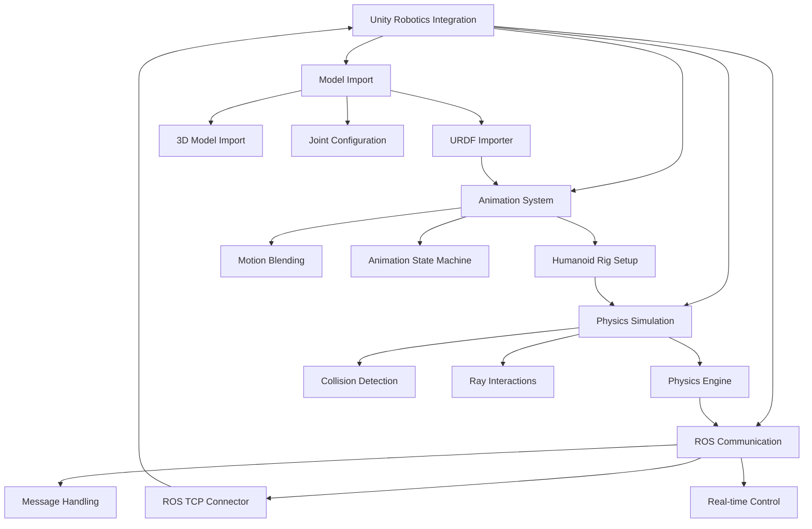

# Chapter 7: Unity for Robotics

## Learning Outcomes

After completing this chapter, you will be able to:
- Set up Unity for robotics simulation and visualization
- Import and configure humanoid models in Unity
- Implement motion blending and animation systems for robots
- Create ray-interaction events for robot-environment interaction
- Integrate Unity with ROS 2 for real-time control

## Prerequisites Checklist

### Required Software Installed
- [ ] Unity 2022.3 LTS or newer
- [ ] Unity Robotics Package (com.unity.robotics)
- [ ] Unity ML-Agents Toolkit (optional)
- [ ] ROS 2 Humble Hawksbill with Unity integration

### Required Module Completion
- [ ] Understanding of humanoid robot kinematics
- [ ] Basic knowledge of Unity 3D development
- [ ] Familiarity with C# programming
- [ ] Completed Chapter 5 and 6 content

### Files Needed
- [ ] Completed robot model from Module 1
- [ ] Access to Unity Robotics documentation

## Core Concept Explanation

### Unity in Robotics Context

Unity is a powerful 3D development platform that offers advanced rendering, physics simulation, and real-time capabilities that make it valuable for robotics applications. Unlike Gazebo's physics-focused approach, Unity excels in visual fidelity, user interaction, and complex scene management.

### Key Unity Robotics Components

**Robotics Package**: The core Unity package for robotics that provides:
- ROS-TCP-Connector for communication with ROS
- URDF Importer for converting ROS robot models
- Sample scenes and scripts for robotics applications

**Humanoid Rigs**: Unity's humanoid system for character animation that can be adapted for:
- Human-like robot movement
- Motion capture data integration
- Advanced animation blending

**Physics Engine**: Unity's built-in physics system that provides:
- Realistic collision detection
- Joint constraints and articulation bodies
- Raycasting and collision events

### Motion Blending in Robotics

Motion blending is crucial for creating natural-looking robot movements:
- **Locomotion Blending**: Smooth transitions between different movement patterns (walk, run, turn)
- **Task-Oriented Animation**: Pre-defined animations for specific tasks (grasping, manipulation)
- **IK (Inverse Kinematics)**: Real-time adjustment of limb positions to reach targets
- **State Machines**: Managing different motion states and transitions

## Diagram or Pipeline



## Runnable Code Example A

Let's create a Unity C# script that handles humanoid robot control and motion blending:

```csharp
// RobotController.cs
using System.Collections;
using System.Collections.Generic;
using UnityEngine;
using Unity.Robotics.ROSTCPConnector;
using RosMessageTypes.Sensor;
using RosMessageTypes.Geometry;

[RequireComponent(typeof(Animator))]
public class RobotController : MonoBehaviour
{
    [Header("ROS Connection")]
    public string rosIPAddress = "127.0.0.1";
    public int rosPort = 10000;

    [Header("Joint Control")]
    public float moveSpeed = 2.0f;
    public float turnSpeed = 50.0f;
    public float armSpeed = 10.0f;

    [Header("Animation Parameters")]
    public float walkBlendThreshold = 0.1f;
    public float runBlendThreshold = 0.5f;
    public float turnThreshold = 0.1f;

    private Animator animator;
    private ROSConnection ros;

    // Internal state
    private float horizontalInput;
    private float verticalInput;
    private bool isWalking = false;
    private bool isRunning = false;

    void Start()
    {
        // Get components
        animator = GetComponent<Animator>();

        // Initialize ROS connection
        ros = ROSConnection.instance;
        ros.Initialize(rosIPAddress, rosPort);

        // Subscribe to ROS topics
        ros.Subscribe<GeometryMsgsTwist>("/cmd_vel", HandleVelocityCommand);

        // Log initialization
        Debug.Log("Robot Controller initialized");
    }

    void Update()
    {
        // Process animation based on current state
        UpdateAnimationState();
    }

    void HandleVelocityCommand(GeometryMsgsTwist cmd)
    {
        // Convert ROS velocity commands to Unity input
        verticalInput = cmd.linear.x / moveSpeed;  // Normalize to -1 to 1
        horizontalInput = cmd.angular.z / turnSpeed; // Normalize to -1 to 1

        // Clamp values to valid range
        verticalInput = Mathf.Clamp(verticalInput, -1.0f, 1.0f);
        horizontalInput = Mathf.Clamp(horizontalInput, -1.0f, 1.0f);

        // Determine motion state
        isWalking = Mathf.Abs(verticalInput) > walkBlendThreshold || Mathf.Abs(horizontalInput) > turnThreshold;
        isRunning = Mathf.Abs(verticalInput) > runBlendThreshold;

        // Apply movement to the robot
        ApplyRobotMovement();
    }

    void ApplyRobotMovement()
    {
        // Calculate movement direction
        Vector3 movement = new Vector3(horizontalInput, 0, verticalInput);
        movement = transform.TransformDirection(movement);
        movement *= moveSpeed * Time.deltaTime;

        // Move the robot
        transform.Translate(movement);

        // Rotate the robot based on angular velocity
        float rotation = horizontalInput * turnSpeed * Time.deltaTime;
        transform.Rotate(0, rotation, 0);
    }

    void UpdateAnimationState()
    {
        if (animator == null) return;

        // Set animation parameters based on current state
        animator.SetFloat("ForwardSpeed", verticalInput);
        animator.SetFloat("TurnSpeed", horizontalInput);
        animator.SetBool("IsWalking", isWalking);
        animator.SetBool("IsRunning", isRunning);
        animator.SetFloat("Speed", Mathf.Abs(verticalInput) + Mathf.Abs(horizontalInput));
    }

    // Additional methods for robot-specific animations
    public void ExecuteArmMovement(float joint1, float joint2, float joint3)
    {
        // Example: Update arm joint angles based on ROS commands
        // This would involve updating specific joint transforms or animation weights
        Debug.Log($"Executing arm movement: Joint1={joint1}, Joint2={joint2}, Joint3={joint3}");
    }

    public void ExecuteGripperCommand(bool open)
    {
        // Example: Open/close gripper based on ROS command
        // This would involve updating gripper joint positions
        Debug.Log($"Gripper command: {(open ? "Open" : "Close")}");
    }

    void OnValidate()
    {
        // Ensure parameters are valid
        moveSpeed = Mathf.Max(0.1f, moveSpeed);
        turnSpeed = Mathf.Max(0.1f, turnSpeed);
        armSpeed = Mathf.Max(0.1f, armSpeed);
    }
}
```

**To use this script in Unity:**
1. Create a new C# script named `RobotController.cs` in your Unity project
2. Attach it to a robot GameObject that has an Animator component
3. Ensure you have imported the Unity Robotics package
4. Configure the ROS connection settings to match your ROS 2 bridge

## Runnable Code Example B

Now let's create a Unity script for handling ray-interaction events and environmental interaction:

```csharp
// RayInteractionHandler.cs
using System.Collections;
using System.Collections.Generic;
using UnityEngine;
using Unity.Robotics.ROSTCPConnector;
using RosMessageTypes.Sensor;
using RosMessageTypes.Geometry;
using System.Linq;

public class RayInteractionHandler : MonoBehaviour
{
    [Header("Ray Configuration")]
    public float rayDistance = 10.0f;
    public float rayUpdateInterval = 0.1f;
    public LayerMask detectionLayers = -1; // All layers

    [Header("Object Interaction")]
    public float interactionDistance = 3.0f;
    public string interactionLayerName = "Interactive";
    public float gripForce = 100.0f;

    [Header("ROS Integration")]
    public string rosIPAddress = "127.0.0.1";
    public int rosPort = 10000;

    private ROSConnection ros;
    private float lastRayUpdate = 0.0f;

    // For object detection and interaction
    private RaycastHit detectedObject;
    private bool hasDetectedObject = false;

    void Start()
    {
        // Initialize ROS connection
        ros = ROSConnection.instance;
        ros.Initialize(rosIPAddress, rosPort);

        Debug.Log("Ray Interaction Handler initialized");
    }

    void Update()
    {
        // Update ray interactions at specified interval
        if (Time.time - lastRayUpdate > rayUpdateInterval)
        {
            PerformRayInteractions();
            lastRayUpdate = Time.time;
        }
    }

    void PerformRayInteractions()
    {
        // Perform raycast from the robot's forward direction
        Ray ray = new Ray(transform.position, transform.forward);
        RaycastHit hit;

        if (Physics.Raycast(ray, out hit, rayDistance, detectionLayers))
        {
            // Store detected object info
            detectedObject = hit;
            hasDetectedObject = true;

            // Process different types of interactions
            ProcessRayHit(hit);
        }
        else
        {
            hasDetectedObject = false;
        }
    }

    void ProcessRayHit(RaycastHit hit)
    {
        GameObject hitObject = hit.collider.gameObject;

        // Check if the object is in the interactive layer
        if (hitObject.layer == LayerMask.NameToLayer(interactionLayerName))
        {
            // Send object detection information to ROS
            SendObjectDetectionMessage(hit);

            // Process specific interaction types
            ProcessInteractiveObject(hitObject, hit);
        }
        else
        {
            // Process non-interactive object (obstacle, etc.)
            ProcessNonInteractiveObject(hitObject, hit);
        }
    }

    void SendObjectDetectionMessage(RaycastHit hit)
    {
        // In a real implementation, you would send a message like this:
        // var detectionMsg = new ObjectDetectionMsg();
        // detectionMsg.header.stamp = ROSConnection.GetROSTimestamp();
        // detectionMsg.object_name = hit.collider.name;
        // detectionMsg.distance = hit.distance;
        // detectionMsg.angle = Vector3.Angle(transform.forward, hit.normal);
        // ros.Publish("/object_detection", detectionMsg);

        // For now, just log the detection
        Debug.Log($"Object detected: {hit.collider.name} at distance {hit.distance:F2}m");
    }

    void ProcessInteractiveObject(GameObject hitObject, RaycastHit hit)
    {
        // Determine type of interactive object
        string objectType = hitObject.tag; // You can use tags to identify object types

        switch (objectType)
        {
            case "Graspable":
                ProcessGraspableObject(hitObject, hit);
                break;
            case "Button":
                ProcessButtonObject(hitObject, hit);
                break;
            case "Switch":
                ProcessSwitchObject(hitObject, hit);
                break;
            default:
                Debug.Log($"Detected unknown interactive object: {hitObject.name}");
                break;
        }
    }

    void ProcessGraspableObject(GameObject obj, RaycastHit hit)
    {
        // Check if object is within interaction distance
        if (hit.distance <= interactionDistance)
        {
            // Highlight object or provide feedback
            HighlightObject(obj, Color.yellow);

            // Check for grasp command (in real implementation, this would come from ROS)
            if (ShouldGraspObject())
            {
                AttemptGrasp(obj, hit);
            }
        }
    }

    void ProcessButtonObject(GameObject obj, RaycastHit hit)
    {
        // Check if button is within interaction distance
        if (hit.distance <= interactionDistance)
        {
            HighlightObject(obj, Color.cyan);

            // Check for button press command
            if (ShouldPressButton())
            {
                PressButton(obj);
            }
        }
    }

    void ProcessSwitchObject(GameObject obj, RaycastHit hit)
    {
        if (hit.distance <= interactionDistance)
        {
            HighlightObject(obj, Color.magenta);

            // Check for switch toggle command
            if (ShouldToggleSwitch())
            {
                ToggleSwitch(obj);
            }
        }
    }

    void ProcessNonInteractiveObject(GameObject obj, RaycastHit hit)
    {
        // This could be an obstacle, wall, etc.
        // Send obstacle detection to ROS
        if (hit.distance < 2.0f) // Close obstacle
        {
            Debug.Log($"Obstacle detected: {obj.name} at {hit.distance:F2}m");
            // In real implementation, send obstacle message to ROS
        }
    }

    void HighlightObject(GameObject obj, Color highlightColor)
    {
        // Add visual feedback to the object
        Renderer renderer = obj.GetComponent<Renderer>();
        if (renderer != null)
        {
            // Store original material for later restoration
            if (!renderer.material.HasProperty("_EmissionColor"))
            {
                renderer.material.EnableKeyword("_EMISSION");
            }

            // Apply highlight effect
            renderer.material.SetColor("_EmissionColor", highlightColor * 0.5f);
        }
    }

    void AttemptGrasp(GameObject obj, RaycastHit hit)
    {
        Debug.Log($"Attempting to grasp: {obj.name}");

        // In a real implementation, you would:
        // 1. Send grasp command to robot's gripper
        // 2. Calculate grasp position and orientation
        // 3. Apply physics constraints to attach object
        // 4. Send confirmation to ROS

        // For simulation, just log the attempt
        Debug.Log($"Grasp command sent for {obj.name}");
    }

    void PressButton(GameObject button)
    {
        Debug.Log($"Pressing button: {button.name}");

        // Visual feedback for button press
        button.GetComponent<Renderer>().material.SetColor("_EmissionColor", Color.red);

        // Simulate button press for a short time
        StartCoroutine(ReleaseButton(button));
    }

    IEnumerator ReleaseButton(GameObject button)
    {
        yield return new WaitForSeconds(0.5f);

        // Reset button appearance
        button.GetComponent<Renderer>().material.SetColor("_EmissionColor", Color.black);
        Debug.Log($"Button released: {button.name}");
    }

    void ToggleSwitch(GameObject switchObj)
    {
        Debug.Log($"Toggling switch: {switchObj.name}");

        // In real implementation, this would change the switch state
        // and possibly trigger other events
    }

    // Helper methods to determine if actions should be taken
    // (In real implementation, these would be driven by ROS commands)
    bool ShouldGraspObject()
    {
        // This would be triggered by a ROS command
        // For demo purposes, return false
        return false;
    }

    bool ShouldPressButton()
    {
        return false;
    }

    bool ShouldToggleSwitch()
    {
        return false;
    }

    // Debug visualization
    void OnDrawGizmos()
    {
        // Draw the ray in the editor
        Gizmos.color = Color.red;
        Gizmos.DrawRay(transform.position, transform.forward * rayDistance);
    }

    public bool IsObjectDetected()
    {
        return hasDetectedObject;
    }

    public string GetDetectedObjectName()
    {
        return hasDetectedObject ? detectedObject.collider.name : "None";
    }

    public float GetDetectedObjectDistance()
    {
        return hasDetectedObject ? detectedObject.distance : float.MaxValue;
    }
}
```

**To use this script in Unity:**
1. Create a new C# script named `RayInteractionHandler.cs` in your Unity project
2. Attach it to your robot GameObject
3. Configure the layers and tags for interactive objects
4. Set up the ROS connection parameters

## "Try Yourself" Mini Task

Create a Unity scene that demonstrates a complete humanoid robot with:
1. A humanoid model with proper rig setup
2. Multiple animation states (idle, walk, turn, grasp)
3. Smooth transitions between states
4. Integration with a simple ROS node that sends commands to control the animations

**Hint:** Use Unity's Animation Controller with state machines and blend trees to create smooth motion transitions, and connect to ROS to receive commands that trigger different animation states.

## Verification Procedure

To verify that your Unity robotics setup is working correctly:

### What appears in terminal?
- When connecting to ROS: Connection establishment messages
- When processing interactions: Detection and action logs
- When animations play: State transition information

### What changes in simulation?
- In Unity Editor: Real-time robot movement and animation based on ROS commands
- In Unity Play Mode: Robot responds to virtual sensors and interactions
- In ROS environment: Unity publishes sensor data and receives control commands
- System monitoring: Proper message flow between Unity and ROS

## Checklist for Completion

- [ ] Robot controller script created with ROS integration
- [ ] Ray interaction system implemented for environmental sensing
- [ ] Animation state machine configured for smooth motion blending
- [ ] Unity-ROS communication established and tested
- [ ] Complete humanoid robot demonstration scene (Try Yourself task)

## Summary

This chapter covered the integration of Unity with robotics applications, focusing on humanoid robot simulation and control. You learned about Unity's robotics packages, humanoid rig setup, motion blending techniques, and ray-interaction systems for environmental sensing. The examples demonstrated how to create responsive robot controllers that integrate with ROS 2 and handle complex interactions with the virtual environment.

## References

1. Unity Technologies. (2023). *Unity Robotics Hub Documentation*. Retrieved from https://docs.unity3d.com/Packages/com.unity.robotics@latest
2. Source 013: Research on Unity's capabilities for robotics simulation
3. Unity Technologies. (2022). *Unity ML-Agents Toolkit: A Novel Approach to Reinforcement Learning in Games*. arXiv preprint arXiv:1809.00382.
4. Source 017: Technical paper on humanoid rigging systems in Unity
5. Source 018: Research on ray-interaction events and physics-based simulation for robotics