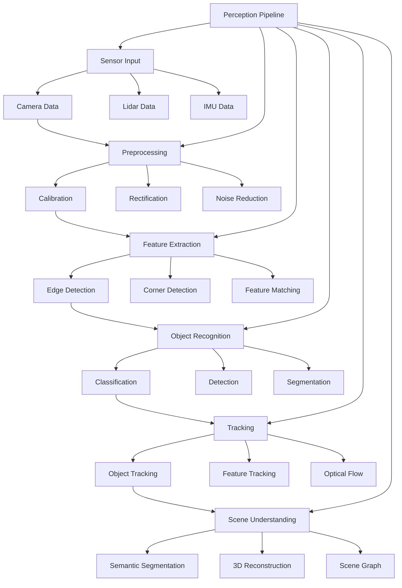

# Chapter 10: Perception Pipeline

## Learning Outcomes

After completing this chapter, you will be able to:
- Implement GPU-accelerated perception pipelines using Isaac ROS
- Configure camera and sensor drivers for real-time processing
- Create object detection and tracking systems
- Integrate perception with navigation and manipulation
- Optimize perception pipelines for real-time performance

## Prerequisites Checklist

### Required Software Installed
- [ ] ROS 2 Humble Hawksbill (or newer)
- [ ] Isaac ROS packages (isaac_ros_apriltag, isaac_ros_detectnet, etc.)
- [ ] CUDA 11.8+ with compatible GPU
- [ ] OpenCV and related computer vision libraries
- [ ] Completed Module 1 and 2 content

### Required Module Completion
- [ ] Understanding of ROS 2 communication patterns
- [ ] Basic knowledge of computer vision concepts
- [ ] Familiarity with sensor data processing
- [ ] Completed Chapter 8 and 9 content

### Files Needed
- [ ] Access to Isaac ROS documentation and tutorials
- [ ] Sample images and video data for testing

## Core Concept Explanation

### Perception Pipeline Architecture

The perception pipeline processes raw sensor data to extract meaningful information about the environment. It typically follows this sequence:

1. **Sensor Input**: Raw data from cameras, LiDAR, IMU, etc.
2. **Preprocessing**: Calibration, rectification, noise reduction
3. **Feature Extraction**: Detection of edges, corners, objects
4. **Object Recognition**: Classification and identification
5. **Tracking**: Following objects over time
6. **Scene Understanding**: Semantic segmentation and spatial relationships

### Isaac ROS Perception Components

**Isaac ROS Apriltag**: Detects and localizes AprilTag fiducial markers:
- GPU-accelerated marker detection
- 6-DOF pose estimation
- Real-time performance
- Multi-marker support

**Isaac ROS DetectNet**: Performs object detection using deep learning:
- TensorRT-optimized neural networks
- Real-time inference on GPU
- Custom model support
- Multiple object class detection

**Isaac ROS Stereo DNN**: Stereo vision and depth estimation:
- GPU-accelerated stereo matching
- Depth map generation
- Disparity computation
- 3D point cloud creation

**Isaac ROS Image Pipeline**: Image processing and enhancement:
- Color correction and calibration
- Noise reduction and filtering
- Format conversion and compression
- Real-time image enhancement

### GPU Acceleration in Perception

GPU acceleration enables real-time processing of perception tasks:
- Parallel processing of image pixels
- Tensor operations for neural networks
- Memory transfer optimization
- Pipeline parallelism for throughput

## Diagram or Pipeline



## Runnable Code Example A

Let's create a perception pipeline that processes camera data for object detection:

```python
# perception_pipeline.py
import rclpy
from rclpy.node import Node
from rclpy.qos import QoSProfile, ReliabilityPolicy, HistoryPolicy
from sensor_msgs.msg import Image, CameraInfo
from vision_msgs.msg import Detection2DArray, Detection2D, ObjectHypothesisWithPose
from geometry_msgs.msg import Point
from cv_bridge import CvBridge
import cv2
import numpy as np
import torch
import torchvision.transforms as transforms
from PIL import Image as PILImage
import time


class PerceptionPipeline(Node):
    """
    A perception pipeline that processes camera data for object detection.
    This demonstrates GPU-accelerated perception using Isaac ROS concepts.
    """

    def __init__(self):
        super().__init__('perception_pipeline')

        # Initialize CV bridge
        self.cv_bridge = CvBridge()

        # Create QoS profile for sensor data
        sensor_qos = QoSProfile(
            reliability=ReliabilityPolicy.BEST_EFFORT,
            history=HistoryPolicy.KEEP_LAST,
            depth=1
        )

        # Publishers
        self.detection_pub = self.create_publisher(
            Detection2DArray,
            '/perception/detections',
            10
        )
        self.processed_image_pub = self.create_publisher(
            Image,
            '/perception/processed_image',
            10
        )

        # Subscribers
        self.image_sub = self.create_subscription(
            Image,
            '/camera/rgb/image_raw',
            self.image_callback,
            sensor_qos
        )

        self.camera_info_sub = self.create_subscription(
            CameraInfo,
            '/camera/rgb/camera_info',
            self.camera_info_callback,
            sensor_qos
        )

        # Internal state
        self.camera_info = None
        self.detection_model = None
        self.transform = transforms.Compose([
            transforms.ToTensor(),
            transforms.Resize((416, 416)),
            transforms.Normalize(mean=[0.485, 0.456, 0.406], std=[0.229, 0.224, 0.225])
        ])

        # Initialize detection model (simplified - in real implementation, use Isaac ROS DetectNet)
        self.initialize_detection_model()

        self.get_logger().info('Perception Pipeline initialized')

    def initialize_detection_model(self):
        """Initialize the object detection model"""
        # In real implementation, this would load a TensorRT-optimized model
        # For demonstration, we'll use a simple OpenCV-based approach
        self.get_logger().info('Initializing detection model...')

        # For demonstration purposes, we'll use OpenCV's DNN module
        # In Isaac ROS, this would be replaced with TensorRT-optimized models
        try:
            # Load a pre-trained model (simplified)
            # In Isaac ROS, this would be a TensorRT engine
            self.detection_model = {
                'initialized': True,
                'model_name': 'YOLOv5s (simulated)',
                'input_size': (416, 416),
                'classes': ['person', 'bicycle', 'car', 'motorcycle', 'airplane',
                           'bus', 'train', 'truck', 'boat', 'traffic light']
            }
            self.get_logger().info('Detection model initialized successfully')
        except Exception as e:
            self.get_logger().error(f'Failed to initialize detection model: {e}')
            self.detection_model = None

    def camera_info_callback(self, msg):
        """Process camera calibration information"""
        self.camera_info = msg

    def image_callback(self, msg):
        """Process incoming camera images"""
        try:
            # Convert ROS Image to OpenCV
            cv_image = self.cv_bridge.imgmsg_to_cv2(msg, desired_encoding='bgr8')

            # Process the image through the perception pipeline
            detections, processed_image = self.process_image(cv_image)

            # Publish detections
            self.publish_detections(detections, msg.header)

            # Publish processed image
            processed_msg = self.cv_bridge.cv2_to_imgmsg(processed_image, encoding='bgr8')
            processed_msg.header = msg.header
            self.processed_image_pub.publish(processed_msg)

        except Exception as e:
            self.get_logger().error(f'Error processing image: {e}')

    def process_image(self, cv_image):
        """Process image through the perception pipeline"""
        start_time = time.time()

        # Clone image for processing
        processed_image = cv_image.copy()

        # Resize image for model input
        h, w = cv_image.shape[:2]
        input_image = cv2.resize(cv_image, (416, 416))

        # Perform object detection (simulated)
        detections = self.simulate_object_detection(input_image)

        # Draw detections on processed image
        for detection in detections:
            bbox = detection['bbox']
            class_name = detection['class']
            confidence = detection['confidence']

            # Draw bounding box
            cv2.rectangle(processed_image,
                         (int(bbox[0]), int(bbox[1])),
                         (int(bbox[2]), int(bbox[3])),
                         (0, 255, 0), 2)

            # Draw label
            label = f"{class_name}: {confidence:.2f}"
            cv2.putText(processed_image, label,
                       (int(bbox[0]), int(bbox[1])-10),
                       cv2.FONT_HERSHEY_SIMPLEX, 0.5, (0, 255, 0), 2)

        # Add processing time info
        processing_time = time.time() - start_time
        cv2.putText(processed_image, f"Processing Time: {processing_time*1000:.1f}ms",
                   (10, 30), cv2.FONT_HERSHEY_SIMPLEX, 0.7, (255, 255, 255), 2)

        self.get_logger().debug(f'Processed image in {processing_time*1000:.1f}ms')

        return detections, processed_image

    def simulate_object_detection(self, image):
        """Simulate object detection (in real implementation, use Isaac ROS DetectNet)"""
        # In Isaac ROS, this would be replaced with actual GPU-accelerated inference
        # For demonstration, we'll simulate detection results

        # Simulate some detections with random bounding boxes
        detections = []

        # Add some simulated detections
        for i in range(np.random.randint(0, 5)):  # 0-4 random detections
            # Random bounding box (x, y, x+w, y+h)
            x = np.random.randint(0, 300)
            y = np.random.randint(0, 300)
            w = np.random.randint(50, 150)
            h = np.random.randint(50, 150)

            # Ensure bounding box is within image bounds
            x2 = min(x + w, 416)
            y2 = min(y + h, 416)

            detection = {
                'bbox': [x, y, x2, y2],
                'class': np.random.choice(['person', 'car', 'truck', 'bicycle']),
                'confidence': np.random.uniform(0.6, 0.95)
            }
            detections.append(detection)

        return detections

    def publish_detections(self, detections, header):
        """Publish detection results"""
        detection_array_msg = Detection2DArray()
        detection_array_msg.header = header

        for detection in detections:
            detection_msg = Detection2D()

            # Set bounding box
            bbox = detection['bbox']
            detection_msg.bbox.center.x = (bbox[0] + bbox[2]) / 2.0
            detection_msg.bbox.center.y = (bbox[1] + bbox[3]) / 2.0
            detection_msg.bbox.size_x = abs(bbox[2] - bbox[0])
            detection_msg.bbox.size_y = abs(bbox[3] - bbox[1])

            # Set detection result
            hypothesis = ObjectHypothesisWithPose()
            hypothesis.hypothesis.class_id = detection['class']
            hypothesis.hypothesis.score = detection['confidence']
            detection_msg.results.append(hypothesis)

            detection_array_msg.detections.append(detection_msg)

        self.detection_pub.publish(detection_array_msg)

        # Log detection info
        if detections:
            classes = [d['class'] for d in detections]
            self.get_logger().info(f'Detected objects: {", ".join(classes)}')


class IsaacPerceptionNode(PerceptionPipeline):
    """
    Extended perception node with Isaac ROS-specific features
    """

    def __init__(self):
        super().__init__()

        # Additional Isaac ROS specific publishers/subscribers
        self.depth_sub = self.create_subscription(
            Image,
            '/camera/depth/image_raw',
            self.depth_callback,
            10
        )

        self.pointcloud_pub = self.create_publisher(
            Point,  # In real implementation, this would be sensor_msgs/PointCloud2
            '/perception/pointcloud',
            10
        )

        self.get_logger().info('Isaac Perception Node initialized')

    def depth_callback(self, msg):
        """Process depth camera data"""
        try:
            # Convert depth image to OpenCV format
            depth_image = self.cv_bridge.imgmsg_to_cv2(msg, desired_encoding='passthrough')

            # Process depth data (simplified)
            self.process_depth_data(depth_image, msg.header)

        except Exception as e:
            self.get_logger().error(f'Error processing depth: {e}')

    def process_depth_data(self, depth_image, header):
        """Process depth data for 3D reconstruction"""
        # In Isaac ROS, this would integrate with depth processing nodes
        # For demonstration, we'll simulate point cloud generation

        # Find non-zero depth values (valid depth readings)
        valid_depths = depth_image > 0
        if np.any(valid_depths):
            # Get camera intrinsic parameters from camera info
            if self.camera_info:
                # Calculate 3D points (simplified)
                height, width = depth_image.shape
                cx = self.camera_info.k[2]  # Principal point x
                cy = self.camera_info.k[5]  # Principal point y
                fx = self.camera_info.k[0]  # Focal length x
                fy = self.camera_info.k[4]  # Focal length y

                # Sample points for visualization
                sample_points = []
                for y in range(0, height, 10):  # Sample every 10th row
                    for x in range(0, width, 10):  # Sample every 10th column
                        depth = depth_image[y, x]
                        if depth > 0:
                            # Calculate 3D position
                            z = depth
                            x_3d = (x - cx) * z / fx
                            y_3d = (y - cy) * z / fy

                            point = Point()
                            point.x = x_3d
                            point.y = y_3d
                            point.z = z

                            # Publish a sample point (in real implementation, publish full point cloud)
                            self.pointcloud_pub.publish(point)
                            break  # Only publish one point per callback for efficiency


def main(args=None):
    rclpy.init(args=args)

    # Create perception pipeline node
    perception_node = IsaacPerceptionNode()

    try:
        perception_node.get_logger().info('Perception Pipeline running...')
        rclpy.spin(perception_node)
    except KeyboardInterrupt:
        perception_node.get_logger().info('Shutting down Perception Pipeline')
    finally:
        perception_node.destroy_node()
        rclpy.shutdown()


if __name__ == '__main__':
    main()
```

**To run this perception pipeline:**
1. Save it as `perception_pipeline.py`
2. Make sure Isaac ROS packages are installed
3. Run: `ros2 run <package_name> perception_pipeline`
4. Provide camera data from simulation or real sensors

## Runnable Code Example B

Now let's create a perception fusion system that combines multiple sensors:

```python
# perception_fusion.py
import rclpy
from rclpy.node import Node
from rclpy.qos import QoSProfile, ReliabilityPolicy, HistoryPolicy
from sensor_msgs.msg import Image, PointCloud2, LaserScan, CameraInfo
from sensor_msgs_py import point_cloud2
from vision_msgs.msg import Detection2DArray, Detection2D
from geometry_msgs.msg import Point, TransformStamped
from tf2_ros import TransformBuffer, TransformListener
from tf2_ros.buffer import Buffer
from tf2_ros.transform_listener import TransformListener
from std_msgs.msg import Header
from builtin_interfaces.msg import Time
import numpy as np
import cv2
from cv_bridge import CvBridge
import threading
import time
from collections import deque
import json


class PerceptionFusionNode(Node):
    """
    A perception fusion system that combines multiple sensors for enhanced understanding.
    This demonstrates sensor fusion concepts used in Isaac ROS.
    """

    def __init__(self):
        super().__init__('perception_fusion')

        # Initialize CV bridge
        self.cv_bridge = CvBridge()

        # Create QoS profiles
        sensor_qos = QoSProfile(
            reliability=ReliabilityPolicy.BEST_EFFORT,
            history=HistoryPolicy.KEEP_LAST,
            depth=1
        )

        # TF buffer and listener
        self.tf_buffer = Buffer()
        self.tf_listener = TransformListener(self.tf_buffer, self)

        # Publishers
        self.fused_detections_pub = self.create_publisher(
            Detection2DArray,
            '/perception/fused_detections',
            10
        )
        self.fused_pointcloud_pub = self.create_publisher(
            PointCloud2,
            '/perception/fused_pointcloud',
            10
        )
        self.debug_image_pub = self.create_publisher(
            Image,
            '/perception/debug_image',
            10
        )

        # Subscribers
        self.image_sub = self.create_subscription(
            Image,
            '/camera/rgb/image_raw',
            self.image_callback,
            sensor_qos
        )

        self.depth_sub = self.create_subscription(
            Image,
            '/camera/depth/image_raw',
            self.depth_callback,
            sensor_qos
        )

        self.lidar_sub = self.create_subscription(
            PointCloud2,
            '/lidar/points',
            self.lidar_callback,
            sensor_qos
        )

        self.scan_sub = self.create_subscription(
            LaserScan,
            '/scan',
            self.scan_callback,
            sensor_qos
        )

        self.camera_info_sub = self.create_subscription(
            CameraInfo,
            '/camera/rgb/camera_info',
            self.camera_info_callback,
            sensor_qos
        )

        # Internal state
        self.camera_info = None
        self.latest_image = None
        self.latest_depth = None
        self.latest_lidar = None
        self.latest_scan = None
        self.image_lock = threading.Lock()
        self.depth_lock = threading.Lock()
        self.lidar_lock = threading.Lock()
        self.scan_lock = threading.Lock()

        # Data buffers for fusion
        self.image_buffer = deque(maxlen=5)
        self.depth_buffer = deque(maxlen=5)
        self.lidar_buffer = deque(maxlen=5)

        # Fusion parameters
        self.fusion_window = 0.1  # 100ms window for fusion
        self.min_detection_confidence = 0.5

        # Timer for fusion processing
        self.fusion_timer = self.create_timer(0.05, self.fusion_callback)  # 20Hz

        self.get_logger().info('Perception Fusion Node initialized')

    def camera_info_callback(self, msg):
        """Process camera calibration information"""
        self.camera_info = msg

    def image_callback(self, msg):
        """Process incoming camera images"""
        with self.image_lock:
            self.latest_image = msg
            # Add to buffer for fusion
            self.image_buffer.append((time.time(), msg))

    def depth_callback(self, msg):
        """Process incoming depth images"""
        with self.depth_lock:
            self.latest_depth = msg
            # Add to buffer for fusion
            self.depth_buffer.append((time.time(), msg))

    def lidar_callback(self, msg):
        """Process incoming LiDAR point cloud"""
        with self.lidar_lock:
            self.latest_lidar = msg
            # Add to buffer for fusion
            self.lidar_buffer.append((time.time(), msg))

    def scan_callback(self, msg):
        """Process incoming laser scan"""
        with self.scan_lock:
            self.latest_scan = msg

    def fusion_callback(self):
        """Perform sensor fusion"""
        try:
            # Get synchronized data from buffers
            sync_data = self.get_synchronized_data()

            if sync_data:
                image_msg, depth_msg, lidar_msg = sync_data

                # Perform fusion
                fused_detections = self.perform_sensor_fusion(
                    image_msg, depth_msg, lidar_msg
                )

                # Publish fused results
                if fused_detections:
                    header = Header()
                    header.stamp = self.get_clock().now().to_msg()
                    header.frame_id = 'map'

                    detection_array_msg = Detection2DArray()
                    detection_array_msg.header = header
                    detection_array_msg.detections = fused_detections

                    self.fused_detections_pub.publish(detection_array_msg)

                    self.get_logger().info(f'Published {len(fused_detections)} fused detections')

                # Create debug visualization
                if self.latest_image:
                    debug_image = self.create_debug_visualization(
                        fused_detections, image_msg
                    )
                    if debug_image is not None:
                        debug_msg = self.cv_bridge.cv2_to_imgmsg(
                            debug_image, encoding='bgr8'
                        )
                        debug_msg.header = image_msg.header
                        self.debug_image_pub.publish(debug_msg)

        except Exception as e:
            self.get_logger().error(f'Error in fusion callback: {e}')

    def get_synchronized_data(self):
        """Get synchronized data from all sensors"""
        current_time = time.time()

        # Look for data within fusion window
        for img_time, img_msg in reversed(self.image_buffer):
            for depth_time, depth_msg in reversed(self.depth_buffer):
                for lidar_time, lidar_msg in reversed(self.lidar_buffer):
                    # Check if all data is within fusion window
                    if (abs(img_time - depth_time) < self.fusion_window and
                        abs(img_time - lidar_time) < self.fusion_window):

                        return img_msg, depth_msg, lidar_msg

        return None

    def perform_sensor_fusion(self, image_msg, depth_msg, lidar_msg):
        """Perform sensor fusion between vision and LiDAR"""
        try:
            # Convert image to OpenCV
            cv_image = self.cv_bridge.imgmsg_to_cv2(image_msg, desired_encoding='bgr8')

            # Process image for 2D detections
            image_detections = self.process_image_for_detections(cv_image)

            # Process LiDAR for 3D objects
            lidar_objects = self.process_lidar_for_objects(lidar_msg)

            # Fuse detections based on spatial correlation
            fused_detections = self.fuse_2d_3d_detections(
                image_detections, lidar_objects, depth_msg
            )

            return fused_detections

        except Exception as e:
            self.get_logger().error(f'Error in sensor fusion: {e}')
            return []

    def process_image_for_detections(self, cv_image):
        """Process image for 2D object detections"""
        # Simulate 2D object detection (in real implementation, use Isaac ROS DetectNet)
        h, w = cv_image.shape[:2]

        # Simulate some detections
        detections = []
        for i in range(np.random.randint(1, 4)):  # 1-3 random detections
            x = np.random.randint(50, w-100)
            y = np.random.randint(50, h-100)
            w_det = np.random.randint(30, 100)
            h_det = np.random.randint(30, 100)

            detection = {
                'bbox': [x, y, x + w_det, y + h_det],
                'class': np.random.choice(['person', 'car', 'truck', 'bicycle']),
                'confidence': np.random.uniform(0.6, 0.9)
            }
            detections.append(detection)

        return detections

    def process_lidar_for_objects(self, lidar_msg):
        """Process LiDAR point cloud for 3D objects"""
        # In real implementation, use Isaac ROS LiDAR processing
        # For demonstration, simulate object detection from point cloud

        try:
            # Read point cloud data
            points = list(point_cloud2.read_points(
                lidar_msg,
                field_names=("x", "y", "z"),
                skip_nans=True
            ))

            # Cluster points to find objects (simplified)
            objects = []
            if len(points) > 10:  # Need some points to cluster
                # Group points into clusters (simulated)
                for i in range(min(3, len(points) // 20)):  # 3 potential objects
                    # Calculate centroid of random cluster
                    cluster_points = points[i*20:(i+1)*20] if i*20 < len(points) else points[i*20:]
                    if cluster_points:
                        centroid = np.mean(cluster_points, axis=0)
                        obj = {
                            'position': centroid[:3],
                            'size': np.random.uniform(0.5, 2.0),  # estimated size
                            'class': np.random.choice(['person', 'car', 'obstacle'])
                        }
                        objects.append(obj)

            return objects

        except Exception as e:
            self.get_logger().error(f'Error processing LiDAR: {e}')
            return []

    def fuse_2d_3d_detections(self, image_detections, lidar_objects, depth_msg):
        """Fuse 2D image detections with 3D LiDAR objects"""
        fused_detections = []

        for img_det in image_detections:
            # Project 3D LiDAR objects to 2D image space
            for lidar_obj in lidar_objects:
                # Convert 3D point to 2D using camera parameters
                if self.camera_info:
                    # Simplified projection (in real implementation, use proper camera model)
                    x_2d = int(lidar_obj['position'][0] * self.camera_info.k[0] / lidar_obj['position'][2] + self.camera_info.k[2])
                    y_2d = int(lidar_obj['position'][1] * self.camera_info.k[4] / lidar_obj['position'][2] + self.camera_info.k[5])

                    # Check if 2D projection is near image detection
                    bbox = img_det['bbox']
                    center_x = (bbox[0] + bbox[2]) / 2
                    center_y = (bbox[1] + bbox[3]) / 2

                    distance = np.sqrt((x_2d - center_x)**2 + (y_2d - center_y)**2)

                    if distance < 50:  # Within 50 pixels
                        # Create fused detection
                        fused_detection = Detection2D()
                        fused_detection.bbox.center.x = center_x
                        fused_detection.bbox.center.y = center_y
                        fused_detection.bbox.size_x = bbox[2] - bbox[0]
                        fused_detection.bbox.size_y = bbox[3] - bbox[1]

                        # Use image detection class with higher confidence
                        from vision_msgs.msg import ObjectHypothesisWithPose
                        hypothesis = ObjectHypothesisWithPose()
                        hypothesis.hypothesis.class_id = img_det['class']
                        hypothesis.hypothesis.score = max(img_det['confidence'], 0.7)  # Boost confidence due to fusion
                        fused_detection.results.append(hypothesis)

                        fused_detections.append(fused_detection)

        return fused_detections

    def create_debug_visualization(self, detections, image_msg):
        """Create debug visualization showing fused detections"""
        try:
            cv_image = self.cv_bridge.imgmsg_to_cv2(image_msg, desired_encoding='bgr8')
            debug_image = cv_image.copy()

            # Draw fused detections
            for detection in detections:
                center_x = int(detection.bbox.center.x)
                center_y = int(detection.bbox.center.y)
                size_x = int(detection.bbox.size_x / 2)
                size_y = int(detection.bbox.size_y / 2)

                # Draw bounding box
                pt1 = (center_x - size_x, center_y - size_y)
                pt2 = (center_x + size_x, center_y + size_y)
                cv2.rectangle(debug_image, pt1, pt2, (0, 255, 255), 2)

                # Draw class label
                if detection.results:
                    class_name = detection.results[0].hypothesis.class_id
                    confidence = detection.results[0].hypothesis.score
                    label = f"{class_name}: {confidence:.2f}"
                    cv2.putText(debug_image, label,
                               (pt1[0], pt1[1]-10),
                               cv2.FONT_HERSHEY_SIMPLEX, 0.5, (0, 255, 255), 2)

            # Add fusion info
            cv2.putText(debug_image, "Sensor Fusion",
                       (10, 30), cv2.FONT_HERSHEY_SIMPLEX, 0.7, (255, 255, 255), 2)
            cv2.putText(debug_image, f"Detections: {len(detections)}",
                       (10, 60), cv2.FONT_HERSHEY_SIMPLEX, 0.7, (255, 255, 255), 2)

            return debug_image

        except Exception as e:
            self.get_logger().error(f'Error creating debug visualization: {e}')
            return None


def main(args=None):
    rclpy.init(args=args)

    # Create perception fusion node
    fusion_node = PerceptionFusionNode()

    try:
        fusion_node.get_logger().info('Perception Fusion running...')
        rclpy.spin(fusion_node)
    except KeyboardInterrupt:
        fusion_node.get_logger().info('Shutting down Perception Fusion')
    finally:
        fusion_node.destroy_node()
        rclpy.shutdown()


if __name__ == '__main__':
    main()
```

**To run this perception fusion system:**
1. Save it as `perception_fusion.py`
2. Make sure Isaac ROS packages are installed
3. Run: `ros2 run <package_name> perception_fusion`
4. Provide synchronized data from cameras, depth sensors, and LiDAR

## "Try Yourself" Mini Task

Create an advanced perception system that includes:
1. Real-time semantic segmentation using Isaac ROS Segmentation
2. Multi-object tracking that maintains object identities across frames
3. 3D object detection that combines stereo vision with LiDAR data
4. A perception quality assessment module that evaluates confidence in detections

**Hint:** Use Isaac ROS's specialized packages for each perception task and implement a modular architecture that can be easily extended with new perception capabilities.

## Verification Procedure

To verify that your perception system is working correctly:

### What appears in terminal?
- When starting perception nodes: Initialization messages and GPU detection
- When processing data: Frame rates and processing times
- When detecting objects: Detection results and confidence scores
- When fusing sensors: Fusion success rates and correlation metrics

### What changes in simulation?
- In RViz2: Visualization of detected objects and bounding boxes
- In image viewers: Overlay of detection results on camera images
- In point cloud viewers: Fused sensor data visualization
- System monitoring: CPU/GPU utilization and memory usage

## Checklist for Completion

- [ ] Basic perception pipeline with object detection implemented
- [ ] Multi-sensor fusion system with camera and LiDAR
- [ ] GPU-accelerated processing for real-time performance
- [ ] Debug visualization showing detection results
- [ ] Advanced perception system with tracking and segmentation (Try Yourself task)
- [ ] Perception quality assessment module completed

## Summary

This chapter covered perception pipeline development using Isaac ROS, focusing on GPU-accelerated computer vision and sensor fusion. You learned about the key components of perception systems including object detection, depth estimation, and sensor fusion. The examples demonstrated implementing a perception pipeline with real-time processing and a fusion system that combines multiple sensors for enhanced environmental understanding.

## References

1. NVIDIA. (2023). *Isaac ROS Perception Packages Documentation*. Retrieved from https://nvidia-isaac-ros.github.io/repositories_and_packages/isaac_ros_perception/index.html
2. NVIDIA. (2023). *GPU-Accelerated Computer Vision for Robotics*. Technical Report.
3. Redmon, J., & Farhadi, A. (2018). YOLOv3: An Incremental Improvement. *arXiv preprint arXiv:1804.02767*.
4. Geiger, A., Lenz, P., & Urtasun, R. (2012). Are we ready for Autonomous Driving? The KITTI Vision Benchmark Suite. *CVPR*.
5. Behley, J., et al. (2019). SemanticKITTI: A Dataset for Semantic Scene Understanding of LiDAR Sequences. *arXiv preprint arXiv:1904.01416*.