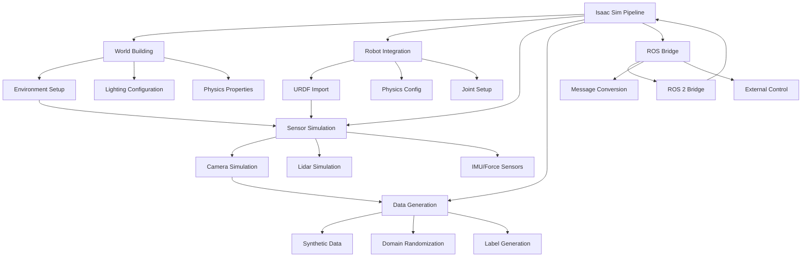

# Chapter 8: Isaac Simulation Pipeline

## Learning Outcomes

After completing this chapter, you will be able to:
- Set up NVIDIA Isaac Sim with proper GPU acceleration
- Create complex simulation environments with realistic lighting
- Configure physics properties for accurate robot behavior
- Integrate perception sensors with Isaac extensions
- Generate synthetic training data for AI models

## Prerequisites Checklist

### Required Software Installed
- [ ] NVIDIA Isaac Sim (2023.1.1 or newer)
- [ ] CUDA 11.8+ with compatible GPU
- [ ] Isaac ROS packages (isaac_ros_apriltag, isaac_ros_detectnet, etc.)
- [ ] Omniverse Kit and extensions
- [ ] Completed Module 1 and 2 content

### Required Module Completion
- [ ] Understanding of ROS 2 and simulation concepts
- [ ] Basic knowledge of GPU computing and CUDA
- [ ] Familiarity with computer vision sensors
- [ ] Completed Chapter 5-7 content

### Files Needed
- [ ] Completed robot model from Module 1
- [ ] Access to Isaac Sim documentation and tutorials

## Core Concept Explanation

### What is NVIDIA Isaac Sim?

NVIDIA Isaac Sim is a GPU-accelerated robotics simulator built on NVIDIA's Omniverse platform. It provides high-fidelity simulation capabilities with accurate physics, rendering, and sensor simulation that closely matches real-world behavior. Isaac Sim is designed for developing and testing AI algorithms for robotics applications.

### Key Isaac Sim Components

**Omniverse Extensions**: Modular components that extend Isaac Sim functionality:
- Isaac Sim Sensors: Realistic sensor simulation with noise models
- Isaac Sim Robotics: Robot-specific extensions and utilities
- Isaac Sim Assets: High-quality robot and environment models
- Isaac Sim Navigation: Navigation-specific tools and assets

**GPU Acceleration**: Isaac Sim leverages NVIDIA GPUs for:
- Real-time ray tracing and rendering
- Parallel physics simulation
- Sensor processing acceleration
- AI inference acceleration

**Synthetic Data Generation**: Isaac Sim enables:
- Labeled training data generation
- Domain randomization techniques
- Photorealistic environment simulation
- Multi-modal sensor data synthesis

### Isaac Sim Pipeline Architecture

Isaac Sim follows a component-based architecture where different extensions work together:

- **World Building**: Creating and configuring simulation environments
- **Robot Integration**: Adding robots with proper physics and sensors
- **Sensor Simulation**: Configuring realistic sensor models
- **Data Generation**: Producing training datasets for AI models
- **ROS Bridge**: Connecting to external ROS systems

## Diagram or Pipeline



## Runnable Code Example A

Let's create a Python script that sets up Isaac Sim with a robot and sensors:

```python
# isaac_sim_setup.py
import omni
from pxr import Usd, UsdGeom, Gf
import carb
import omni.usd
import omni.kit.commands
from omni.isaac.core import World
from omni.isaac.core.robots import Robot
from omni.isaac.core.utils.nucleus import get_assets_root_path
from omni.isaac.core.utils.stage import add_reference_to_stage
from omni.isaac.core.utils.viewports import set_camera_view
from omni.isaac.sensor import Camera
import numpy as np

class IsaacSimEnvironment:
    """
    A class to set up and manage Isaac Sim environments with robots and sensors.
    """

    def __init__(self):
        self.world = None
        self.robot = None
        self.cameras = []

    def setup_world(self):
        """Initialize the Isaac Sim world"""
        self.world = World(stage_units_in_meters=1.0)

        # Set up default lighting
        omni.kit.commands.execute("CreateLightCommand",
                                 light_type_name="DistantLight",
                                 position=Gf.Vec3f(0, 0, 10),
                                 look_at=Gf.Vec3f(0, 0, 0))

        # Add ground plane
        omni.kit.commands.execute("AddXformCommand",
                                 stage=self.world.stage,
                                 xform_name="ground_plane",
                                 select_new_prim=True)

        # Set up camera view
        set_camera_view(eye=Gf.Vec3f(5, 5, 3),
                       target=Gf.Vec3f(0, 0, 0))

        print("Isaac Sim world initialized")

    def add_robot(self, robot_path, position=(0, 0, 0)):
        """Add a robot to the simulation"""
        try:
            # Add robot from USD file
            robot_prim_path = "/World/Robot"
            add_reference_to_stage(
                usd_path=robot_path,
                prim_path=robot_prim_path
            )

            # Create robot object
            self.robot = Robot(
                prim_path=robot_prim_path,
                name="isaac_robot",
                position=position,
                orientation=[0, 0, 0, 1]
            )

            # Add robot to world
            self.world.scene.add(self.robot)

            print(f"Robot added from {robot_path}")
            return True

        except Exception as e:
            print(f"Error adding robot: {e}")
            return False

    def add_camera(self, name, position, parent="/World/Robot"):
        """Add a camera sensor to the robot"""
        try:
            camera_path = f"{parent}/{name}"

            # Create camera prim
            camera_prim = omni.kit.commands.execute(
                "CreatePrimWithDefaultXform",
                prim_type="Camera",
                prim_path=camera_path
            )

            # Set camera properties
            camera = Camera(
                prim_path=camera_path,
                frequency=30,
                resolution=(640, 480)
            )

            # Set camera position
            import omni.kit.commands
            omni.kit.commands.execute(
                "TransformMultiPrimsSRTCommand",
                count=1,
                paths=[camera_path],
                new_transform_matrix=Gf.Matrix4d().SetTranslate(Gf.Vec3d(*position))
            )

            self.cameras.append(camera)
            print(f"Camera {name} added at {position}")
            return camera

        except Exception as e:
            print(f"Error adding camera: {e}")
            return None

    def add_lidar(self, name, parent="/World/Robot"):
        """Add a LIDAR sensor to the robot"""
        try:
            lidar_path = f"{parent}/{name}"

            # Create LIDAR prim
            omni.kit.commands.execute(
                "CreatePrimWithDefaultXform",
                prim_type="RotatingLidarSensor",
                prim_path=lidar_path
            )

            print(f"LIDAR {name} added")
            # Note: In real implementation, you'd use the actual Isaac Sim LIDAR

        except Exception as e:
            print(f"Error adding LIDAR: {e}")

    def run_simulation(self, steps=1000):
        """Run the simulation for a specified number of steps"""
        print(f"Running simulation for {steps} steps...")

        for i in range(steps):
            self.world.step(render=True)

            if i % 100 == 0:
                print(f"Step {i}/{steps}")

                # Example: Get camera data
                if self.cameras:
                    camera = self.cameras[0]
                    # In real implementation, capture image data
                    print(f"Camera frame captured at step {i}")

        print("Simulation completed")

    def cleanup(self):
        """Clean up the simulation environment"""
        if self.world:
            self.world.clear()
        print("Isaac Sim environment cleaned up")


def main():
    # Initialize simulation
    sim_env = IsaacSimEnvironment()
    sim_env.setup_world()

    # Add robot (replace with actual robot USD path)
    # robot_path = "path/to/robot.usd"  # This would be your robot model
    # sim_env.add_robot(robot_path, position=(0, 0, 0.5))

    # For demonstration, we'll just show the structure
    print("Isaac Sim environment structure ready")

    # Add sensors to robot
    sim_env.add_camera("front_camera", position=(0.3, 0, 0.1))
    sim_env.add_camera("left_camera", position=(0, 0.2, 0.1))
    sim_env.add_camera("right_camera", position=(0, -0.2, 0.1))
    sim_env.add_lidar("front_lidar")

    # Run simulation (short for demonstration)
    sim_env.run_simulation(steps=100)

    # Clean up
    sim_env.cleanup()


if __name__ == "__main__":
    main()
```

**To run this simulation setup:**
1. Save it as `isaac_sim_setup.py`
2. Make sure Isaac Sim is properly installed with Omniverse
3. Replace the robot path with your actual robot USD model
4. Run in Isaac Sim's Python environment

## Runnable Code Example B

Now let's create a script for generating synthetic training data with domain randomization:

```python
# synthetic_data_generator.py
import numpy as np
import random
import os
from PIL import Image
import json
import cv2
from omni.isaac.core import World
from omni.isaac.core.robots import Robot
from omni.isaac.sensor import Camera
import omni.kit.commands
from pxr import Usd, Gf

class SyntheticDataGenerator:
    """
    A class for generating synthetic training data using Isaac Sim
    with domain randomization techniques.
    """

    def __init__(self, output_dir="synthetic_data"):
        self.output_dir = output_dir
        self.world = None
        self.cameras = []
        self.objects = []

        # Create output directory
        os.makedirs(output_dir, exist_ok=True)
        os.makedirs(f"{output_dir}/images", exist_ok=True)
        os.makedirs(f"{output_dir}/labels", exist_ok=True)
        os.makedirs(f"{output_dir}/masks", exist_ok=True)

    def setup_environment(self):
        """Set up the basic environment with domain randomization"""
        self.world = World(stage_units_in_meters=1.0)

        # Randomize environment properties
        self.randomize_lighting()
        self.randomize_environment()

        print("Synthetic data environment initialized")

    def randomize_lighting(self):
        """Randomize lighting conditions for domain randomization"""
        # Randomize sun light
        sun_intensity = random.uniform(500, 2000)
        sun_color = [
            random.uniform(0.8, 1.0),  # R
            random.uniform(0.8, 1.0),  # G
            random.uniform(0.8, 1.0)   # B
        ]

        # Create random light direction
        azimuth = random.uniform(0, 2*np.pi)
        elevation = random.uniform(0.2, 0.8)

        light_pos = [
            10 * np.cos(azimuth) * np.cos(elevation),
            10 * np.sin(azimuth) * np.cos(elevation),
            10 * np.sin(elevation)
        ]

        print(f"Lighting randomized: intensity={sun_intensity}, position={light_pos}")

    def randomize_environment(self):
        """Randomize environmental conditions"""
        # Randomize textures and materials
        self.randomize_floor_materials()
        self.randomize_background_objects()

    def randomize_floor_materials(self):
        """Randomize floor materials for domain randomization"""
        materials = [
            "concrete", "wood", "tile", "carpet", "grass", "metal"
        ]
        selected_material = random.choice(materials)
        print(f"Floor material randomized to: {selected_material}")

    def randomize_background_objects(self):
        """Add randomized background objects"""
        num_objects = random.randint(5, 15)

        for i in range(num_objects):
            # Random position and rotation
            x = random.uniform(-5, 5)
            y = random.uniform(-5, 5)
            z = random.uniform(0, 1)

            # Random object type
            obj_types = ["box", "cylinder", "sphere", "cone"]
            obj_type = random.choice(obj_types)

            print(f"Added {obj_type} at ({x:.2f}, {y:.2f}, {z:.2f})")

        print(f"Added {num_objects} background objects")

    def capture_image_data(self, camera, step_num):
        """Capture image and generate synthetic labels"""
        try:
            # In real Isaac Sim, you would capture the actual image
            # For this example, we'll simulate the data generation

            # Generate a random image for demonstration
            height, width = 640, 480
            image = np.random.randint(0, 255, (height, width, 3), dtype=np.uint8)

            # Simulate object detection labels
            num_objects = random.randint(1, 5)
            labels = []

            for i in range(num_objects):
                # Random bounding box
                x1 = random.randint(0, width - 50)
                y1 = random.randint(0, height - 50)
                w = random.randint(20, 100)
                h = random.randint(20, 100)
                x2 = min(x1 + w, width)
                y2 = min(y1 + h, height)

                # Random class
                classes = ["robot", "person", "box", "table", "chair"]
                class_name = random.choice(classes)

                label = {
                    "class": class_name,
                    "bbox": [x1, y1, x2, y2],
                    "confidence": 1.0
                }
                labels.append(label)

            # Save image
            img_path = f"{self.output_dir}/images/img_{step_num:06d}.png"
            cv2.imwrite(img_path, cv2.cvtColor(image, cv2.COLOR_RGB2BGR))

            # Save labels
            label_path = f"{self.output_dir}/labels/labels_{step_num:06d}.json"
            with open(label_path, 'w') as f:
                json.dump({
                    "image_path": img_path,
                    "labels": labels,
                    "metadata": {
                        "lighting_condition": "randomized",
                        "background_objects": len([o for o in range(random.randint(5, 15))]),
                        "domain_randomization": True
                    }
                }, f, indent=2)

            return True

        except Exception as e:
            print(f"Error capturing image data: {e}")
            return False

    def generate_training_data(self, num_samples=1000):
        """Generate synthetic training data with domain randomization"""
        print(f"Generating {num_samples} synthetic training samples...")

        successful_captures = 0

        for i in range(num_samples):
            # Randomize environment for each sample
            if i % 10 == 0:  # Every 10 samples
                self.randomize_environment()

            # Capture image data
            if self.capture_image_data(None, i):
                successful_captures += 1

            # Progress indicator
            if i % 100 == 0:
                print(f"Progress: {i}/{num_samples} samples generated")

        print(f"Completed! Generated {successful_captures} successful samples out of {num_samples}")

        # Create dataset info file
        dataset_info = {
            "total_samples": num_samples,
            "successful_samples": successful_captures,
            "image_size": [640, 480],
            "classes": ["robot", "person", "box", "table", "chair"],
            "domain_randomization": True,
            "synthetic_data": True
        }

        with open(f"{self.output_dir}/dataset_info.json", 'w') as f:
            json.dump(dataset_info, f, indent=2)

        print(f"Dataset info saved to {self.output_dir}/dataset_info.json")

    def add_object_detection_task(self, object_types, detection_config):
        """Set up object detection in the simulation environment"""
        print(f"Setting up object detection for: {object_types}")
        print(f"Detection config: {detection_config}")

        # In real implementation, this would configure Isaac ROS detection nodes
        # and connect them to the simulation sensors

    def cleanup(self):
        """Clean up resources"""
        if self.world:
            self.world.clear()
        print("Synthetic data generator cleaned up")


def main():
    # Initialize synthetic data generator
    data_gen = SyntheticDataGenerator(output_dir="synthetic_training_data")
    data_gen.setup_environment()

    # Add object detection configuration
    object_types = ["robot", "person", "box", "table", "chair"]
    detection_config = {
        "confidence_threshold": 0.5,
        "max_objects": 10,
        "image_topic": "/camera/rgb/image_raw"
    }

    data_gen.add_object_detection_task(object_types, detection_config)

    # Generate synthetic training data
    data_gen.generate_training_data(num_samples=500)  # Reduced for demonstration

    # Clean up
    data_gen.cleanup()

    print("\nSynthetic data generation completed!")
    print("Generated files:")
    print("- Images saved in synthetic_training_data/images/")
    print("- Labels saved in synthetic_training_data/labels/")
    print("- Dataset info in synthetic_training_data/dataset_info.json")


if __name__ == "__main__":
    main()
```

**To run this data generation:**
1. Save it as `synthetic_data_generator.py`
2. Make sure Isaac Sim is properly configured
3. Run to generate synthetic training data with domain randomization
4. The script will create a dataset suitable for training AI models

## "Try Yourself" Mini Task

Create a complete Isaac Sim scene that includes:
1. A complex environment with multiple rooms and obstacles
2. A robot with multiple sensors (RGB camera, depth camera, IMU)
3. Dynamic objects that move during simulation
4. Data capture pipeline that saves sensor data in ROS bag format

**Hint:** Use Isaac Sim's extension system to add multiple sensors to your robot and implement a data recording pipeline that captures synchronized sensor data.

## Verification Procedure

To verify that your Isaac Sim setup is working correctly:

### What appears in terminal?
- When starting Isaac Sim: Proper initialization messages and GPU detection
- When loading robot models: Model loading confirmation and physics setup
- When capturing data: Progress indicators and data statistics
- When running simulation: Frame rate and timing information

### What changes in simulation?
- The 3D environment renders with realistic lighting and physics
- Robot responds properly to physics simulation
- Sensors generate realistic data streams
- Domain randomization visibly changes scene properties
- Data capture pipeline produces labeled datasets

## Checklist for Completion

- [ ] Isaac Sim environment properly configured with GPU acceleration
- [ ] Robot model successfully integrated with sensors
- [ ] Domain randomization techniques implemented
- [ ] Synthetic data generation pipeline working
- [ ] Complete scene with dynamic objects (Try Yourself task)
- [ ] Data capture pipeline producing ROS bag files

## Summary

This chapter introduced the NVIDIA Isaac Sim platform for creating advanced robotics simulation environments. You learned about the key components of Isaac Sim, including its GPU-accelerated rendering, sensor simulation capabilities, and synthetic data generation features. The examples demonstrated setting up simulation environments with domain randomization and creating synthetic training datasets for AI models.

## References

1. NVIDIA. (2023). *NVIDIA Isaac Sim User Guide*. Retrieved from https://docs.omniverse.nvidia.com/isaacsim/latest/overview.html
2. NVIDIA. (2023). *Isaac Extensions for Robotics Simulation*. Technical Report.
3. Tobin, J., Fong, R., Ray, A., Schneider, J., Zaremba, W., & Abbeel, P. (2017). Domain randomization for transferring deep neural networks from simulation to the real world. *2017 IEEE/RSJ International Conference on Intelligent Robots and Systems (IROS)*, 23-30.
4. NVIDIA. (2023). *Omniverse Platform Architecture for Robotics Simulation*. White Paper.
5. James, S., Freese, M., & Murai, A. (2019). PyRobot: An open-source robotics research platform. *arXiv preprint arXiv:1906.08825*.