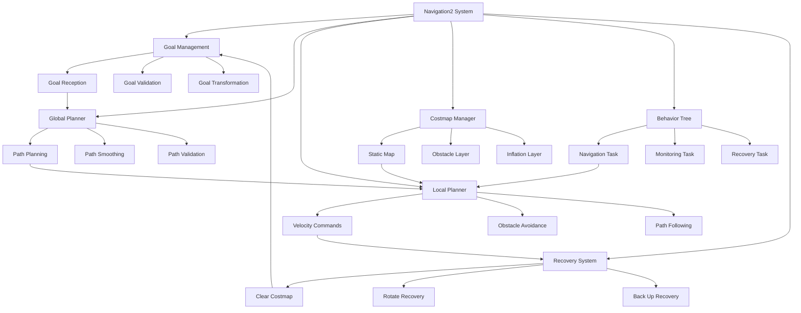

# Chapter 9: Autonomous Navigation

## Learning Outcomes

After completing this chapter, you will be able to:
- Configure and tune Navigation2 (Nav2) for mobile robots
- Implement global and local path planning algorithms
- Set up costmap layers for obstacle avoidance
- Create behavior trees for navigation recovery
- Integrate navigation with perception systems

## Prerequisites Checklist

### Required Software Installed
- [ ] ROS 2 Humble Hawksbill (or newer)
- [ ] Navigation2 (Nav2) packages
- [ ] Isaac ROS navigation extensions
- [ ] RViz2 for visualization
- [ ] Completed Module 1 and 2 content

### Required Module Completion
- [ ] Understanding of ROS 2 communication patterns
- [ ] Basic knowledge of path planning algorithms
- [ ] Familiarity with TF transforms
- [ ] Completed Chapter 8 content

### Files Needed
- [ ] Completed robot model with proper transforms
- [ ] Access to Nav2 documentation and tutorials

## Core Concept Explanation

### Navigation2 (Nav2) Architecture

Navigation2 is the navigation stack for ROS 2 that provides path planning, obstacle avoidance, and motion control capabilities. It's built on a behavior tree architecture that allows for complex navigation behaviors and recovery actions.

### Key Navigation Components

**Global Planner**: Computes optimal paths from start to goal:
- A* algorithm for grid-based planning
- Dijkstra's algorithm for weighted graphs
- RRT (Rapidly-exploring Random Tree) for complex environments
- Custom plugins for specialized planning

**Local Planner**: Executes short-term motion while avoiding obstacles:
- DWA (Dynamic Window Approach)
- TEB (Timed Elastic Band)
- MPC (Model Predictive Control)
- Trajectory rollout algorithms

**Costmap Management**: Maintains environment representation:
- Static map layer (known obstacles)
- Obstacle layer (sensor-based obstacles)
- Inflation layer (safety margins)
- Voxel layer (3D obstacle representation)

**Behavior Trees**: Organize navigation logic and recovery:
- Sequential execution of navigation tasks
- Conditional branches for different scenarios
- Recovery behaviors for failed actions
- Parallel execution of monitoring tasks

### Navigation Pipeline Flow

The navigation system follows this pipeline:
1. **Goal Reception**: Accept navigation goal from client
2. **Global Planning**: Compute path to goal
3. **Local Planning**: Execute path with obstacle avoidance
4. **Motion Control**: Send velocity commands to robot
5. **Monitoring**: Track progress and detect failures
6. **Recovery**: Execute recovery behaviors if needed

## Diagram or Pipeline



## Runnable Code Example A

Let's create a navigation server that implements Nav2 with custom configurations:

```python
# nav2_server.py
import rclpy
from rclpy.node import Node
from rclpy.action import ActionServer, CancelResponse, GoalResponse
from rclpy.callback_groups import ReentrantCallbackGroup
from rclpy.executors import MultiThreadedExecutor
from rclpy.qos import QoSProfile

from geometry_msgs.msg import PoseStamped, Point
from nav_msgs.msg import Path
from sensor_msgs.msg import LaserScan
from tf2_ros import TransformException
from tf2_ros.buffer import Buffer
from tf2_ros.transform_listener import TransformListener

from nav2_msgs.action import NavigateToPose
from nav2_msgs.srv import LoadMap, ClearEntireCostmap

import math
import time
from typing import Optional


class Nav2Server(Node):
    """
    A custom navigation server implementing Nav2 functionality.
    This demonstrates the core components of autonomous navigation.
    """

    def __init__(self):
        super().__init__('nav2_server')

        # Initialize TF buffer and listener
        self.tf_buffer = Buffer()
        self.tf_listener = TransformListener(self.tf_buffer, self)

        # Publishers
        self.path_pub = self.create_publisher(Path, '/plan', 10)
        self.cmd_vel_pub = self.create_publisher(PoseStamped, '/goal_pose', 10)

        # Subscribers
        self.scan_sub = self.create_subscription(
            LaserScan,
            '/scan',
            self.scan_callback,
            10
        )

        # Action server for navigation
        self.nav_action_server = ActionServer(
            self,
            NavigateToPose,
            'navigate_to_pose',
            execute_callback=self.execute_navigate_to_pose,
            callback_group=ReentrantCallbackGroup(),
            goal_callback=self.goal_callback,
            cancel_callback=self.cancel_callback
        )

        # Service clients for costmap management
        self.clear_costmap_client = self.create_client(
            ClearEntireCostmap,
            'global_costmap/clear_entirely_global_costmap'
        )
        self.clear_local_costmap_client = self.create_client(
            ClearEntireCostmap,
            'local_costmap/clear_entirely_local_costmap'
        )

        # Internal state
        self.current_pose = None
        self.current_goal = None
        self.is_navigating = False
        self.obstacle_detected = False

        self.get_logger().info('Nav2 Server initialized')

    def scan_callback(self, msg):
        """Process laser scan data for obstacle detection"""
        # Check for obstacles in front of robot (simplified)
        front_scan = msg.ranges[140:220]  # Front 80-degree field
        front_scan = [d for d in front_scan if d > 0 and d < 10.0]  # Filter valid readings

        if front_scan:
            min_distance = min(front_scan)
            self.obstacle_detected = min_distance < 0.5  # 0.5m threshold

    def goal_callback(self, goal_request):
        """Handle incoming navigation goals"""
        self.get_logger().info(f'Received navigation goal: {goal_request.pose.pose}')

        # Validate goal
        if self.validate_goal(goal_request.pose):
            return GoalResponse.ACCEPT
        else:
            return GoalResponse.REJECT

    def cancel_callback(self, goal_handle):
        """Handle goal cancellation"""
        self.get_logger().info('Navigation goal cancelled')
        return CancelResponse.ACCEPT

    def validate_goal(self, goal_pose):
        """Validate navigation goal"""
        # In real implementation, check if goal is reachable
        # For now, accept all goals
        return True

    async def execute_navigate_to_pose(self, goal_handle):
        """Execute navigation to pose goal"""
        self.get_logger().info('Executing navigation goal')

        goal_pose = goal_handle.request.pose
        feedback_msg = NavigateToPose.Feedback()
        result = NavigateToPose.Result()

        # Store current goal
        self.current_goal = goal_pose
        self.is_navigating = True

        try:
            # Get current robot pose
            current_pose = await self.get_robot_pose()
            if not current_pose:
                self.get_logger().error('Could not get robot pose')
                goal_handle.abort()
                result.error_code = result.ERROR
                return result

            # Plan path to goal (simplified - in real implementation, use proper planner)
            path = self.plan_path(current_pose, goal_pose)
            if not path:
                self.get_logger().error('Could not plan path to goal')
                goal_handle.abort()
                result.error_code = result.ERROR
                return result

            # Publish path for visualization
            path_msg = self.create_path_message(path)
            self.path_pub.publish(path_msg)

            # Execute navigation
            success = await self.follow_path(path, goal_pose, feedback_msg, goal_handle)

            if success:
                self.get_logger().info('Navigation completed successfully')
                goal_handle.succeed()
                result.error_code = result.SUCCESS
            else:
                self.get_logger().error('Navigation failed')
                goal_handle.abort()
                result.error_code = result.ERROR

        except Exception as e:
            self.get_logger().error(f'Navigation execution error: {e}')
            goal_handle.abort()
            result.error_code = result.ERROR

        finally:
            self.is_navigating = False
            self.current_goal = None

        return result

    async def get_robot_pose(self):
        """Get current robot pose from TF"""
        try:
            transform = self.tf_buffer.lookup_transform(
                'map', 'base_link', rclpy.time.Time()
            )
            pose = PoseStamped()
            pose.header.frame_id = 'map'
            pose.pose.position.x = transform.transform.translation.x
            pose.pose.position.y = transform.transform.translation.y
            pose.pose.position.z = transform.transform.translation.z
            pose.pose.orientation = transform.transform.rotation
            return pose
        except TransformException as ex:
            self.get_logger().error(f'Could not get robot pose: {ex}')
            return None

    def plan_path(self, start_pose, goal_pose):
        """Plan path from start to goal (simplified implementation)"""
        # This is a simplified path planner - in real implementation,
        # use proper path planning algorithms like A*, Dijkstra, etc.

        path = []

        # Calculate path points (linear interpolation for demonstration)
        start_x = start_pose.pose.position.x
        start_y = start_pose.pose.position.y
        goal_x = goal_pose.pose.position.x
        goal_y = goal_pose.pose.position.y

        # Simple linear path (in real implementation, use proper path planner)
        steps = 50  # Number of path points
        for i in range(steps + 1):
            t = i / steps
            x = start_x + t * (goal_x - start_x)
            y = start_y + t * (goal_y - start_y)

            point = Point()
            point.x = x
            point.y = y
            point.z = 0.0
            path.append(point)

        return path

    def create_path_message(self, path_points):
        """Create Path message from path points"""
        path_msg = Path()
        path_msg.header.frame_id = 'map'
        path_msg.header.stamp = self.get_clock().now().to_msg()

        for point in path_points:
            pose = PoseStamped()
            pose.header.frame_id = 'map'
            pose.pose.position = point
            pose.pose.orientation.w = 1.0  # Default orientation
            path_msg.poses.append(pose)

        return path_msg

    async def follow_path(self, path, goal_pose, feedback_msg, goal_handle):
        """Follow the planned path with obstacle avoidance"""
        self.get_logger().info('Following path...')

        for i, point in enumerate(path):
            if not self.is_navigating or goal_handle.is_cancel_requested:
                if goal_handle.is_cancel_requested:
                    goal_handle.canceled()
                return False

            # Move to next path point
            success = await self.move_to_point(point)
            if not success:
                self.get_logger().warning('Failed to reach path point, attempting recovery')
                recovery_success = await self.execute_recovery_behaviors()
                if not recovery_success:
                    return False

            # Update feedback
            feedback_msg.current_pose = await self.get_robot_pose()
            feedback_msg.distance_remaining = self.calculate_distance_to_goal(
                feedback_msg.current_pose, goal_pose
            )
            goal_handle.publish_feedback(feedback_msg)

            # Check for obstacles
            if self.obstacle_detected:
                self.get_logger().warning('Obstacle detected during navigation')
                # In real implementation, replan or execute obstacle avoidance
                time.sleep(0.1)  # Simulate obstacle handling

        # Check if we reached the goal
        current_pose = await self.get_robot_pose()
        if current_pose:
            distance_to_goal = self.calculate_distance_to_goal(current_pose, goal_pose)
            return distance_to_goal < 0.5  # 0.5m tolerance
        return False

    async def move_to_point(self, target_point):
        """Move robot to target point (simplified controller)"""
        # In real implementation, use proper local planner like DWA or TEB
        # This is a simple proportional controller for demonstration

        max_attempts = 100
        tolerance = 0.1  # 10cm tolerance

        for attempt in range(max_attempts):
            current_pose = await self.get_robot_pose()
            if not current_pose:
                return False

            # Calculate distance to target
            dx = target_point.x - current_pose.pose.position.x
            dy = target_point.y - current_pose.pose.position.y
            distance = math.sqrt(dx*dx + dy*dy)

            if distance < tolerance:
                return True  # Reached target point

            # Calculate required velocity (simplified)
            linear_speed = min(0.2, distance)  # Max 0.2 m/s
            angular_speed = math.atan2(dy, dx)  # Simple heading control

            # Publish velocity command
            cmd_msg = PoseStamped()
            cmd_msg.header.frame_id = 'base_link'
            cmd_msg.pose.position.x = linear_speed
            cmd_msg.pose.orientation.z = angular_speed
            self.cmd_vel_pub.publish(cmd_msg)

            time.sleep(0.1)  # 10Hz control loop

        return False  # Failed to reach point

    async def execute_recovery_behaviors(self):
        """Execute recovery behaviors when navigation fails"""
        self.get_logger().info('Executing recovery behaviors')

        # Clear costmaps
        await self.clear_costmaps()

        # Try rotating in place to clear obstacles
        self.get_logger().info('Attempting rotation recovery')
        success = await self.rotate_recovery()
        if success:
            return True

        # Try backing up
        self.get_logger().info('Attempting backup recovery')
        success = await self.backup_recovery()
        if success:
            return True

        return False

    async def clear_costmaps(self):
        """Clear global and local costmaps"""
        try:
            # Clear global costmap
            while not self.clear_costmap_client.wait_for_service(timeout_sec=1.0):
                self.get_logger().info('Waiting for global costmap clear service...')

            req = ClearEntireCostmap.Request()
            future = self.clear_costmap_client.call_async(req)
            await future

            # Clear local costmap
            while not self.clear_local_costmap_client.wait_for_service(timeout_sec=1.0):
                self.get_logger().info('Waiting for local costmap clear service...')

            future = self.clear_local_costmap_client.call_async(req)
            await future

            self.get_logger().info('Costmaps cleared')

        except Exception as e:
            self.get_logger().error(f'Error clearing costmaps: {e}')

    async def rotate_recovery(self):
        """Execute rotation recovery behavior"""
        self.get_logger().info('Executing rotation recovery')

        # Publish rotation command
        cmd_msg = PoseStamped()
        cmd_msg.header.frame_id = 'base_link'
        cmd_msg.pose.orientation.z = 0.5  # Rotate at 0.5 rad/s

        for i in range(20):  # Rotate for 2 seconds
            self.cmd_vel_pub.publish(cmd_msg)
            time.sleep(0.1)

        return True

    async def backup_recovery(self):
        """Execute backup recovery behavior"""
        self.get_logger().info('Executing backup recovery')

        # Publish backward command
        cmd_msg = PoseStamped()
        cmd_msg.header.frame_id = 'base_link'
        cmd_msg.pose.position.x = -0.1  # Move backward at 0.1 m/s

        for i in range(10):  # Move back for 1 second
            self.cmd_vel_pub.publish(cmd_msg)
            time.sleep(0.1)

        return True

    def calculate_distance_to_goal(self, current_pose, goal_pose):
        """Calculate distance between current pose and goal pose"""
        if not current_pose:
            return float('inf')

        dx = goal_pose.pose.position.x - current_pose.pose.position.x
        dy = goal_pose.pose.position.y - current_pose.pose.position.y
        return math.sqrt(dx*dx + dy*dy)


def main(args=None):
    rclpy.init(args=args)
    nav2_server = Nav2Server()

    # Use MultiThreadedExecutor to handle callbacks properly
    executor = MultiThreadedExecutor(num_threads=4)
    executor.add_node(nav2_server)

    try:
        nav2_server.get_logger().info('Nav2 Server starting...')
        executor.spin()
    except KeyboardInterrupt:
        pass
    finally:
        nav2_server.destroy_node()
        rclpy.shutdown()


if __name__ == '__main__':
    main()
```

**To run this navigation server:**
1. Save it as `nav2_server.py`
2. Make sure Nav2 packages are installed
3. Launch with: `ros2 run <package_name> nav2_server`
4. Send navigation goals using: `ros2 action send_goal /navigate_to_pose nav2_msgs/action/NavigateToPose "{pose: {header: {frame_id: 'map'}, pose: {position: {x: 1.0, y: 1.0, z: 0.0}, orientation: {w: 1.0}}}}"`

## Runnable Code Example B

Now let's create a navigation client that can send goals and monitor progress:

```python
# nav2_client.py
import rclpy
from rclpy.node import Node
from rclpy.action import ActionClient
from rclpy.qos import QoSProfile

from nav2_msgs.action import NavigateToPose
from geometry_msgs.msg import PoseStamped
from sensor_msgs.msg import LaserScan
from tf2_ros import TransformException
from tf2_ros.buffer import Buffer
from tf2_ros.transform_listener import TransformListener

import time
import random


class Nav2Client(Node):
    """
    A navigation client that sends goals to Nav2 and monitors progress.
    This demonstrates how to interact with the navigation system.
    """

    def __init__(self):
        super().__init__('nav2_client')

        # Initialize TF buffer and listener
        self.tf_buffer = Buffer()
        self.tf_listener = TransformListener(self.tf_buffer, self)

        # Action client for navigation
        self.nav_action_client = ActionClient(
            self,
            NavigateToPose,
            'navigate_to_pose'
        )

        # Publishers for visualization
        self.goal_pub = self.create_publisher(PoseStamped, '/goal_pose', 10)

        # Subscribers
        self.scan_sub = self.create_subscription(
            LaserScan,
            '/scan',
            self.scan_callback,
            10
        )

        # Internal state
        self.current_goal = None
        self.navigation_active = False
        self.obstacle_detected = False

        # Timer for sending periodic goals
        self.goal_timer = self.create_timer(10.0, self.send_periodic_goal)

        self.get_logger().info('Nav2 Client initialized')

    def scan_callback(self, msg):
        """Process laser scan data"""
        # Check for obstacles in front of robot
        front_scan = msg.ranges[140:220]  # Front 80-degree field
        front_scan = [d for d in front_scan if d > 0 and d < 10.0]

        if front_scan:
            min_distance = min(front_scan)
            self.obstacle_detected = min_distance < 0.5

    def send_goal(self, x, y, theta=0.0):
        """Send a navigation goal to the server"""
        # Wait for action server
        self.nav_action_client.wait_for_server()

        # Create goal message
        goal_msg = NavigateToPose.Goal()
        goal_msg.pose.header.frame_id = 'map'
        goal_msg.pose.pose.position.x = x
        goal_msg.pose.pose.position.y = y
        goal_msg.pose.pose.position.z = 0.0

        # Convert theta to quaternion (simplified)
        import math
        goal_msg.pose.pose.orientation.z = math.sin(theta / 2.0)
        goal_msg.pose.pose.orientation.w = math.cos(theta / 2.0)

        # Send goal
        self.get_logger().info(f'Sending navigation goal to ({x}, {y})')
        self.current_goal = goal_msg.pose
        self.navigation_active = True

        # Send goal asynchronously
        self._send_goal_future = self.nav_action_client.send_goal_async(
            goal_msg,
            feedback_callback=self.feedback_callback
        )

        self._send_goal_future.add_done_callback(self.goal_response_callback)

    def goal_response_callback(self, future):
        """Handle goal response"""
        goal_handle = future.result()
        if not goal_handle.accepted:
            self.get_logger().info('Goal rejected')
            self.navigation_active = False
            return

        self.get_logger().info('Goal accepted')
        self._get_result_future = goal_handle.get_result_async()
        self._get_result_future.add_done_callback(self.get_result_callback)

    def get_result_callback(self, future):
        """Handle navigation result"""
        result = future.result().result
        status = future.result().status

        if status == 4:  # SUCCEEDED
            self.get_logger().info('Navigation succeeded!')
        elif status == 5:  # CANCELED
            self.get_logger().info('Navigation was canceled')
        else:
            self.get_logger().info(f'Navigation failed with status: {status}')

        self.navigation_active = False
        self.current_goal = None

    def feedback_callback(self, feedback_msg):
        """Handle navigation feedback"""
        feedback = feedback_msg.feedback
        self.get_logger().debug(
            f'Navigation progress: {feedback.distance_remaining:.2f}m remaining'
        )

    def send_periodic_goal(self):
        """Send periodic navigation goals for demonstration"""
        if not self.navigation_active:
            # Generate random goal in a reasonable area
            x = random.uniform(-5.0, 5.0)
            y = random.uniform(-5.0, 5.0)

            # Make sure goal is not too close to current position
            current_pose = self.get_current_pose()
            if current_pose:
                dx = x - current_pose.pose.position.x
                dy = y - current_pose.pose.position.y
                distance = (dx*dx + dy*dy)**0.5

                if distance > 1.0:  # Only send if far enough away
                    self.send_goal(x, y)
            else:
                # If we can't get current pose, just send the random goal
                self.send_goal(x, y)

    def get_current_pose(self):
        """Get current robot pose from TF"""
        try:
            transform = self.tf_buffer.lookup_transform(
                'map', 'base_link', rclpy.time.Time()
            )
            pose = PoseStamped()
            pose.header.frame_id = 'map'
            pose.pose.position.x = transform.transform.translation.x
            pose.pose.position.y = transform.transform.translation.y
            pose.pose.position.z = transform.transform.translation.z
            pose.pose.orientation = transform.transform.rotation
            return pose
        except TransformException:
            return None

    def send_waypoint_sequence(self):
        """Send a sequence of waypoints for complex navigation"""
        waypoints = [
            (2.0, 2.0, 0.0),
            (4.0, 1.0, 1.57),
            (3.0, -2.0, 3.14),
            (0.0, 0.0, 0.0)  # Return to start
        ]

        def send_next_waypoint(index=0):
            if index < len(waypoints):
                x, y, theta = waypoints[index]
                self.get_logger().info(f'Sending waypoint {index + 1}: ({x}, {y})')

                # Wait for previous navigation to complete before sending next
                if not self.navigation_active:
                    self.send_goal(x, y, theta)
                    # Schedule next waypoint after a delay
                    self.create_timer(5.0, lambda: send_next_waypoint(index + 1))
                else:
                    # If navigation is active, check again in 1 second
                    self.create_timer(1.0, lambda: send_next_waypoint(index))

        send_next_waypoint()

    def cancel_current_goal(self):
        """Cancel the current navigation goal"""
        if self.navigation_active and self.current_goal:
            # In real implementation, you would send a cancel request
            self.get_logger().info('Cancelling current navigation goal')
            self.navigation_active = False
            self.current_goal = None


def main(args=None):
    rclpy.init(args=args)
    nav2_client = Nav2Client()

    # Send an initial goal
    nav2_client.send_goal(3.0, 3.0)

    try:
        rclpy.spin(nav2_client)
    except KeyboardInterrupt:
        nav2_client.get_logger().info('Shutting down Nav2 Client')
    finally:
        nav2_client.destroy_node()
        rclpy.shutdown()


if __name__ == '__main__':
    main()
```

**To run this navigation client:**
1. Save it as `nav2_client.py`
2. Run: `ros2 run <package_name> nav2_client`
3. The client will send periodic navigation goals to the server
4. Use RViz2 to visualize the navigation process

## "Try Yourself" Mini Task

Create an autonomous navigation system that includes:
1. A global costmap with static and dynamic obstacle layers
2. A local costmap for immediate obstacle avoidance
3. A behavior tree that includes multiple recovery behaviors
4. Integration with perception sensors to detect and avoid dynamic obstacles

**Hint:** Use Nav2's built-in costmap layers and behavior tree nodes, then extend them with custom recovery behaviors for your specific robot platform.

## Verification Procedure

To verify that your navigation system is working correctly:

### What appears in terminal?
- When starting navigation server: Service and action server initialization
- When sending goals: Goal acceptance and execution messages
- When following paths: Progress feedback and distance updates
- When executing recovery: Recovery behavior activation messages

### What changes in simulation?
- Robot moves along planned paths in Gazebo/Isaac Sim
- Costmaps update with obstacle information in RViz2
- Navigation goals are visualized with planned paths
- Recovery behaviors execute when obstacles are detected

## Checklist for Completion

- [ ] Navigation server with proper path planning implemented
- [ ] Navigation client with goal sending and monitoring
- [ ] Costmap layers configured for obstacle detection
- [ ] Recovery behaviors implemented and tested
- [ ] Behavior tree with multiple navigation strategies (Try Yourself task)
- [ ] Integration with perception sensors completed

## Summary

This chapter covered autonomous navigation using Navigation2 (Nav2), the standard navigation stack for ROS 2. You learned about the key components of navigation systems including global and local planners, costmap management, and behavior trees for recovery. The examples demonstrated implementing a navigation server and client that can plan paths, avoid obstacles, and execute recovery behaviors when needed.

## References

1. Navigation2 Team. (2023). *Navigation2 User Guide*. Retrieved from https://navigation.ros.org/
2. Lu, C., et al. (2020). Navigation2: An End-to-End Navigation Framework for Mobile Robots. *IEEE Robotics and Automation Letters*, 5(4), 5999-6006.
3. Fox, D., Burgard, W., & Thrun, S. (1997). The dynamic window approach to collision avoidance. *IEEE Robotics & Automation Magazine*, 4(1), 23-33.
4. ROS 2 Navigation Working Group. (2023). *Nav2 Behavior Trees Documentation*. Technical Report.
5. ROS 2 Navigation Working Group. (2023). *Costmap 2D Package Documentation*. Technical Report.