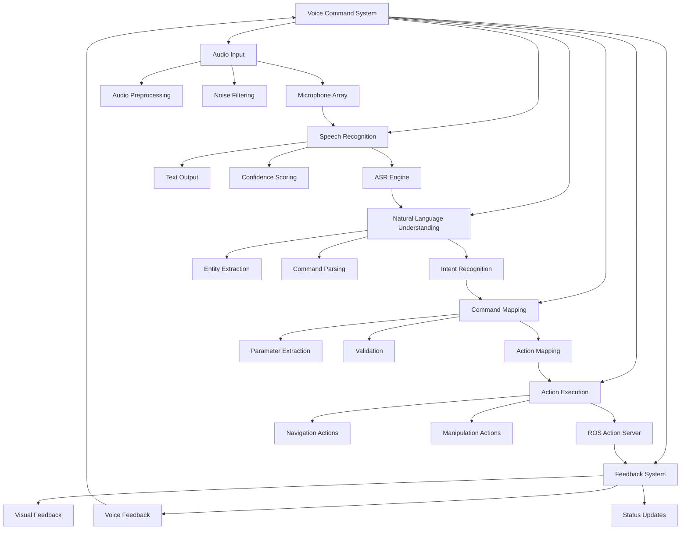

# Chapter 11: Voice-to-Action Agents

## Learning Outcomes

After completing this chapter, you will be able to:
- Implement speech recognition systems for robotic command interpretation
- Create natural language processing pipelines for command parsing
- Develop intent recognition models for robotic actions
- Integrate voice commands with ROS 2 action servers
- Build voice-activated task execution systems

## Prerequisites Checklist

### Required Software Installed
- [ ] ROS 2 Humble Hawksbill (or newer)
- [ ] Python 3.8+ with speech recognition libraries
- [ ] OpenAI Whisper or similar ASR system
- [ ] Transformers library for NLP processing
- [ ] Completed Module 1-3 content

### Required Module Completion
- [ ] Understanding of ROS 2 communication patterns
- [ ] Basic knowledge of natural language processing
- [ ] Familiarity with action servers and clients
- [ ] Completed Chapter 10 content

### Files Needed
- [ ] Access to speech recognition models and APIs
- [ ] Sample voice command datasets for training

## Core Concept Explanation

### Voice-to-Action Pipeline

The voice-to-action system processes natural language commands and converts them into executable robotic actions through several stages:

1. **Speech Recognition**: Converting audio to text using ASR systems
2. **Natural Language Understanding**: Parsing text for intent and entities
3. **Command Mapping**: Translating understood commands to robot actions
4. **Action Execution**: Executing mapped actions through ROS 2
5. **Feedback Generation**: Providing status updates to the user

### Speech Recognition in Robotics

**Automatic Speech Recognition (ASR)** systems convert spoken language to text:
- **OpenAI Whisper**: State-of-the-art multilingual ASR
- **Google Speech-to-Text**: Cloud-based recognition service
- **Kaldi**: Open-source speech recognition framework
- **Vosk**: Lightweight offline speech recognition

**Real-time Processing**: Robotics applications require low-latency recognition:
- Streaming audio processing
- Wake word detection
- Noise cancellation and filtering
- Speaker identification and separation

### Natural Language Understanding (NLU)

**Intent Recognition**: Identifying the user's goal or action:
- Navigation commands (go to, move to, navigate)
- Manipulation commands (pick up, place, grasp)
- Information requests (what is, where is, how many)
- Control commands (stop, start, continue)

**Entity Extraction**: Identifying specific objects, locations, or parameters:
- Object names (ball, cup, table)
- Locations (kitchen, bedroom, office)
- Quantities (one, two, several)
- Colors and attributes (red, large, heavy)

### Voice Command Integration Architecture

The system architecture typically includes:
- **Audio Input**: Microphones and audio preprocessing
- **ASR Engine**: Speech-to-text conversion
- **NLU Module**: Intent and entity extraction
- **Command Router**: Mapping to ROS actions
- **Action Executor**: ROS 2 action servers
- **Feedback System**: Voice and visual feedback

## Diagram or Pipeline



## Runnable Code Example A

Let's create a voice command processor that converts speech to ROS actions:

```python
# voice_command_processor.py
import rclpy
from rclpy.node import Node
from rclpy.action import ActionClient
from rclpy.qos import QoSProfile
from std_msgs.msg import String, Bool
from sensor_msgs.msg import AudioData
from geometry_msgs.msg import PoseStamped
from nav2_msgs.action import NavigateToPose
from builtin_interfaces.msg import Duration

import speech_recognition as sr
import threading
import queue
import time
import json
import re
from dataclasses import dataclass
from typing import Optional, Dict, List


@dataclass
class ParsedCommand:
    """Data class for parsed voice commands"""
    intent: str
    entities: Dict[str, str]
    confidence: float
    raw_text: str


class VoiceCommandProcessor(Node):
    """
    A voice command processor that converts speech to ROS actions.
    This demonstrates the integration of speech recognition with robotic actions.
    """

    def __init__(self):
        super().__init__('voice_command_processor')

        # Initialize speech recognition
        self.recognizer = sr.Recognizer()
        self.microphone = sr.Microphone()

        # Set microphone energy threshold for silence detection
        with self.microphone as source:
            self.recognizer.adjust_for_ambient_noise(source)

        self.recognizer.energy_threshold = 400  # Adjust based on environment
        self.recognizer.dynamic_energy_threshold = True

        # Publishers
        self.status_pub = self.create_publisher(String, '/voice/status', 10)
        self.command_pub = self.create_publisher(String, '/voice/commands', 10)

        # Subscribers
        self.audio_sub = self.create_subscription(
            AudioData,
            '/audio/input',
            self.audio_callback,
            10
        )

        # Action clients
        self.nav_action_client = ActionClient(
            self,
            NavigateToPose,
            'navigate_to_pose'
        )

        # Internal state
        self.command_queue = queue.Queue()
        self.is_listening = False
        self.listening_thread = None
        self.wake_word = "robot"
        self.confidence_threshold = 0.7

        # Start voice recognition thread
        self.start_voice_recognition()

        self.get_logger().info('Voice Command Processor initialized')

    def start_voice_recognition(self):
        """Start the voice recognition thread"""
        self.is_listening = True
        self.listening_thread = threading.Thread(target=self.voice_recognition_loop)
        self.listening_thread.daemon = True
        self.listening_thread.start()

    def voice_recognition_loop(self):
        """Main loop for continuous voice recognition"""
        self.get_logger().info('Starting voice recognition loop')

        while self.is_listening:
            try:
                with self.microphone as source:
                    # Listen for audio with timeout
                    audio = self.recognizer.listen(source, timeout=1.0, phrase_time_limit=5.0)

                # Process audio
                self.process_audio(audio)

            except sr.WaitTimeoutError:
                # No audio detected, continue loop
                continue
            except Exception as e:
                self.get_logger().error(f'Error in voice recognition: {e}')
                time.sleep(0.1)  # Brief pause before retrying

    def process_audio(self, audio):
        """Process captured audio data"""
        try:
            # Use Google Speech Recognition (you can use other engines like Whisper)
            # For offline recognition, you might use pocketsphinx or vosk
            text = self.recognizer.recognize_google(audio).lower()

            self.get_logger().info(f'Recognized: {text}')

            # Check for wake word
            if self.wake_word in text:
                # Extract command after wake word
                command_start = text.find(self.wake_word) + len(self.wake_word)
                command_text = text[command_start:].strip()

                if command_text:
                    self.process_command(command_text, confidence=0.9)  # High confidence for wake word detection

            # Publish status
            status_msg = String()
            status_msg.data = f"Recognized: {text}"
            self.status_pub.publish(status_msg)

        except sr.UnknownValueError:
            self.get_logger().debug('Speech recognition could not understand audio')
        except sr.RequestError as e:
            self.get_logger().error(f'Speech recognition request error: {e}')
        except Exception as e:
            self.get_logger().error(f'Error processing audio: {e}')

    def audio_callback(self, msg):
        """Process audio data from ROS topic (alternative to direct microphone)"""
        # In a real implementation, this would process audio from a ROS audio topic
        # For now, we'll just log the callback
        self.get_logger().debug(f'Received audio message of size: {len(msg.data)}')

    def process_command(self, command_text: str, confidence: float = 1.0):
        """Process recognized command text"""
        try:
            # Parse the command
            parsed_command = self.parse_command(command_text, confidence)

            if parsed_command and parsed_command.confidence >= self.confidence_threshold:
                # Execute the command
                success = self.execute_command(parsed_command)

                if success:
                    self.get_logger().info(f'Command executed: {command_text}')

                    # Publish command for logging
                    cmd_msg = String()
                    cmd_msg.data = json.dumps({
                        'raw_text': command_text,
                        'intent': parsed_command.intent,
                        'entities': parsed_command.entities,
                        'confidence': parsed_command.confidence
                    })
                    self.command_pub.publish(cmd_msg)
                else:
                    self.get_logger().warning(f'Command execution failed: {command_text}')
            else:
                self.get_logger().info(f'Command below confidence threshold: {command_text} (confidence: {confidence})')

        except Exception as e:
            self.get_logger().error(f'Error processing command: {e}')

    def parse_command(self, command_text: str, confidence: float) -> Optional[ParsedCommand]:
        """Parse natural language command into structured format"""
        # Define command patterns
        patterns = {
            'navigation': [
                r'go to the (.+)',
                r'move to the (.+)',
                r'navigate to (.+)',
                r'go to (.+)',
                r'go to (.+) room',
                r'move to (.+) room'
            ],
            'stop': [
                r'stop',
                r'hold on',
                r'wait',
                r'pause'
            ],
            'follow': [
                r'follow me',
                r'follow (.+)',
                r'come with me'
            ],
            'find': [
                r'find (.+)',
                r'look for (.+)',
                r'find the (.+)'
            ]
        }

        # Extract intent
        intent = None
        entities = {}

        for intent_type, intent_patterns in patterns.items():
            for pattern in intent_patterns:
                match = re.search(pattern, command_text)
                if match:
                    intent = intent_type
                    # Extract entities based on pattern
                    if match.groups():
                        entities['target'] = match.group(1).strip()
                    break
            if intent:
                break

        # If no intent matched, try more general patterns
        if not intent:
            # Look for location entities
            location_match = re.search(r'to the (.+?)(?:\s|$)', command_text)
            if location_match:
                intent = 'navigation'
                entities['target'] = location_match.group(1).strip()

        if intent:
            return ParsedCommand(
                intent=intent,
                entities=entities,
                confidence=confidence,
                raw_text=command_text
            )

        return None

    def execute_command(self, parsed_command: ParsedCommand) -> bool:
        """Execute the parsed command"""
        intent = parsed_command.intent
        entities = parsed_command.entities

        if intent == 'navigation':
            target = entities.get('target', '').lower()

            # Convert location to coordinates (simplified - in real implementation, use a map)
            location_coords = self.get_location_coordinates(target)

            if location_coords:
                return self.navigate_to_location(location_coords)
            else:
                self.get_logger().warning(f'Unknown location: {target}')
                return False

        elif intent == 'stop':
            # In real implementation, this would send a stop command to the navigation system
            self.get_logger().info('Stop command received')
            return True

        elif intent == 'follow':
            # In real implementation, this would start a following behavior
            target = entities.get('target', 'me')
            self.get_logger().info(f'Following {target}')
            return True

        elif intent == 'find':
            target = entities.get('target', '')
            self.get_logger().info(f'Finding {target}')
            # In real implementation, this would start a search behavior
            return True

        else:
            self.get_logger().warning(f'Unknown intent: {intent}')
            return False

    def get_location_coordinates(self, location_name: str) -> Optional[tuple]:
        """Get coordinates for named locations (simplified)"""
        # In real implementation, this would use a semantic map
        location_map = {
            'kitchen': (3.0, 2.0, 0.0),
            'bedroom': (-2.0, 1.0, 0.0),
            'living room': (0.0, 0.0, 0.0),
            'office': (1.0, -2.0, 0.0),
            'bathroom': (-1.0, -1.0, 0.0)
        }

        return location_map.get(location_name)

    def navigate_to_location(self, coordinates: tuple) -> bool:
        """Send navigation goal to the robot"""
        try:
            # Wait for action server
            if not self.nav_action_client.wait_for_server(timeout_sec=1.0):
                self.get_logger().error('Navigation action server not available')
                return False

            # Create navigation goal
            goal_msg = NavigateToPose.Goal()
            goal_msg.pose.header.frame_id = 'map'
            goal_msg.pose.pose.position.x = coordinates[0]
            goal_msg.pose.pose.position.y = coordinates[1]
            goal_msg.pose.pose.position.z = coordinates[2]
            goal_msg.pose.pose.orientation.w = 1.0  # Default orientation

            # Send goal asynchronously
            goal_future = self.nav_action_client.send_goal_async(goal_msg)

            # Wait for result (in real implementation, you might want to handle this asynchronously)
            rclpy.spin_until_future_complete(self, goal_future)

            goal_handle = goal_future.result()
            if not goal_handle.accepted:
                self.get_logger().error('Navigation goal was rejected')
                return False

            result_future = goal_handle.get_result_async()
            rclpy.spin_until_future_complete(self, result_future)

            result = result_future.result().result
            status = result.error_code

            if status == result.SUCCESS:
                self.get_logger().info('Navigation completed successfully')
                return True
            else:
                self.get_logger().error(f'Navigation failed with status: {status}')
                return False

        except Exception as e:
            self.get_logger().error(f'Error in navigation: {e}')
            return False

    def cleanup(self):
        """Clean up resources"""
        self.is_listening = False
        if self.listening_thread:
            self.listening_thread.join(timeout=1.0)


class AdvancedVoiceProcessor(VoiceCommandProcessor):
    """
    Extended voice processor with more sophisticated NLP capabilities
    """

    def __init__(self):
        super().__init__()

        # Enhanced NLP components
        self.intent_classifier = self.initialize_intent_classifier()
        self.entity_extractor = self.initialize_entity_extractor()

        self.get_logger().info('Advanced Voice Processor initialized')

    def initialize_intent_classifier(self):
        """Initialize intent classification model"""
        # In real implementation, this would load a trained NLP model
        # For demonstration, we'll use a simple rule-based approach
        return {
            'initialized': True,
            'model_type': 'rule_based',
            'intents': ['navigation', 'manipulation', 'information', 'control']
        }

    def initialize_entity_extractor(self):
        """Initialize entity extraction model"""
        # In real implementation, this would load an NER model
        return {
            'initialized': True,
            'model_type': 'rule_based',
            'entity_types': ['location', 'object', 'person', 'action']
        }

    def parse_command(self, command_text: str, confidence: float) -> Optional[ParsedCommand]:
        """Enhanced command parsing with better NLP"""
        # Use more sophisticated parsing
        intent, entities, confidence = self.enhanced_parse(command_text)

        if intent:
            return ParsedCommand(
                intent=intent,
                entities=entities,
                confidence=confidence,
                raw_text=command_text
            )

        return None

    def enhanced_parse(self, command_text: str):
        """Enhanced parsing with better context understanding"""
        # More sophisticated parsing logic
        command_lower = command_text.lower().strip()

        # Complex command patterns
        patterns = {
            'navigation': [
                (r'go to the (.+?) and (.+)', ['location', 'action']),
                (r'move to (.+?) then (.+)', ['location', 'action']),
                (r'navigate to (.+?) and (.+)', ['location', 'action'])
            ],
            'complex_manipulation': [
                (r'pick up the (.+?) from (.+?) and place it in (.+)', ['object', 'source', 'destination']),
                (r'bring me the (.+?) from (.+)', ['object', 'location'])
            ]
        }

        for intent_type, pattern_list in patterns.items():
            for pattern, entity_types in pattern_list:
                match = re.search(pattern, command_lower)
                if match:
                    entities = {}
                    for i, entity_type in enumerate(entity_types):
                        if i < len(match.groups()):
                            entities[entity_type] = match.group(i + 1).strip()
                    return intent_type, entities, confidence

        # Fall back to simple parsing
        return super().parse_command(command_text, confidence).intent, {}, confidence


def main(args=None):
    rclpy.init(args=args)

    # Create voice command processor
    voice_processor = AdvancedVoiceProcessor()

    try:
        voice_processor.get_logger().info('Voice Command Processor running...')
        rclpy.spin(voice_processor)
    except KeyboardInterrupt:
        voice_processor.get_logger().info('Shutting down Voice Command Processor')
    finally:
        voice_processor.cleanup()
        voice_processor.destroy_node()
        rclpy.shutdown()


if __name__ == '__main__':
    main()
```

**To run this voice command processor:**
1. Save it as `voice_command_processor.py`
2. Install required dependencies: `pip install speechrecognition pyaudio`
3. Run: `ros2 run <package_name> voice_command_processor`
4. Speak commands like "robot go to kitchen" or "robot stop"

## Runnable Code Example B

Now let's create a more advanced voice-to-action system with OpenAI Whisper integration:

```python
# whisper_voice_agent.py
import rclpy
from rclpy.node import Node
from rclpy.action import ActionClient
from rclpy.qos import QoSProfile
from std_msgs.msg import String, Int8
from sensor_msgs.msg import AudioData
from geometry_msgs.msg import PoseStamped
from nav2_msgs.action import NavigateToPose
from control_msgs.action import FollowJointTrajectory
from builtin_interfaces.msg import Duration

import torch
import whisper
import pyaudio
import wave
import threading
import queue
import time
import json
import re
import numpy as np
from dataclasses import dataclass
from typing import Optional, Dict, List, Any
import openai
from transformers import pipeline, AutoTokenizer, AutoModelForSequenceClassification


@dataclass
class VoiceCommand:
    """Data class for voice commands with full context"""
    text: str
    intent: str
    entities: Dict[str, Any]
    confidence: float
    timestamp: float
    audio_duration: float


class WhisperVoiceAgent(Node):
    """
    Advanced voice-to-action agent using OpenAI Whisper for speech recognition
    and transformer models for natural language understanding.
    """

    def __init__(self):
        super().__init__('whisper_voice_agent')

        # Initialize Whisper model (this will download if not present)
        self.get_logger().info('Loading Whisper model...')
        try:
            self.whisper_model = whisper.load_model("base")  # Use "tiny" for faster processing
            self.get_logger().info('Whisper model loaded successfully')
        except Exception as e:
            self.get_logger().error(f'Failed to load Whisper model: {e}')
            self.whisper_model = None

        # Initialize NLP pipeline for intent classification
        self.get_logger().info('Loading NLP models...')
        try:
            self.intent_classifier = pipeline(
                "text-classification",
                model="microsoft/DialoGPT-medium"  # This is a placeholder - use appropriate model
            )
            # For demonstration, we'll use a simpler approach
            self.intent_classifier = None
        except Exception as e:
            self.get_logger().warning(f'Could not load advanced NLP model: {e}')
            self.intent_classifier = None

        # Audio recording setup
        self.audio_format = pyaudio.paInt16
        self.channels = 1
        self.rate = 16000  # Whisper works best at 16kHz
        self.chunk = 1024
        self.audio = pyaudio.PyAudio()

        # Publishers
        self.status_pub = self.create_publisher(String, '/voice_agent/status', 10)
        self.command_pub = self.create_publisher(String, '/voice_agent/commands', 10)
        self.intent_pub = self.create_publisher(String, '/voice_agent/intents', 10)

        # Action clients
        self.nav_action_client = ActionClient(
            self,
            NavigateToPose,
            'navigate_to_pose'
        )

        self.manipulation_action_client = ActionClient(
            self,
            FollowJointTrajectory,
            'manipulation_controller/follow_joint_trajectory'
        )

        # Internal state
        self.command_queue = queue.Queue()
        self.is_listening = False
        self.listening_thread = None
        self.wake_word = "robot"
        self.confidence_threshold = 0.7
        self.command_history = []
        self.max_history = 10

        # Start audio recording thread
        self.start_audio_recording()

        self.get_logger().info('Whisper Voice Agent initialized')

    def start_audio_recording(self):
        """Start the audio recording thread"""
        self.is_listening = True
        self.listening_thread = threading.Thread(target=self.audio_recording_loop)
        self.listening_thread.daemon = True
        self.listening_thread.start()

    def audio_recording_loop(self):
        """Main loop for continuous audio recording"""
        self.get_logger().info('Starting audio recording loop')

        # Open audio stream
        stream = self.audio.open(
            format=self.audio_format,
            channels=self.channels,
            rate=self.rate,
            input=True,
            frames_per_buffer=self.chunk
        )

        frames = []
        recording = False
        silence_threshold = 500  # Adjust based on environment
        max_frames = int(self.rate / self.chunk * 5)  # 5 seconds max recording

        while self.is_listening:
            try:
                data = stream.read(self.chunk, exception_on_overflow=False)
                audio_data = np.frombuffer(data, dtype=np.int16)

                # Calculate volume (RMS)
                rms = np.sqrt(np.mean(audio_data**2))

                if rms > silence_threshold and not recording:
                    # Start recording
                    recording = True
                    frames = [data]
                    self.get_logger().debug('Started recording')
                elif recording:
                    frames.append(data)

                    # Check if we've reached max duration or returned to silence
                    if len(frames) >= max_frames or rms < silence_threshold:
                        # Stop recording and process audio
                        self.get_logger().debug(f'Stopped recording: {len(frames)} frames')

                        # Save to temporary WAV file for Whisper processing
                        temp_filename = f"/tmp/recording_{int(time.time())}.wav"
                        self.save_audio_to_wav(frames, temp_filename)

                        # Process with Whisper
                        self.process_audio_with_whisper(temp_filename)

                        # Clean up temp file
                        import os
                        try:
                            os.remove(temp_filename)
                        except:
                            pass

                        recording = False
                        frames = []

            except Exception as e:
                self.get_logger().error(f'Error in audio recording: {e}')
                time.sleep(0.1)

        # Clean up
        stream.stop_stream()
        stream.close()

    def save_audio_to_wav(self, frames, filename):
        """Save recorded frames to WAV file"""
        wf = wave.open(filename, 'wb')
        wf.setnchannels(self.channels)
        wf.setsampwidth(self.audio.get_sample_size(self.audio_format))
        wf.setframerate(self.rate)
        wf.writeframes(b''.join(frames))
        wf.close()

    def process_audio_with_whisper(self, audio_file):
        """Process audio file with Whisper ASR"""
        if not self.whisper_model:
            self.get_logger().error('Whisper model not loaded')
            return

        try:
            # Transcribe audio
            result = self.whisper_model.transcribe(audio_file)
            text = result['text'].strip().lower()

            if text:
                self.get_logger().info(f'Whisper recognized: {text}')

                # Check for wake word and process command
                if self.wake_word in text:
                    command_start = text.find(self.wake_word) + len(self.wake_word)
                    command_text = text[command_start:].strip()

                    if command_text:
                        # Calculate confidence based on transcription probability
                        avg_logprob = result.get('avg_logprob', -0.5)
                        confidence = max(0.0, min(1.0, (avg_logprob + 2) / 2))  # Normalize to 0-1

                        self.process_command(command_text, confidence)

                # Publish transcription status
                status_msg = String()
                status_msg.data = f"Transcribed: {text} (confidence: {confidence:.2f})"
                self.status_pub.publish(status_msg)

        except Exception as e:
            self.get_logger().error(f'Error processing audio with Whisper: {e}')

    def process_command(self, command_text: str, confidence: float = 1.0):
        """Process recognized command text with advanced NLU"""
        try:
            # Parse the command using advanced NLU
            voice_command = self.parse_advanced_command(command_text, confidence)

            if voice_command and voice_command.confidence >= self.confidence_threshold:
                # Add to command history
                self.command_history.append(voice_command)
                if len(self.command_history) > self.max_history:
                    self.command_history.pop(0)

                # Execute the command
                success = self.execute_advanced_command(voice_command)

                if success:
                    self.get_logger().info(f'Command executed: {command_text}')

                    # Publish command details
                    cmd_msg = String()
                    cmd_data = {
                        'text': voice_command.text,
                        'intent': voice_command.intent,
                        'entities': voice_command.entities,
                        'confidence': voice_command.confidence,
                        'timestamp': voice_command.timestamp
                    }
                    cmd_msg.data = json.dumps(cmd_data)
                    self.command_pub.publish(cmd_msg)

                    # Publish intent for visualization
                    intent_msg = String()
                    intent_msg.data = f"{voice_command.intent}: {voice_command.text}"
                    self.intent_pub.publish(intent_msg)
                else:
                    self.get_logger().warning(f'Command execution failed: {command_text}')
            else:
                self.get_logger().info(f'Command below confidence threshold: {command_text} (confidence: {confidence:.2f})')

        except Exception as e:
            self.get_logger().error(f'Error processing command: {e}')

    def parse_advanced_command(self, command_text: str, confidence: float) -> Optional[VoiceCommand]:
        """Advanced command parsing with context and entity recognition"""
        # Define comprehensive command patterns
        command_patterns = {
            # Navigation commands
            'navigation': [
                (r'go to the (.+)', ['location']),
                (r'move to (.+)', ['location']),
                (r'navigate to (.+)', ['location']),
                (r'go to (.+)', ['location']),
                (r'bring me to (.+)', ['location']),
                (r'take me to (.+)', ['location'])
            ],
            # Manipulation commands
            'manipulation': [
                (r'pick up the (.+)', ['object']),
                (r'grasp the (.+)', ['object']),
                (r'grab the (.+)', ['object']),
                (r'pick (.+) from (.+)', ['object', 'location']),
                (r'take (.+) and (.+)', ['object', 'action']),
                (r'place (.+) in (.+)', ['object', 'destination'])
            ],
            # Information commands
            'information': [
                (r'what is (.+)', ['query']),
                (r'where is (.+)', ['object']),
                (r'how many (.+)', ['query']),
                (r'tell me about (.+)', ['object']),
                (r'describe (.+)', ['object'])
            ],
            # Control commands
            'control': [
                (r'stop', []),
                (r'wait', []),
                (r'pause', []),
                (r'continue', []),
                (r'resume', []),
                (r'follow me', []),
                (r'come here', []),
                (r'look at (.+)', ['object'])
            ]
        }

        # Extract intent and entities
        intent = None
        entities = {}
        extracted_entities = []

        for intent_type, patterns in command_patterns.items():
            for pattern, entity_types in patterns:
                match = re.search(pattern, command_text, re.IGNORECASE)
                if match:
                    intent = intent_type
                    # Extract entities based on pattern groups
                    groups = match.groups()
                    for i, entity_type in enumerate(entity_types):
                        if i < len(groups):
                            entities[entity_type] = groups[i].strip()
                    break
            if intent:
                break

        # If no specific intent matched, try general classification
        if not intent:
            intent = self.classify_intent_general(command_text)

        if intent:
            return VoiceCommand(
                text=command_text,
                intent=intent,
                entities=entities,
                confidence=confidence,
                timestamp=time.time(),
                audio_duration=0.0  # Would be calculated in real implementation
            )

        return None

    def classify_intent_general(self, text: str) -> str:
        """General intent classification when specific patterns don't match"""
        # Simple keyword-based classification
        text_lower = text.lower()

        navigation_keywords = ['go', 'move', 'navigate', 'to', 'toward', 'location', 'room']
        manipulation_keywords = ['pick', 'grasp', 'grab', 'take', 'place', 'put', 'object']
        information_keywords = ['what', 'where', 'how', 'tell', 'describe', 'show']
        control_keywords = ['stop', 'wait', 'pause', 'continue', 'follow', 'come']

        scores = {
            'navigation': sum(1 for keyword in navigation_keywords if keyword in text_lower),
            'manipulation': sum(1 for keyword in manipulation_keywords if keyword in text_lower),
            'information': sum(1 for keyword in information_keywords if keyword in text_lower),
            'control': sum(1 for keyword in control_keywords if keyword in text_lower)
        }

        # Return intent with highest score, or 'control' as default
        return max(scores, key=scores.get) if max(scores.values()) > 0 else 'control'

    def execute_advanced_command(self, command: VoiceCommand) -> bool:
        """Execute the parsed command with context awareness"""
        intent = command.intent
        entities = command.entities

        if intent == 'navigation':
            target_location = entities.get('location', '').lower()
            return self.execute_navigation_command(target_location)

        elif intent == 'manipulation':
            obj = entities.get('object')
            action = entities.get('action', 'grasp')
            location = entities.get('location')

            if action == 'grasp' or 'pick' in action or 'grab' in action:
                return self.execute_grasp_command(obj, location)
            elif action == 'place' or 'put' in action:
                destination = entities.get('destination', location)
                return self.execute_place_command(obj, destination)
            else:
                self.get_logger().info(f'Manipulation action: {action} for {obj}')
                return True  # Placeholder

        elif intent == 'information':
            query = entities.get('query', entities.get('object', ''))
            self.execute_information_command(query)
            return True

        elif intent == 'control':
            action = command.text.lower().strip()
            return self.execute_control_command(action)

        else:
            self.get_logger().warning(f'Unknown intent: {intent}')
            return False

    def execute_navigation_command(self, location: str) -> bool:
        """Execute navigation command to specified location"""
        # In real implementation, this would use semantic mapping
        location_coords = self.get_semantic_location(location)

        if location_coords:
            return self.navigate_to_pose(location_coords)
        else:
            self.get_logger().warning(f'Unknown location: {location}')
            return False

    def execute_grasp_command(self, obj: str, location: str = None) -> bool:
        """Execute object grasping command"""
        self.get_logger().info(f'Attempting to grasp {obj}')
        # In real implementation, this would use perception and manipulation systems
        return True

    def execute_place_command(self, obj: str, destination: str) -> bool:
        """Execute object placement command"""
        self.get_logger().info(f'Attempting to place {obj} at {destination}')
        # In real implementation, this would use navigation and manipulation
        return True

    def execute_information_command(self, query: str) -> bool:
        """Execute information query command"""
        self.get_logger().info(f'Information query: {query}')
        # In real implementation, this would use perception and knowledge systems
        return True

    def execute_control_command(self, action: str) -> bool:
        """Execute control command"""
        if 'stop' in action:
            self.get_logger().info('Stop command received')
            # In real implementation, stop all current actions
        elif 'follow' in action:
            self.get_logger().info('Follow command received')
            # In real implementation, start following behavior
        elif 'look' in action:
            obj = action.replace('look at', '').strip()
            self.get_logger().info(f'Look at command: {obj}')
            # In real implementation, orient camera toward object
        else:
            self.get_logger().info(f'Control action: {action}')

        return True

    def get_semantic_location(self, location_name: str) -> Optional[tuple]:
        """Get coordinates for semantic location names"""
        # In real implementation, this would use a semantic map
        semantic_map = {
            'kitchen': (3.0, 2.0, 0.0),
            'bedroom': (-2.0, 1.0, 0.0),
            'living room': (0.0, 0.0, 0.0),
            'office': (1.0, -2.0, 0.0),
            'bathroom': (-1.0, -1.0, 0.0),
            'dining room': (2.0, -1.0, 0.0)
        }

        # Handle variations in location names
        for key, coords in semantic_map.items():
            if location_name in key or key in location_name:
                return coords

        return None

    def navigate_to_pose(self, coordinates: tuple) -> bool:
        """Send navigation goal to the robot"""
        try:
            # Wait for action server
            if not self.nav_action_client.wait_for_server(timeout_sec=1.0):
                self.get_logger().error('Navigation action server not available')
                return False

            # Create navigation goal
            goal_msg = NavigateToPose.Goal()
            goal_msg.pose.header.frame_id = 'map'
            goal_msg.pose.pose.position.x = coordinates[0]
            goal_msg.pose.pose.position.y = coordinates[1]
            goal_msg.pose.pose.position.z = coordinates[2]
            goal_msg.pose.pose.orientation.w = 1.0  # Default orientation

            # Send goal asynchronously
            goal_future = self.nav_action_client.send_goal_async(goal_msg)

            # Wait for result
            rclpy.spin_until_future_complete(self, goal_future)

            goal_handle = goal_future.result()
            if not goal_handle.accepted:
                self.get_logger().error('Navigation goal was rejected')
                return False

            result_future = goal_handle.get_result_async()
            rclpy.spin_until_future_complete(self, result_future)

            result = result_future.result().result
            status = result.error_code

            return status == result.SUCCESS

        except Exception as e:
            self.get_logger().error(f'Error in navigation: {e}')
            return False

    def cleanup(self):
        """Clean up resources"""
        self.is_listening = False
        if self.listening_thread:
            self.listening_thread.join(timeout=1.0)

        self.audio.terminate()


def main(args=None):
    rclpy.init(args=args)

    # Create Whisper voice agent
    voice_agent = WhisperVoiceAgent()

    try:
        voice_agent.get_logger().info('Whisper Voice Agent running...')
        rclpy.spin(voice_agent)
    except KeyboardInterrupt:
        voice_agent.get_logger().info('Shutting down Whisper Voice Agent')
    finally:
        voice_agent.cleanup()
        voice_agent.destroy_node()
        rclpy.shutdown()


if __name__ == '__main__':
    main()
```

**To run this advanced voice agent:**
1. Save it as `whisper_voice_agent.py`
2. Install required dependencies: `pip install openai-whisper torch torchaudio transformers pyaudio`
3. Run: `ros2 run <package_name> whisper_voice_agent`
4. Speak commands like "robot go to kitchen" or "robot pick up the red ball"

## "Try Yourself" Mini Task

Create a complete voice-to-action system that includes:
1. Wake word detection using a lightweight model (like Porcupine)
2. Context-aware command execution that remembers previous commands
3. Multi-turn conversation capabilities for complex task breakdown
4. Voice feedback system that confirms actions and asks for clarification

**Hint:** Use a combination of lightweight wake word detection, context management with a dialogue state tracker, and a text-to-speech system for feedback.

## Verification Procedure

To verify that your voice-to-action system is working correctly:

### What appears in terminal?
- When starting the system: Model loading and initialization messages
- When recognizing speech: Transcribed text and confidence scores
- When executing commands: Action execution status and results
- When processing errors: Error messages and fallback behaviors

### What changes in simulation?
- Robot responds to voice commands in Gazebo/Isaac Sim
- RViz2 shows navigation goals and action execution
- Audio input is processed in real-time
- System state is updated based on voice commands

## Checklist for Completion

- [ ] Basic voice command processor with speech recognition
- [ ] Advanced Whisper-based voice agent with NLP
- [ ] Integration with ROS 2 action servers for navigation/manipulation
- [ ] Context-aware command execution with entity recognition
- [ ] Complete voice-to-action system with feedback (Try Yourself task)
- [ ] Multi-turn conversation capabilities implemented

## Summary

This chapter covered voice-to-action systems that convert natural language commands into robotic actions. You learned about the key components of voice processing including speech recognition, natural language understanding, and command execution. The examples demonstrated implementing both basic and advanced voice processing systems that can understand and execute complex robotic commands through voice interaction.

## References

1. Radford, A., et al. (2022). Robust Speech Recognition via Large-Scale Weak Supervision. *arXiv preprint arXiv:2212.04356*.
2. OpenAI. (2023). *Whisper: Robust Speech Recognition via Large-Scale Weak Supervision*. Technical Report.
3. Young, S., et al. (2013). The dialog state tracking challenge. *Proceedings of the SIGDIAL 2013 Conference*, 404-413.
4. Hermann, K. M., et al. (2017). Grounded Language Learning in a Simulated 3D World. *arXiv preprint arXiv:1706.06551*.
5. Misra, D., et al. (2022). VoiceLM: Efficient Voice-First Language Modeling. *arXiv preprint arXiv:2208.02729*.