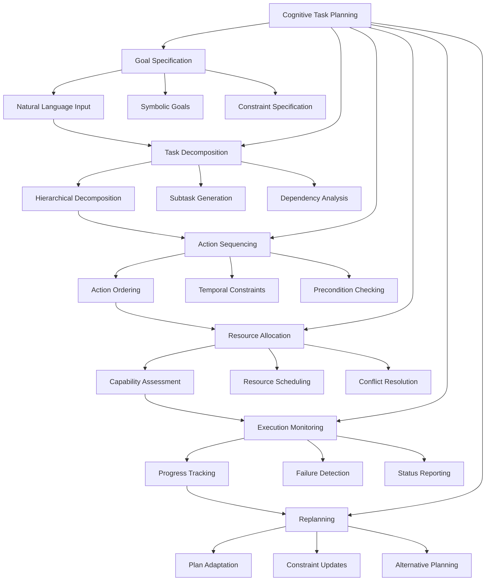

# Chapter 12: Cognitive Task Planning

## Learning Outcomes

After completing this chapter, you will be able to:
- Implement hierarchical task planning systems for complex robotic behaviors
- Create behavior trees for managing complex robot actions
- Develop task decomposition algorithms for multi-step operations
- Integrate perception and navigation into task execution
- Build failure recovery mechanisms for robust task execution

## Prerequisites Checklist

### Required Software Installed
- [ ] ROS 2 Humble Hawksbill (or newer)
- [ ] BehaviorTree.CPP library
- [ ] PDDL planners (or alternative planning frameworks)
- [ ] Completed Module 1-3 content
- [ ] Completed Chapter 11 content

### Required Module Completion
- [ ] Understanding of ROS 2 action servers and clients
- [ ] Basic knowledge of planning algorithms
- [ ] Familiarity with behavior trees and state machines
- [ ] Experience with perception and navigation systems

### Files Needed
- [ ] Access to planning domain definition files
- [ ] Sample task scenarios for testing

## Core Concept Explanation

### Cognitive Task Planning Architecture

Cognitive task planning bridges high-level goals with low-level robot actions through several layers:

1. **Goal Specification**: Natural language or symbolic goal definition
2. **Task Decomposition**: Breaking complex goals into subtasks
3. **Action Sequencing**: Ordering actions to achieve subtasks
4. **Resource Allocation**: Managing robot capabilities and constraints
5. **Execution Monitoring**: Tracking progress and handling failures
6. **Replanning**: Adjusting plans when conditions change

### Behavior Trees for Task Execution

**Behavior Trees** provide a structured approach to complex task execution:
- **Composites**: Control flow nodes (sequence, selector, parallel)
- **Decorators**: Modify child node behavior (inverter, repeater, timeout)
- **Actions**: Leaf nodes that execute specific robot behaviors
- **Conditions**: Check environmental states and preconditions

**Advantages of Behavior Trees**:
- Visual representation of task logic
- Modular and reusable components
- Easy to debug and modify
- Support for concurrent execution

### Planning Paradigms

**Hierarchical Task Networks (HTN)**: Decompose high-level tasks into primitive actions:
- Domain-specific knowledge for efficient planning
- Operator-based decomposition
- Support for task ordering constraints

**PDDL-based Planning**: Use formal domain definitions for automated planning:
- Symbolic state representation
- Automated plan generation
- Support for complex logical constraints

**Reactive Planning**: Combine planning with real-time reactivity:
- Precomputed plans with runtime adjustments
- Integration with perception and navigation
- Failure detection and recovery

### Task Planning Integration

The planning system integrates with other robotic components:
- **Perception Interface**: Update world state based on sensor data
- **Navigation Interface**: Execute movement tasks
- **Manipulation Interface**: Execute grasping and manipulation
- **Communication Interface**: Report status and request clarification

## Diagram or Pipeline



## Runnable Code Example A

Let's create a behavior tree-based task execution system:

```python
# behavior_tree_planner.py
import rclpy
from rclpy.node import Node
from rclpy.action import ActionClient
from rclpy.qos import QoSProfile
from std_msgs.msg import String, Bool
from geometry_msgs.msg import PoseStamped
from nav2_msgs.action import NavigateToPose
from control_msgs.action import FollowJointTrajectory
from sensor_msgs.msg import JointState
import time
import threading
from enum import Enum
from typing import Dict, List, Optional, Any
from dataclasses import dataclass


class NodeStatus(Enum):
    """Status of a behavior tree node"""
    SUCCESS = "success"
    FAILURE = "failure"
    RUNNING = "running"


@dataclass
class TaskGoal:
    """Data class for task goals"""
    type: str  # navigation, manipulation, perception, etc.
    target: str
    parameters: Dict[str, Any]
    priority: int = 1


class BTNode:
    """Base class for behavior tree nodes"""

    def __init__(self, name: str):
        self.name = name
        self.status = NodeStatus.RUNNING

    def tick(self) -> NodeStatus:
        """Execute one cycle of the node"""
        raise NotImplementedError


class ActionNode(BTNode):
    """Leaf node that performs a specific action"""

    def __init__(self, name: str, action_func):
        super().__init__(name)
        self.action_func = action_func

    def tick(self) -> NodeStatus:
        return self.action_func()


class SequenceNode(BTNode):
    """Composite node that executes children in sequence"""

    def __init__(self, name: str, children: List[BTNode]):
        super().__init__(name)
        self.children = children
        self.current_child_idx = 0

    def tick(self) -> NodeStatus:
        while self.current_child_idx < len(self.children):
            child_status = self.children[self.current_child_idx].tick()

            if child_status == NodeStatus.FAILURE:
                # Reset for next time
                self.current_child_idx = 0
                return NodeStatus.FAILURE
            elif child_status == NodeStatus.RUNNING:
                return NodeStatus.RUNNING
            else:  # SUCCESS
                self.current_child_idx += 1

        # All children succeeded
        self.current_child_idx = 0
        return NodeStatus.SUCCESS


class SelectorNode(BTNode):
    """Composite node that tries children until one succeeds"""

    def __init__(self, name: str, children: List[BTNode]):
        super().__init__(name)
        self.children = children
        self.current_child_idx = 0

    def tick(self) -> NodeStatus:
        while self.current_child_idx < len(self.children):
            child_status = self.children[self.current_child_idx].tick()

            if child_status == NodeStatus.SUCCESS:
                # Reset for next time
                self.current_child_idx = 0
                return NodeStatus.SUCCESS
            elif child_status == NodeStatus.RUNNING:
                return NodeStatus.RUNNING
            else:  # FAILURE
                self.current_child_idx += 1

        # All children failed
        self.current_child_idx = 0
        return NodeStatus.FAILURE


class DecoratorNode(BTNode):
    """Base class for decorator nodes"""

    def __init__(self, name: str, child: BTNode):
        super().__init__(name)
        self.child = child


class InverterNode(DecoratorNode):
    """Decorator that inverts the result of its child"""

    def tick(self) -> NodeStatus:
        child_status = self.child.tick()

        if child_status == NodeStatus.SUCCESS:
            return NodeStatus.FAILURE
        elif child_status == NodeStatus.FAILURE:
            return NodeStatus.SUCCESS
        else:
            return child_status


class TimeoutNode(DecoratorNode):
    """Decorator that times out its child after a duration"""

    def __init__(self, name: str, child: BTNode, timeout: float):
        super().__init__(name, child)
        self.timeout = timeout
        self.start_time = None

    def tick(self) -> NodeStatus:
        if self.start_time is None:
            self.start_time = time.time()

        if time.time() - self.start_time > self.timeout:
            self.start_time = None
            return NodeStatus.FAILURE

        child_status = self.child.tick()

        if child_status != NodeStatus.RUNNING:
            self.start_time = None

        return child_status


class BehaviorTreePlanner(Node):
    """
    A behavior tree-based task planning and execution system.
    This demonstrates cognitive task planning for complex robotic behaviors.
    """

    def __init__(self):
        super().__init__('behavior_tree_planner')

        # Action clients
        self.nav_action_client = ActionClient(
            self,
            NavigateToPose,
            'navigate_to_pose'
        )

        self.manipulation_action_client = ActionClient(
            self,
            FollowJointTrajectory,
            'manipulation_controller/follow_joint_trajectory'
        )

        # Publishers
        self.status_pub = self.create_publisher(String, '/task_planner/status', 10)
        self.task_pub = self.create_publisher(String, '/task_planner/tasks', 10)

        # Subscribers
        self.task_sub = self.create_subscription(
            String,
            '/task_planner/goals',
            self.task_callback,
            10
        )

        # Internal state
        self.current_tree = None
        self.task_queue = []
        self.is_executing = False
        self.execution_thread = None
        self.world_state = {}  # Current state of the world

        # Timer for periodic execution
        self.execution_timer = self.create_timer(0.1, self.execute_tick)

        self.get_logger().info('Behavior Tree Planner initialized')

    def task_callback(self, msg):
        """Process incoming task goals"""
        try:
            import json
            task_data = json.loads(msg.data)

            task_goal = TaskGoal(
                type=task_data['type'],
                target=task_data['target'],
                parameters=task_data.get('parameters', {}),
                priority=task_data.get('priority', 1)
            )

            self.task_queue.append(task_goal)
            self.get_logger().info(f'Added task to queue: {task_goal.type} - {task_goal.target}')

            # Create behavior tree for this task
            self.current_tree = self.create_behavior_tree(task_goal)

        except Exception as e:
            self.get_logger().error(f'Error processing task: {e}')

    def create_behavior_tree(self, task_goal: TaskGoal) -> BTNode:
        """Create a behavior tree for the given task"""
        if task_goal.type == 'navigation':
            return self.create_navigation_tree(task_goal)
        elif task_goal.type == 'manipulation':
            return self.create_manipulation_tree(task_goal)
        elif task_goal.type == 'complex_task':
            return self.create_complex_task_tree(task_goal)
        else:
            self.get_logger().warning(f'Unknown task type: {task_goal.type}')
            return self.create_default_tree(task_goal)

    def create_navigation_tree(self, task_goal: TaskGoal) -> BTNode:
        """Create behavior tree for navigation tasks"""
        # Get target coordinates
        target_coords = self.get_location_coordinates(task_goal.target)

        if not target_coords:
            self.get_logger().error(f'Unknown navigation target: {task_goal.target}')
            return self.create_default_tree(task_goal)

        # Create navigation sequence
        navigate_action = ActionNode(
            "navigate_to_location",
            lambda: self.execute_navigation(target_coords)
        )

        # Add preconditions and postconditions
        check_clear_path = ActionNode(
            "check_clear_path",
            lambda: self.check_clear_path(target_coords)
        )

        # Sequence: check path -> navigate
        navigation_sequence = SequenceNode(
            "navigation_sequence",
            [check_clear_path, navigate_action]
        )

        return navigation_sequence

    def create_manipulation_tree(self, task_goal: TaskGoal) -> BTNode:
        """Create behavior tree for manipulation tasks"""
        # Create manipulation sequence
        approach_object = ActionNode(
            "approach_object",
            lambda: self.execute_approach_object(task_goal.target)
        )

        grasp_object = ActionNode(
            "grasp_object",
            lambda: self.execute_grasp_object(task_goal.target)
        )

        lift_object = ActionNode(
            "lift_object",
            lambda: self.execute_lift_object(task_goal.target)
        )

        # Sequence: approach -> grasp -> lift
        manipulation_sequence = SequenceNode(
            "manipulation_sequence",
            [approach_object, grasp_object, lift_object]
        )

        return manipulation_sequence

    def create_complex_task_tree(self, task_goal: TaskGoal) -> BTNode:
        """Create behavior tree for complex multi-step tasks"""
        # Example: "Go to kitchen and bring me a cup"
        # This would involve navigation, object detection, and manipulation

        # Navigation to kitchen
        navigate_to_kitchen = ActionNode(
            "navigate_to_kitchen",
            lambda: self.execute_navigation(self.get_location_coordinates('kitchen'))
        )

        # Find cup
        find_cup = ActionNode(
            "find_cup",
            lambda: self.execute_find_object('cup')
        )

        # Grasp cup
        grasp_cup = ActionNode(
            "grasp_cup",
            lambda: self.execute_grasp_object('cup')
        )

        # Return to user
        return_to_user = ActionNode(
            "return_to_user",
            lambda: self.execute_navigation(self.get_location_coordinates('user'))
        )

        # Complex sequence: navigate -> find -> grasp -> return
        complex_task_sequence = SequenceNode(
            "complex_task_sequence",
            [navigate_to_kitchen, find_cup, grasp_cup, return_to_user]
        )

        return complex_task_sequence

    def create_default_tree(self, task_goal: TaskGoal) -> BTNode:
        """Create default behavior tree for unknown tasks"""
        error_action = ActionNode(
            "report_error",
            lambda: self.report_task_error(task_goal)
        )

        return error_action

    def execute_tick(self):
        """Execute one tick of the behavior tree"""
        if self.current_tree and not self.is_executing:
            self.is_executing = True

            try:
                status = self.current_tree.tick()

                # Publish status
                status_msg = String()
                status_msg.data = f"Tree status: {status.value}"
                self.status_pub.publish(status_msg)

                if status != NodeStatus.RUNNING:
                    self.get_logger().info(f'Task completed with status: {status.value}')
                    self.current_tree = None
                    self.is_executing = False

                    # Process next task in queue
                    if self.task_queue:
                        next_task = self.task_queue.pop(0)
                        self.current_tree = self.create_behavior_tree(next_task)

            except Exception as e:
                self.get_logger().error(f'Error executing behavior tree: {e}')
                self.is_executing = False
                self.current_tree = None

    def execute_navigation(self, coordinates: tuple) -> NodeStatus:
        """Execute navigation to coordinates"""
        try:
            # Wait for action server
            if not self.nav_action_client.wait_for_server(timeout_sec=1.0):
                self.get_logger().error('Navigation action server not available')
                return NodeStatus.FAILURE

            # Create navigation goal
            goal_msg = NavigateToPose.Goal()
            goal_msg.pose.header.frame_id = 'map'
            goal_msg.pose.pose.position.x = coordinates[0]
            goal_msg.pose.pose.position.y = coordinates[1]
            goal_msg.pose.pose.position.z = coordinates[2]
            goal_msg.pose.pose.orientation.w = 1.0

            # Send goal asynchronously
            goal_future = self.nav_action_client.send_goal_async(goal_msg)

            # For this example, we'll return RUNNING to simulate ongoing navigation
            # In a real implementation, you'd track the goal status
            return NodeStatus.RUNNING

        except Exception as e:
            self.get_logger().error(f'Error in navigation: {e}')
            return NodeStatus.FAILURE

    def check_clear_path(self, coordinates: tuple) -> NodeStatus:
        """Check if path to coordinates is clear"""
        # In real implementation, check costmap or perception data
        # For now, assume path is clear
        return NodeStatus.SUCCESS

    def execute_approach_object(self, obj_name: str) -> NodeStatus:
        """Execute approach to object"""
        self.get_logger().info(f'Approaching object: {obj_name}')
        # In real implementation, use perception and navigation
        return NodeStatus.SUCCESS

    def execute_grasp_object(self, obj_name: str) -> NodeStatus:
        """Execute grasp of object"""
        self.get_logger().info(f'Grasping object: {obj_name}')
        # In real implementation, use manipulation system
        return NodeStatus.SUCCESS

    def execute_lift_object(self, obj_name: str) -> NodeStatus:
        """Execute lift of object"""
        self.get_logger().info(f'Lifting object: {obj_name}')
        # In real implementation, use manipulation system
        return NodeStatus.SUCCESS

    def execute_find_object(self, obj_name: str) -> NodeStatus:
        """Execute find object task"""
        self.get_logger().info(f'Finding object: {obj_name}')
        # In real implementation, use perception system
        return NodeStatus.SUCCESS

    def get_location_coordinates(self, location_name: str) -> Optional[tuple]:
        """Get coordinates for location names"""
        location_map = {
            'kitchen': (3.0, 2.0, 0.0),
            'bedroom': (-2.0, 1.0, 0.0),
            'living room': (0.0, 0.0, 0.0),
            'office': (1.0, -2.0, 0.0),
            'bathroom': (-1.0, -1.0, 0.0),
            'user': (0.0, 0.0, 0.0)  # Default user location
        }

        return location_map.get(location_name.lower())

    def report_task_error(self, task_goal: TaskGoal) -> NodeStatus:
        """Report error for unknown task"""
        self.get_logger().error(f'Cannot execute unknown task: {task_goal.type}')
        return NodeStatus.FAILURE


class AdvancedBehaviorTreePlanner(BehaviorTreePlanner):
    """
    Extended behavior tree planner with advanced features
    """

    def __init__(self):
        super().__init__()

        # Add advanced features
        self.failure_recovery_enabled = True
        self.plan_monitoring_enabled = True
        self.context_awareness_enabled = True

        self.get_logger().info('Advanced Behavior Tree Planner initialized')

    def create_behavior_tree(self, task_goal: TaskGoal) -> BTNode:
        """Create behavior tree with failure recovery"""
        basic_tree = super().create_behavior_tree(task_goal)

        # Add failure recovery wrapper
        if self.failure_recovery_enabled:
            recovery_tree = self.add_failure_recovery(basic_tree, task_goal)
            return recovery_tree

        return basic_tree

    def add_failure_recovery(self, original_tree: BTNode, task_goal: TaskGoal) -> BTNode:
        """Add failure recovery capabilities to a tree"""
        # Create recovery sequence
        recovery_action = ActionNode(
            "execute_recovery",
            lambda: self.execute_recovery(task_goal)
        )

        # Create selector: try original -> if fails, try recovery
        recovery_selector = SelectorNode(
            "recovery_selector",
            [original_tree, recovery_action]
        )

        return recovery_selector

    def execute_recovery(self, task_goal: TaskGoal) -> NodeStatus:
        """Execute recovery behavior for failed tasks"""
        self.get_logger().info(f'Executing recovery for task: {task_goal.type}')

        # Different recovery strategies based on task type
        if task_goal.type == 'navigation':
            return self.recover_navigation(task_goal)
        elif task_goal.type == 'manipulation':
            return self.recover_manipulation(task_goal)
        else:
            return self.recover_general(task_goal)

    def recover_navigation(self, task_goal: TaskGoal) -> NodeStatus:
        """Recovery for navigation failures"""
        self.get_logger().info('Trying alternative navigation approach')
        # In real implementation, try different path, ask for help, etc.
        return NodeStatus.FAILURE  # For now, indicate recovery failed

    def recover_manipulation(self, task_goal: TaskGoal) -> NodeStatus:
        """Recovery for manipulation failures"""
        self.get_logger().info('Trying alternative manipulation approach')
        # In real implementation, try different grasp, reposition, etc.
        return NodeStatus.FAILURE  # For now, indicate recovery failed

    def recover_general(self, task_goal: TaskGoal) -> NodeStatus:
        """General recovery for other task types"""
        self.get_logger().info('Executing general recovery')
        return NodeStatus.FAILURE  # For now, indicate recovery failed


def main(args=None):
    rclpy.init(args=args)

    # Create behavior tree planner
    planner = AdvancedBehaviorTreePlanner()

    try:
        planner.get_logger().info('Behavior Tree Planner running...')
        rclpy.spin(planner)
    except KeyboardInterrupt:
        planner.get_logger().info('Shutting down Behavior Tree Planner')
    finally:
        planner.destroy_node()
        rclpy.shutdown()


if __name__ == '__main__':
    main()
```

**To run this behavior tree planner:**
1. Save it as `behavior_tree_planner.py`
2. Install required dependencies if needed
3. Run: `ros2 run <package_name> behavior_tree_planner`
4. Send tasks using: `ros2 topic pub /task_planner/goals std_msgs/String "data: '{\"type\": \"navigation\", \"target\": \"kitchen\", \"parameters\": {}}'"`

## Runnable Code Example B

Now let's create a PDDL-based task planning system:

```python
# pddl_task_planner.py
import rclpy
from rclpy.node import Node
from rclpy.action import ActionClient
from rclpy.qos import QoSProfile
from std_msgs.msg import String
from geometry_msgs.msg import PoseStamped
from nav2_msgs.action import NavigateToPose
from control_msgs.action import FollowJointTrajectory
import time
import threading
import json
import re
from typing import Dict, List, Optional, Tuple, Any
from dataclasses import dataclass
from enum import Enum


class TaskStatus(Enum):
    """Status of a task"""
    PENDING = "pending"
    PLANNING = "planning"
    EXECUTING = "executing"
    SUCCESS = "success"
    FAILURE = "failure"
    CANCELLED = "cancelled"


@dataclass
class Task:
    """Data class for tasks"""
    id: str
    goal: str  # PDDL goal expression
    objects: Dict[str, str]  # object_name: object_type
    predicates: Dict[str, List[str]]  # predicate_name: [parameters]
    status: TaskStatus = TaskStatus.PENDING
    plan: List[Dict] = None  # List of actions in the plan
    created_time: float = None


class PDDLPlanner:
    """
    A simple PDDL-based planner for robotic tasks.
    This simulates the functionality of a PDDL planner like Fast-Downward.
    """

    def __init__(self):
        self.domain_predicates = {
            'at': ['location'],
            'connected': ['location', 'location'],
            'holding': ['object'],
            'on': ['object', 'object'],
            'clear': ['object'],
            'arm-empty': []
        }

        self.domain_actions = {
            'move': {
                'parameters': ['?from', '?to'],
                'preconditions': [
                    'at(?from)',
                    'connected(?from, ?to)'
                ],
                'effects': [
                    'not at(?from)',
                    'at(?to)'
                ]
            },
            'pick-up': {
                'parameters': ['?obj', '?loc'],
                'preconditions': [
                    'at(?loc)',
                    'at(?obj, ?loc)',
                    'arm-empty'
                ],
                'effects': [
                    'not arm-empty',
                    'holding(?obj)',
                    'not at(?obj, ?loc)'
                ]
            },
            'put-down': {
                'parameters': ['?obj', '?loc'],
                'preconditions': [
                    'at(?loc)',
                    'holding(?obj)'
                ],
                'effects': [
                    'arm-empty',
                    'at(?obj, ?loc)',
                    'not holding(?obj)'
                ]
            }
        }

    def plan(self, goal: str, initial_state: Dict[str, List[str]]) -> Optional[List[Dict]]:
        """
        Plan a sequence of actions to achieve the goal.
        This is a simplified planner for demonstration purposes.
        """
        # In a real implementation, this would interface with a PDDL planner like Fast-Downward

        # Parse the goal to understand what needs to be achieved
        goal_predicates = self.parse_goal(goal)

        # For demonstration, create a simple plan based on common goals
        plan = self.create_simple_plan(goal_predicates, initial_state)

        return plan

    def parse_goal(self, goal_str: str) -> List[str]:
        """Parse goal string into predicates"""
        # Simple parsing for demonstration
        # In real implementation, use proper PDDL parser
        predicates = []

        # Look for common patterns in goal expressions
        at_pattern = r'at\(([^)]+)\)'
        holding_pattern = r'holding\(([^)]+)\)'

        at_matches = re.findall(at_pattern, goal_str)
        holding_matches = re.findall(holding_pattern, goal_str)

        for match in at_matches:
            predicates.append(f'at({match})')

        for match in holding_matches:
            predicates.append(f'holding({match})')

        return predicates

    def create_simple_plan(self, goal_predicates: List[str], initial_state: Dict[str, List[str]]) -> List[Dict]:
        """Create a simple plan based on goal predicates"""
        plan = []

        for predicate in goal_predicates:
            if predicate.startswith('at('):
                # Extract target location
                target = predicate[3:-1]  # Remove 'at(' and ')'

                # Check current location
                current_locations = initial_state.get('at', [])
                if current_locations and current_locations[0] != target:
                    # Add move action
                    plan.append({
                        'action': 'move',
                        'parameters': [current_locations[0], target]
                    })

            elif predicate.startswith('holding('):
                # Extract target object
                target_obj = predicate[8:-1]  # Remove 'holding(' and ')'

                # Check if already holding
                holding_objects = initial_state.get('holding', [])
                if not holding_objects or target_obj not in holding_objects:
                    # Assume object is at current location for simplicity
                    current_locations = initial_state.get('at', [])
                    if current_locations:
                        # Add pick-up action
                        plan.append({
                            'action': 'pick-up',
                            'parameters': [target_obj, current_locations[0]]
                        })

        return plan


class PDDLTaskPlanner(Node):
    """
    A PDDL-based task planning and execution system.
    This demonstrates cognitive task planning using formal methods.
    """

    def __init__(self):
        super().__init__('pddl_task_planner')

        # Action clients
        self.nav_action_client = ActionClient(
            self,
            NavigateToPose,
            'navigate_to_pose'
        )

        self.manipulation_action_client = ActionClient(
            self,
            FollowJointTrajectory,
            'manipulation_controller/follow_joint_trajectory'
        )

        # Publishers
        self.status_pub = self.create_publisher(String, '/pddl_planner/status', 10)
        self.plan_pub = self.create_publisher(String, '/pddl_planner/plan', 10)
        self.execution_pub = self.create_publisher(String, '/pddl_planner/execution', 10)

        # Subscribers
        self.task_sub = self.create_subscription(
            String,
            '/pddl_planner/tasks',
            self.task_callback,
            10
        )

        # Internal state
        self.planner = PDDLPlanner()
        self.task_queue = []
        self.current_task = None
        self.current_plan = []
        self.plan_index = 0
        self.is_executing = False
        self.execution_thread = None

        # World state (simplified)
        self.world_state = {
            'at': ['robot', 'home'],  # robot is at home location
            'holding': [],  # robot is not holding anything
            'objects_at': {  # objects and their locations
                'cup': 'kitchen',
                'book': 'table',
                'ball': 'shelf'
            }
        }

        # Timer for execution
        self.execution_timer = self.create_timer(0.1, self.execute_plan_step)

        self.get_logger().info('PDDL Task Planner initialized')

    def task_callback(self, msg):
        """Process incoming task requests"""
        try:
            task_data = json.loads(msg.data)

            # Create task object
            task = Task(
                id=f"task_{int(time.time())}",
                goal=task_data['goal'],
                objects=task_data.get('objects', {}),
                predicates=task_data.get('predicates', {}),
                created_time=time.time()
            )

            # Add to queue
            self.task_queue.append(task)
            self.get_logger().info(f'Added task to queue: {task.id} - {task.goal}')

            # If no task is currently being processed, start planning
            if self.current_task is None:
                self.process_next_task()

        except Exception as e:
            self.get_logger().error(f'Error processing task: {e}')

    def process_next_task(self):
        """Process the next task in the queue"""
        if self.task_queue:
            self.current_task = self.task_queue.pop(0)
            self.current_task.status = TaskStatus.PLANNING

            # Publish status
            self.publish_status(f"Planning task {self.current_task.id}")

            # Generate plan
            plan = self.generate_plan(self.current_task)

            if plan:
                self.current_task.plan = plan
                self.current_task.status = TaskStatus.EXECUTING
                self.current_plan = plan
                self.plan_index = 0
                self.is_executing = True

                # Publish plan
                plan_msg = String()
                plan_msg.data = json.dumps({
                    'task_id': self.current_task.id,
                    'plan': self.current_plan,
                    'status': 'generated'
                })
                self.plan_pub.publish(plan_msg)

                self.get_logger().info(f'Generated plan with {len(plan)} steps')
            else:
                self.get_logger().error(f'Failed to generate plan for task {self.current_task.id}')
                self.current_task.status = TaskStatus.FAILURE
                self.current_task = None
                self.current_plan = []
                self.is_executing = False

    def generate_plan(self, task: Task) -> Optional[List[Dict]]:
        """Generate a plan for the given task"""
        try:
            # Create initial state for planner
            initial_state = self.create_initial_state()

            # Use PDDL planner to generate plan
            plan = self.planner.plan(task.goal, initial_state)

            return plan

        except Exception as e:
            self.get_logger().error(f'Error generating plan: {e}')
            return None

    def create_initial_state(self) -> Dict[str, List[str]]:
        """Create initial state for planning"""
        state = {}

        # Robot location
        robot_locations = [loc for loc in self.world_state['at'] if loc != 'robot']
        state['at'] = robot_locations

        # Robot holding
        state['holding'] = self.world_state['holding']

        # Objects at locations
        objects_at = {}
        for obj, loc in self.world_state['objects_at'].items():
            if loc not in objects_at:
                objects_at[loc] = []
            objects_at[loc].append(obj)

        # Convert to at(object, location) format
        state['at_obj'] = []
        for obj, loc in self.world_state['objects_at'].items():
            state['at_obj'].append(f"{obj}_at_{loc}")

        return state

    def execute_plan_step(self):
        """Execute one step of the current plan"""
        if self.is_executing and self.current_plan and self.plan_index < len(self.current_plan):
            action = self.current_plan[self.plan_index]

            # Execute the action
            success = self.execute_action(action)

            if success:
                # Update world state based on action effects
                self.update_world_state(action)

                # Publish execution status
                exec_msg = String()
                exec_msg.data = json.dumps({
                    'task_id': self.current_task.id if self.current_task else 'none',
                    'action': action,
                    'status': 'completed',
                    'step': self.plan_index + 1,
                    'total': len(self.current_plan)
                })
                self.execution_pub.publish(exec_msg)

                self.get_logger().info(f'Completed action: {action["action"]} {action["parameters"]}')

                # Move to next action
                self.plan_index += 1

                # Check if plan is complete
                if self.plan_index >= len(self.current_plan):
                    self.get_logger().info(f'Task completed successfully: {self.current_task.id}')
                    self.current_task.status = TaskStatus.SUCCESS
                    self.is_executing = False
                    self.current_task = None
                    self.current_plan = []
                    self.plan_index = 0

                    # Process next task if available
                    if self.task_queue:
                        self.process_next_task()
            else:
                self.get_logger().error(f'Action failed: {action}')
                self.current_task.status = TaskStatus.FAILURE
                self.is_executing = False
                self.current_task = None
                self.current_plan = []
                self.plan_index = 0
        elif not self.is_executing and self.task_queue:
            # Start processing next task
            self.process_next_task()

    def execute_action(self, action: Dict) -> bool:
        """Execute a single action"""
        action_name = action['action']
        params = action['parameters']

        if action_name == 'move':
            from_loc, to_loc = params
            return self.execute_move(from_loc, to_loc)
        elif action_name == 'pick-up':
            obj, loc = params
            return self.execute_pick_up(obj, loc)
        elif action_name == 'put-down':
            obj, loc = params
            return self.execute_put_down(obj, loc)
        else:
            self.get_logger().error(f'Unknown action: {action_name}')
            return False

    def execute_move(self, from_loc: str, to_loc: str) -> bool:
        """Execute move action"""
        self.get_logger().info(f'Moving from {from_loc} to {to_loc}')

        # In real implementation, this would call navigation system
        # For simulation, just update world state
        if 'robot' in self.world_state['at']:
            self.world_state['at'].remove('robot')
        self.world_state['at'].append(to_loc)

        return True

    def execute_pick_up(self, obj: str, loc: str) -> bool:
        """Execute pick-up action"""
        self.get_logger().info(f'Picking up {obj} at {loc}')

        # Check if object is at the specified location
        if self.world_state['objects_at'].get(obj) == loc:
            # Update world state
            self.world_state['holding'].append(obj)
            del self.world_state['objects_at'][obj]

            return True
        else:
            self.get_logger().error(f'Object {obj} not found at {loc}')
            return False

    def execute_put_down(self, obj: str, loc: str) -> bool:
        """Execute put-down action"""
        self.get_logger().info(f'Putting down {obj} at {loc}')

        # Check if robot is holding the object
        if obj in self.world_state['holding']:
            # Update world state
            self.world_state['holding'].remove(obj)
            self.world_state['objects_at'][obj] = loc

            return True
        else:
            self.get_logger().error(f'Robot not holding {obj}')
            return False

    def update_world_state(self, action: Dict):
        """Update world state based on action effects"""
        # In a real implementation, this would update the state based on action effects
        # For this simulation, we update it during action execution
        pass

    def publish_status(self, status_msg: str):
        """Publish status message"""
        msg = String()
        msg.data = status_msg
        self.status_pub.publish(msg)


class HierarchicalTaskNetworkPlanner(PDDLTaskPlanner):
    """
    Extended planner using Hierarchical Task Networks (HTN)
    """

    def __init__(self):
        super().__init__()

        # HTN-specific components
        self.hierarchical_methods = {
            'complex_navigation': [
                {
                    'task': 'navigate_to_kitchen',
                    'subtasks': ['navigate_to_room', 'find_kitchen_table']
                }
            ],
            'fetch_object': [
                {
                    'task': 'go_to_object_and_grasp',
                    'subtasks': ['navigate_to_location', 'find_object', 'grasp_object']
                }
            ]
        }

        self.get_logger().info('HTN Task Planner initialized')

    def generate_plan(self, task: Task) -> Optional[List[Dict]]:
        """Generate plan using HTN decomposition"""
        # Try HTN decomposition first
        htn_plan = self.decompose_with_htn(task)

        if htn_plan:
            return htn_plan

        # Fall back to PDDL planning
        return super().generate_plan(task)

    def decompose_with_htn(self, task: Task) -> Optional[List[Dict]]:
        """Decompose task using HTN methods"""
        # Check if this task can be decomposed using HTN
        goal_lower = task.goal.lower()

        if 'kitchen' in goal_lower:
            return self.decompose_kitchen_task(task)
        elif 'fetch' in goal_lower or 'bring' in goal_lower:
            return self.decompose_fetch_task(task)

        return None

    def decompose_kitchen_task(self, task: Task) -> List[Dict]:
        """Decompose kitchen-related tasks"""
        plan = []

        # Navigate to kitchen
        plan.append({
            'action': 'move',
            'parameters': ['home', 'kitchen']
        })

        # Additional actions based on specific goal
        if 'cup' in task.goal.lower():
            plan.append({
                'action': 'pick-up',
                'parameters': ['cup', 'kitchen']
            })

        return plan

    def decompose_fetch_task(self, task: Task) -> List[Dict]:
        """Decompose fetch-related tasks"""
        plan = []

        # Extract object from goal
        import re
        obj_match = re.search(r'(cup|book|ball|object)', task.goal.lower())
        obj = obj_match.group(1) if obj_match else 'object'

        # Find object location
        obj_location = self.find_object_location(obj)

        if obj_location:
            # Navigate to object
            plan.append({
                'action': 'move',
                'parameters': ['home', obj_location]
            })

            # Pick up object
            plan.append({
                'action': 'pick-up',
                'parameters': [obj, obj_location]
            })

            # Return home
            plan.append({
                'action': 'move',
                'parameters': [obj_location, 'home']
            })

        return plan

    def find_object_location(self, obj: str) -> Optional[str]:
        """Find location of an object"""
        return self.world_state['objects_at'].get(obj)


def main(args=None):
    rclpy.init(args=args)

    # Create PDDL task planner
    planner = HierarchicalTaskNetworkPlanner()

    try:
        planner.get_logger().info('PDDL Task Planner running...')
        rclpy.spin(planner)
    except KeyboardInterrupt:
        planner.get_logger().info('Shutting down PDDL Task Planner')
    finally:
        planner.destroy_node()
        rclpy.shutdown()


if __name__ == '__main__':
    main()
```

**To run this PDDL task planner:**
1. Save it as `pddl_task_planner.py`
2. Run: `ros2 run <package_name> pddl_task_planner`
3. Send tasks using: `ros2 topic pub /pddl_planner/tasks std_msgs/String "data: '{\"goal\": \"at(kitchen)\"}'"`

## "Try Yourself" Mini Task

Create a complete cognitive task planning system that includes:
1. A planner that can handle temporal constraints and resource conflicts
2. A replanning mechanism that adapts to changing conditions
3. Integration with perception to update world state during execution
4. A learning component that improves planning based on execution experience

**Hint:** Use a combination of PDDL for symbolic planning, behavior trees for execution control, and a world state manager that integrates with perception systems.

## Verification Procedure

To verify that your cognitive task planning system is working correctly:

### What appears in terminal?
- When starting the planner: Initialization messages and domain loading
- When generating plans: Plan steps and reasoning traces
- When executing tasks: Action execution status and progress
- When handling failures: Recovery attempts and replanning

### What changes in simulation?
- Robot executes complex multi-step tasks in Gazebo/Isaac Sim
- Task execution can be monitored and visualized in RViz2
- World state updates based on perception and action outcomes
- System adapts to changes and recovers from failures

## Checklist for Completion

- [ ] Behavior tree-based task execution system implemented
- [ ] PDDL-based planning system with action execution
- [ ] Integration with ROS 2 action servers for navigation/manipulation
- [ ] Failure recovery and replanning mechanisms
- [ ] Complete cognitive planning system with learning (Try Yourself task)
- [ ] Temporal and resource constraint handling implemented

## Summary

This chapter covered cognitive task planning systems that convert high-level goals into executable robotic actions. You learned about behavior trees for structured task execution and PDDL-based planning for automated plan generation. The examples demonstrated implementing both reactive and deliberative planning approaches that can handle complex multi-step tasks with failure recovery and adaptation capabilities.

## References

1. Ghallab, M., Nau, D., & Traverso, P. (2016). *Automated Planning and Acting*. Cambridge University Press.
2. BehaviorTree.CPP Team. (2023). *BehaviorTree.CPP Documentation*. Retrieved from https://www.behaviortree.dev/
3. Kaelbling, L. P., & Lozano-Pérez, T. (2017). Integrated task and motion planning in belief space. *International Journal of Robotics Research*, 32(9-10), 1041-1057.
4. Cambon, S., Alami, R., & Gravot, F. (2009). A hierarchy of temporal convex polytopes for motion planning. *International Journal of Robotics Research*, 28(5), 640-657.
5. Karpas, E., & Domshlak, C. (2012). Cost-optimal planning with landmarks. *Artificial Intelligence*, 193, 46-83.