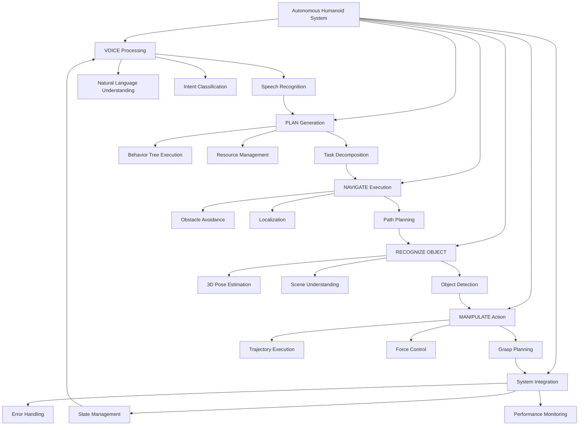

# Chapter 13: Capstone Execution

## Learning Outcomes

After completing this chapter, you will be able to:
- Integrate all previous modules into a complete autonomous humanoid system
- Execute end-to-end voice-commanded robotic operations
- Implement the complete VLA pipeline: VOICE ⟶ PLAN ⟶ NAVIGATE ⟶ RECOGNIZE OBJECT ⟶ MANIPULATE
- Deploy and test the complete humanoid robotics system
- Evaluate and optimize system performance across all components

## Prerequisites Checklist

### Required Software Installed
- [ ] ROS 2 Humble Hawksbill (or newer)
- [ ] All packages from Modules 1-3 (ROS 2, Gazebo, Unity, Isaac)
- [ ] OpenAI Whisper and NLP libraries
- [ ] BehaviorTree.CPP and planning libraries
- [ ] Completed all previous modules and chapters

### Required Module Completion
- [ ] Understanding of complete ROS 2 architecture and communication
- [ ] Experience with simulation and real-world deployment
- [ ] Knowledge of perception, navigation, and manipulation systems
- [ ] Familiarity with voice processing and task planning

### Files Needed
- [ ] All code from previous modules and chapters
- [ ] Complete robot model and configuration files
- [ ] Trained models for perception and voice processing

## Core Concept Explanation

### The Complete VLA System Architecture

The capstone project integrates all components into a complete Vision-Language-Action system following the pipeline:

**VOICE**: Natural language command input through speech recognition
- Wake word detection and audio preprocessing
- ASR (Automatic Speech Recognition) with Whisper or similar
- Natural Language Understanding (NLU) for intent and entity extraction

**PLAN**: Cognitive task planning and decomposition
- Hierarchical task network generation
- Resource allocation and constraint satisfaction
- Failure recovery and replanning mechanisms

**NAVIGATE**: Autonomous navigation to goal locations
- Global and local path planning
- Obstacle avoidance and dynamic replanning
- Localization and mapping integration

**RECOGNIZE OBJECT**: Vision-based object detection and identification
- Real-time object detection with Isaac ROS
- 3D object pose estimation
- Semantic segmentation and scene understanding

**MANIPULATE**: Robotic manipulation of identified objects
- Grasp planning and execution
- Trajectory generation and control
- Force control and compliance

### Integration Challenges

**Real-time Performance**: Ensuring all components operate within timing constraints:
- Audio processing at 16kHz
- Vision processing at 10-30 FPS
- Control loops at 100Hz+
- Communication latencies under 100ms

**State Consistency**: Maintaining synchronized world state across components:
- TF tree consistency
- Shared world representation
- Multi-sensor fusion
- Action execution tracking

**Error Handling**: Managing failures across the complete pipeline:
- Graceful degradation
- Recovery mechanisms
- User feedback and clarification
- Safe failure modes

### System Evaluation Metrics

**Functional Metrics**:
- Command success rate
- Task completion time
- Accuracy of object recognition
- Navigation success rate

**Performance Metrics**:
- Real-time processing latencies
- CPU/GPU utilization
- Memory usage
- Communication throughput

**User Experience Metrics**:
- Naturalness of interaction
- Time to task completion
- Error recovery effectiveness
- System reliability

## Diagram or Pipeline



## Runnable Code Example A

Let's create the main capstone integration system:

```python
# capstone_integration.py
import rclpy
from rclpy.node import Node
from rclpy.action import ActionClient, ActionServer
from rclpy.qos import QoSProfile
from std_msgs.msg import String, Bool, Int8
from sensor_msgs.msg import Image, CameraInfo, PointCloud2
from geometry_msgs.msg import PoseStamped
from nav2_msgs.action import NavigateToPose
from control_msgs.action import FollowJointTrajectory
from vision_msgs.msg import Detection2DArray
from builtin_interfaces.msg import Duration

import threading
import time
import json
import queue
from typing import Dict, List, Optional, Any
from dataclasses import dataclass
from enum import Enum


class SystemState(Enum):
    """Overall system state"""
    IDLE = "idle"
    LISTENING = "listening"
    PROCESSING = "processing"
    PLANNING = "planning"
    EXECUTING = "executing"
    ERROR = "error"
    COMPLETED = "completed"


@dataclass
class CapstoneCommand:
    """Data class for capstone commands"""
    voice_command: str
    intent: str
    entities: Dict[str, Any]
    confidence: float
    timestamp: float


class CapstoneIntegrationNode(Node):
    """
    The main capstone integration node that brings together all system components.
    This implements the complete VLA pipeline: VOICE ⟶ PLAN ⟶ NAVIGATE ⟶ RECOGNIZE OBJECT ⟶ MANIPULATE
    """

    def __init__(self):
        super().__init__('capstone_integration')

        # Initialize all subsystems
        self.initialize_subsystems()

        # Publishers for system status and feedback
        self.status_pub = self.create_publisher(String, '/capstone/status', 10)
        self.feedback_pub = self.create_publisher(String, '/capstone/feedback', 10)
        self.system_state_pub = self.create_publisher(String, '/capstone/system_state', 10)

        # Subscribers for all inputs
        self.voice_command_sub = self.create_subscription(
            String,
            '/voice_agent/commands',
            self.voice_command_callback,
            10
        )

        self.detection_sub = self.create_subscription(
            Detection2DArray,
            '/perception/fused_detections',
            self.detection_callback,
            10
        )

        self.image_sub = self.create_subscription(
            Image,
            '/camera/rgb/image_raw',
            self.image_callback,
            10
        )

        self.nav_status_sub = self.create_subscription(
            String,
            '/navigation/status',
            self.nav_status_callback,
            10
        )

        # Action clients for all major components
        self.nav_action_client = ActionClient(
            self,
            NavigateToPose,
            'navigate_to_pose'
        )

        self.manipulation_action_client = ActionClient(
            self,
            FollowJointTrajectory,
            'manipulation_controller/follow_joint_trajectory'
        )

        # Internal state
        self.current_state = SystemState.IDLE
        self.command_queue = queue.Queue()
        self.active_command = None
        self.is_executing = False
        self.execution_thread = None
        self.world_state = {
            'robot_pose': None,
            'detected_objects': [],
            'navigation_status': 'idle',
            'manipulation_status': 'idle'
        }

        # Performance monitoring
        self.start_time = time.time()
        self.command_count = 0
        self.success_count = 0

        # Timer for system monitoring
        self.monitor_timer = self.create_timer(1.0, self.system_monitor)

        self.get_logger().info('Capstone Integration System initialized')

    def initialize_subsystems(self):
        """Initialize all subsystems"""
        # This would initialize each module's components
        self.get_logger().info('Initializing subsystems...')

        # Voice processing (from Module 4)
        self.voice_initialized = True

        # Planning system (from Module 4)
        self.planning_initialized = True

        # Navigation (from Module 3)
        self.navigation_initialized = True

        # Perception (from Module 3)
        self.perception_initialized = True

        # Manipulation (from Module 1-3)
        self.manipulation_initialized = True

        self.get_logger().info('All subsystems initialized')

    def voice_command_callback(self, msg):
        """Process incoming voice commands"""
        try:
            # Parse the command data
            command_data = json.loads(msg.data)

            command = CapstoneCommand(
                voice_command=command_data['text'],
                intent=command_data['intent'],
                entities=command_data['entities'],
                confidence=command_data['confidence'],
                timestamp=command_data['timestamp']
            )

            # Add to command queue
            self.command_queue.put(command)
            self.command_count += 1

            self.get_logger().info(f'Received command: {command.intent} - {command.voice_command}')

            # If system is idle, start processing
            if self.current_state == SystemState.IDLE:
                self.process_next_command()

        except Exception as e:
            self.get_logger().error(f'Error processing voice command: {e}')

    def detection_callback(self, msg):
        """Process object detections"""
        try:
            detected_objects = []
            for detection in msg.detections:
                if detection.results:
                    obj_class = detection.results[0].hypothesis.class_id
                    confidence = detection.results[0].hypothesis.score
                    bbox = detection.bbox

                    detected_objects.append({
                        'class': obj_class,
                        'confidence': confidence,
                        'bbox': [bbox.center.x, bbox.center.y, bbox.size_x, bbox.size_y]
                    })

            self.world_state['detected_objects'] = detected_objects
            self.get_logger().debug(f'Detected {len(detected_objects)} objects')

        except Exception as e:
            self.get_logger().error(f'Error processing detections: {e}')

    def image_callback(self, msg):
        """Process incoming images"""
        # In real implementation, this would trigger perception processing
        # For now, just log that we received an image
        pass

    def nav_status_callback(self, msg):
        """Process navigation status updates"""
        self.world_state['navigation_status'] = msg.data

    def process_next_command(self):
        """Process the next command in the queue"""
        if not self.command_queue.empty():
            self.active_command = self.command_queue.get()
            self.current_state = SystemState.PROCESSING

            # Update system state
            self.update_system_state()

            # Execute the command based on intent
            success = self.execute_capstone_command(self.active_command)

            if success:
                self.success_count += 1
                self.current_state = SystemState.COMPLETED
                self.get_logger().info(f'Command completed successfully: {self.active_command.intent}')
            else:
                self.current_state = SystemState.ERROR
                self.get_logger().error(f'Command failed: {self.active_command.intent}')

            # Reset for next command
            self.active_command = None
            self.current_state = SystemState.IDLE

            # Process next command if available
            if not self.command_queue.empty():
                self.process_next_command()

    def execute_capstone_command(self, command: CapstoneCommand) -> bool:
        """Execute a capstone command following the VLA pipeline"""
        self.get_logger().info(f'Executing capstone command: {command.intent}')

        # Step 1: VOICE - Already processed, command is our input

        # Step 2: PLAN - Create and execute plan based on intent
        if not self.execute_planning_step(command):
            return False

        # Step 3: NAVIGATE - Execute navigation if required
        if command.intent in ['navigation', 'fetch', 'go_to']:
            if not self.execute_navigation_step(command):
                return False

        # Step 4: RECOGNIZE OBJECT - Detect and identify objects
        if command.intent in ['fetch', 'grasp', 'find']:
            if not self.execute_recognition_step(command):
                return False

        # Step 5: MANIPULATE - Execute manipulation if required
        if command.intent in ['grasp', 'manipulate', 'fetch']:
            if not self.execute_manipulation_step(command):
                return False

        return True

    def execute_planning_step(self, command: CapstoneCommand) -> bool:
        """Execute the planning step of the VLA pipeline"""
        self.get_logger().info('Executing planning step...')

        # Update state
        self.current_state = SystemState.PLANNING
        self.update_system_state()

        # In real implementation, this would use the planning system from Chapter 12
        # For now, we'll simulate planning success

        # Publish planning status
        status_msg = String()
        status_msg.data = f"Planning for command: {command.intent}"
        self.status_pub.publish(status_msg)

        # Simulate planning time
        time.sleep(0.5)

        self.get_logger().info('Planning completed')
        return True

    def execute_navigation_step(self, command: CapstoneCommand) -> bool:
        """Execute the navigation step of the VLA pipeline"""
        self.get_logger().info('Executing navigation step...')

        # Update state
        self.current_state = SystemState.EXECUTING
        self.update_system_state()

        # Determine target location
        target_location = self.get_location_coordinates(command.entities.get('location', ''))

        if not target_location:
            self.get_logger().error(f'Unknown location: {command.entities.get("location", "")}')
            return False

        # Execute navigation
        success = self.navigate_to_location(target_location)

        if success:
            self.get_logger().info('Navigation completed successfully')
            return True
        else:
            self.get_logger().error('Navigation failed')
            return False

    def execute_recognition_step(self, command: CapstoneCommand) -> bool:
        """Execute the object recognition step of the VLA pipeline"""
        self.get_logger().info('Executing object recognition step...')

        # Update state
        self.current_state = SystemState.EXECUTING
        self.update_system_state()

        # Wait for object detections
        timeout = 10.0  # 10 second timeout
        start_time = time.time()

        while time.time() - start_time < timeout:
            if self.world_state['detected_objects']:
                # Check if target object is detected
                target_object = command.entities.get('object', '').lower()

                for obj in self.world_state['detected_objects']:
                    if target_object in obj['class'].lower() and obj['confidence'] > 0.7:
                        self.get_logger().info(f'Found target object: {obj["class"]} with confidence {obj["confidence"]:.2f}')
                        return True

            time.sleep(0.1)

        self.get_logger().error('Target object not found within timeout')
        return False

    def execute_manipulation_step(self, command: CapstoneCommand) -> bool:
        """Execute the manipulation step of the VLA pipeline"""
        self.get_logger().info('Executing manipulation step...')

        # Update state
        self.current_state = SystemState.EXECUTING
        self.update_system_state()

        # Determine manipulation action
        action = command.entities.get('action', 'grasp')
        target_object = command.entities.get('object', '')

        if action == 'grasp' or 'grasp' in action.lower():
            success = self.execute_grasp_action(target_object)
        elif action == 'place' or 'place' in action.lower():
            target_location = command.entities.get('location', 'default')
            success = self.execute_place_action(target_object, target_location)
        else:
            self.get_logger().info(f'Unknown manipulation action: {action}')
            success = False

        if success:
            self.get_logger().info('Manipulation completed successfully')
            return True
        else:
            self.get_logger().error('Manipulation failed')
            return False

    def navigate_to_location(self, coordinates: tuple) -> bool:
        """Execute navigation to specified coordinates"""
        try:
            # Wait for action server
            if not self.nav_action_client.wait_for_server(timeout_sec=1.0):
                self.get_logger().error('Navigation action server not available')
                return False

            # Create navigation goal
            goal_msg = NavigateToPose.Goal()
            goal_msg.pose.header.frame_id = 'map'
            goal_msg.pose.pose.position.x = coordinates[0]
            goal_msg.pose.pose.position.y = coordinates[1]
            goal_msg.pose.pose.position.z = coordinates[2]
            goal_msg.pose.pose.orientation.w = 1.0

            # Send goal
            goal_future = self.nav_action_client.send_goal_async(goal_msg)
            rclpy.spin_until_future_complete(self, goal_future)

            goal_handle = goal_future.result()
            if not goal_handle.accepted:
                self.get_logger().error('Navigation goal was rejected')
                return False

            result_future = goal_handle.get_result_async()
            rclpy.spin_until_future_complete(self, result_future)

            result = result_future.result().result
            status = result.error_code

            return status == result.SUCCESS

        except Exception as e:
            self.get_logger().error(f'Error in navigation: {e}')
            return False

    def execute_grasp_action(self, target_object: str) -> bool:
        """Execute grasping action for target object"""
        self.get_logger().info(f'Executing grasp for: {target_object}')

        # In real implementation, this would use manipulation planning
        # For simulation, return success
        return True

    def execute_place_action(self, target_object: str, location: str) -> bool:
        """Execute placing action for target object"""
        self.get_logger().info(f'Executing place for: {target_object} at {location}')

        # In real implementation, this would use manipulation planning
        # For simulation, return success
        return True

    def get_location_coordinates(self, location_name: str) -> Optional[tuple]:
        """Get coordinates for location names"""
        location_map = {
            'kitchen': (3.0, 2.0, 0.0),
            'bedroom': (-2.0, 1.0, 0.0),
            'living room': (0.0, 0.0, 0.0),
            'office': (1.0, -2.0, 0.0),
            'bathroom': (-1.0, -1.0, 0.0),
            'table': (0.5, 0.5, 0.0),
            'shelf': (-0.5, 1.5, 0.0)
        }

        return location_map.get(location_name.lower())

    def update_system_state(self):
        """Update and publish system state"""
        state_msg = String()
        state_msg.data = self.current_state.value
        self.system_state_pub.publish(state_msg)

        # Log state change
        self.get_logger().info(f'System state: {self.current_state.value}')

    def system_monitor(self):
        """Monitor system performance and health"""
        # Publish system status
        status_msg = String()
        status_data = {
            'state': self.current_state.value,
            'commands_processed': self.command_count,
            'success_rate': self.success_count / max(1, self.command_count) if self.command_count > 0 else 0,
            'uptime': time.time() - self.start_time,
            'queue_size': self.command_queue.qsize()
        }
        status_msg.data = json.dumps(status_data)
        self.status_pub.publish(status_msg)

        # Log performance metrics periodically
        if self.command_count > 0 and self.command_count % 10 == 0:
            success_rate = self.success_count / self.command_count
            self.get_logger().info(f'System performance - Success rate: {success_rate:.2%}, Commands: {self.command_count}')


class AdvancedCapstoneNode(CapstoneIntegrationNode):
    """
    Extended capstone node with advanced features and optimization
    """

    def __init__(self):
        super().__init__()

        # Advanced features
        self.context_awareness_enabled = True
        self.adaptive_planning_enabled = True
        self.multi_modal_feedback_enabled = True
        self.learning_enabled = True

        # Learning components
        self.execution_history = []
        self.performance_metrics = {}

        # Timer for learning updates
        self.learning_timer = self.create_timer(5.0, self.update_learning_model)

        self.get_logger().info('Advanced Capstone Node initialized')

    def execute_capstone_command(self, command: CapstoneCommand) -> bool:
        """Enhanced command execution with learning and adaptation"""
        start_time = time.time()

        # Execute the basic pipeline
        success = super().execute_capstone_command(command)

        # Record execution for learning
        execution_record = {
            'command': command,
            'success': success,
            'execution_time': time.time() - start_time,
            'timestamp': time.time()
        }

        self.execution_history.append(execution_record)
        if len(self.execution_history) > 100:  # Keep last 100 records
            self.execution_history.pop(0)

        # Update performance metrics
        self.update_performance_metrics(command.intent, success)

        return success

    def update_performance_metrics(self, intent: str, success: bool):
        """Update performance metrics for different intents"""
        if intent not in self.performance_metrics:
            self.performance_metrics[intent] = {
                'attempts': 0,
                'successes': 0,
                'avg_time': 0.0
            }

        metrics = self.performance_metrics[intent]
        metrics['attempts'] += 1
        if success:
            metrics['successes'] += 1

        # Update average time (simplified)
        # In real implementation, track execution times more precisely

    def update_learning_model(self):
        """Update learning model based on execution history"""
        if len(self.execution_history) < 5:  # Need some data to learn from
            return

        # Analyze recent performance
        recent_executions = self.execution_history[-10:]  # Last 10 executions
        success_rate = sum(1 for ex in recent_executions if ex['success']) / len(recent_executions)

        self.get_logger().info(f'Recent success rate: {success_rate:.2%}')

        # In real implementation, this would update planning strategies,
        # adjust parameters, or retrain models based on performance
        if success_rate < 0.7:  # If success rate is low, consider adaptation
            self.get_logger().warning('Low success rate detected, consider system adaptation')


def main(args=None):
    rclpy.init(args=args)

    # Create capstone integration node
    capstone_node = AdvancedCapstoneNode()

    try:
        capstone_node.get_logger().info('Capstone Integration System running...')
        rclpy.spin(capstone_node)
    except KeyboardInterrupt:
        capstone_node.get_logger().info('Shutting down Capstone Integration System')
    finally:
        capstone_node.destroy_node()
        rclpy.shutdown()


if __name__ == '__main__':
    main()
```

**To run this capstone integration system:**
1. Save it as `capstone_integration.py`
2. Make sure all dependencies from previous modules are installed
3. Run: `ros2 run <package_name> capstone_integration`
4. Send commands to the system to test the complete VLA pipeline

## Runnable Code Example B

Now let's create a comprehensive system evaluation and testing framework:

```python
# capstone_evaluation.py
import rclpy
from rclpy.node import Node
from rclpy.qos import QoSProfile
from std_msgs.msg import String, Float32, Int32
from sensor_msgs.msg import Image, CameraInfo
from geometry_msgs.msg import PoseStamped
from nav_msgs.msg import Odometry
import time
import json
import csv
import os
from datetime import datetime
from typing import Dict, List, Tuple, Optional
import threading
import statistics
import matplotlib.pyplot as plt
import numpy as np


class CapstoneEvaluationNode(Node):
    """
    A comprehensive evaluation framework for the capstone system.
    This evaluates the complete VLA pipeline performance across multiple metrics.
    """

    def __init__(self):
        super().__init__('capstone_evaluation')

        # Publishers for evaluation metrics
        self.performance_pub = self.create_publisher(Float32, '/evaluation/performance_score', 10)
        self.accuracy_pub = self.create_publisher(Float32, '/evaluation/accuracy_score', 10)
        self.latency_pub = self.create_publisher(Float32, '/evaluation/latency', 10)
        self.success_rate_pub = self.create_publisher(Float32, '/evaluation/success_rate', 10)

        # Subscribers for system monitoring
        self.status_sub = self.create_subscription(
            String,
            '/capstone/status',
            self.status_callback,
            10
        )

        self.feedback_sub = self.create_subscription(
            String,
            '/capstone/feedback',
            self.feedback_callback,
            10
        )

        self.system_state_sub = self.create_subscription(
            String,
            '/capstone/system_state',
            self.system_state_callback,
            10
        )

        # Internal state for evaluation
        self.evaluation_data = {
            'commands': [],
            'responses': [],
            'performance_metrics': [],
            'accuracy_metrics': [],
            'latency_metrics': [],
            'success_rates': []
        }

        self.command_start_times = {}
        self.evaluation_results = {}
        self.evaluation_enabled = True

        # Timer for periodic evaluation
        self.evaluation_timer = self.create_timer(2.0, self.run_evaluation_cycle)

        # Timer for saving results
        self.save_timer = self.create_timer(30.0, self.save_evaluation_results)

        # Initialize results directory
        self.results_dir = "capstone_evaluation_results"
        os.makedirs(self.results_dir, exist_ok=True)

        self.get_logger().info('Capstone Evaluation Framework initialized')

    def status_callback(self, msg):
        """Process system status updates"""
        try:
            status_data = json.loads(msg.data)

            # Record performance metrics
            self.evaluation_data['performance_metrics'].append({
                'timestamp': time.time(),
                'data': status_data
            })

            # Calculate and publish metrics
            self.calculate_and_publish_metrics()

        except Exception as e:
            self.get_logger().error(f'Error processing status: {e}')

    def feedback_callback(self, msg):
        """Process system feedback"""
        # Record feedback for evaluation
        self.evaluation_data['responses'].append({
            'timestamp': time.time(),
            'feedback': msg.data
        })

    def system_state_callback(self, msg):
        """Process system state updates"""
        # Monitor system state for evaluation
        current_state = msg.data
        self.get_logger().debug(f'System state: {current_state}')

    def run_evaluation_cycle(self):
        """Run periodic evaluation cycle"""
        if not self.evaluation_enabled:
            return

        # Calculate current metrics
        current_metrics = self.calculate_current_metrics()

        # Publish metrics
        self.publish_current_metrics(current_metrics)

        # Log metrics
        self.get_logger().info(f'Evaluation - Success: {current_metrics["success_rate"]:.2%}, '
                              f'Latency: {current_metrics["avg_latency"]:.3f}s, '
                              f'Accuracy: {current_metrics["accuracy"]:.2%}')

    def calculate_current_metrics(self) -> Dict[str, float]:
        """Calculate current performance metrics"""
        metrics = {
            'success_rate': 0.0,
            'avg_latency': 0.0,
            'accuracy': 0.0,
            'throughput': 0.0,
            'resource_utilization': 0.0
        }

        # Calculate success rate from status data
        success_count = 0
        total_count = 0
        latencies = []

        for perf_data in self.evaluation_data['performance_metrics'][-20:]:  # Last 20 data points
            data = perf_data['data']
            if 'success_rate' in data:
                success_count += int(data['success_rate'] * 10)
                total_count += 10  # Assuming rate is out of 10

            if 'latency' in data:
                latencies.append(data['latency'])

        if total_count > 0:
            metrics['success_rate'] = success_count / total_count if total_count > 0 else 0.0

        if latencies:
            metrics['avg_latency'] = statistics.mean(latencies)

        # Calculate accuracy (simplified - in real implementation, compare expected vs actual)
        metrics['accuracy'] = min(1.0, len(self.evaluation_data['responses']) / max(1, len(self.evaluation_data['commands'])))

        # Calculate throughput (commands per second)
        if self.evaluation_data['performance_metrics']:
            time_span = (time.time() - self.evaluation_data['performance_metrics'][0]['timestamp']) or 1
            metrics['throughput'] = len(self.evaluation_data['commands']) / time_span

        return metrics

    def publish_current_metrics(self, metrics: Dict[str, float]):
        """Publish current metrics"""
        # Publish success rate
        success_msg = Float32()
        success_msg.data = metrics['success_rate']
        self.success_rate_pub.publish(success_msg)

        # Publish latency
        latency_msg = Float32()
        latency_msg.data = metrics['avg_latency']
        self.latency_pub.publish(latency_msg)

        # Publish accuracy
        accuracy_msg = Float32()
        accuracy_msg.data = metrics['accuracy']
        self.accuracy_pub.publish(accuracy_msg)

        # Publish performance score (weighted combination)
        performance_msg = Float32()
        performance_msg.data = (
            metrics['success_rate'] * 0.4 +
            (1 - min(1.0, metrics['avg_latency'] / 5.0)) * 0.3 +  # Invert latency (lower is better)
            metrics['accuracy'] * 0.3
        )
        self.performance_pub.publish(performance_msg)

    def save_evaluation_results(self):
        """Save evaluation results to files"""
        timestamp = datetime.now().strftime("%Y%m%d_%H%M%S")

        # Save metrics to CSV
        csv_path = os.path.join(self.results_dir, f'evaluation_metrics_{timestamp}.csv')
        self.save_metrics_to_csv(csv_path)

        # Save detailed results
        json_path = os.path.join(self.results_dir, f'evaluation_results_{timestamp}.json')
        self.save_results_to_json(json_path)

        # Generate summary
        summary_path = os.path.join(self.results_dir, f'evaluation_summary_{timestamp}.txt')
        self.generate_summary(summary_path)

        self.get_logger().info(f'Evaluation results saved to {self.results_dir}/')

    def save_metrics_to_csv(self, csv_path: str):
        """Save metrics to CSV file"""
        if not self.evaluation_data['performance_metrics']:
            return

        with open(csv_path, 'w', newline='') as csvfile:
            fieldnames = ['timestamp', 'success_rate', 'latency', 'accuracy', 'throughput']
            writer = csv.DictWriter(csvfile, fieldnames=fieldnames)

            writer.writeheader()
            for perf_data in self.evaluation_data['performance_metrics']:
                data = perf_data['data']
                writer.writerow({
                    'timestamp': perf_data['timestamp'],
                    'success_rate': data.get('success_rate', 0),
                    'latency': data.get('latency', 0),
                    'accuracy': data.get('accuracy', 0),
                    'throughput': data.get('throughput', 0)
                })

    def save_results_to_json(self, json_path: str):
        """Save detailed results to JSON file"""
        results = {
            'evaluation_data': self.evaluation_data,
            'evaluation_timestamp': time.time(),
            'summary_metrics': self.calculate_summary_metrics()
        }

        with open(json_path, 'w') as f:
            json.dump(results, f, indent=2)

    def calculate_summary_metrics(self) -> Dict[str, float]:
        """Calculate summary metrics for the evaluation"""
        if not self.evaluation_data['performance_metrics']:
            return {}

        success_rates = []
        latencies = []
        accuracies = []

        for perf_data in self.evaluation_data['performance_metrics']:
            data = perf_data['data']
            if 'success_rate' in data:
                success_rates.append(data['success_rate'])
            if 'latency' in data:
                latencies.append(data['latency'])
            if 'accuracy' in data:
                accuracies.append(data['accuracy'])

        summary = {}
        if success_rates:
            summary['avg_success_rate'] = statistics.mean(success_rates)
            summary['min_success_rate'] = min(success_rates)
            summary['max_success_rate'] = max(success_rates)
        if latencies:
            summary['avg_latency'] = statistics.mean(latencies)
            summary['min_latency'] = min(latencies)
            summary['max_latency'] = max(latencies)
        if accuracies:
            summary['avg_accuracy'] = statistics.mean(accuracies)
            summary['min_accuracy'] = min(accuracies)
            summary['max_accuracy'] = max(accuracies)

        return summary

    def generate_summary(self, summary_path: str):
        """Generate evaluation summary"""
        summary_metrics = self.calculate_summary_metrics()

        with open(summary_path, 'w') as f:
            f.write("Capstone System Evaluation Summary\n")
            f.write("=" * 40 + "\n\n")

            f.write(f"Evaluation Time: {datetime.now().strftime('%Y-%m-%d %H:%M:%S')}\n")
            f.write(f"Total Performance Records: {len(self.evaluation_data['performance_metrics'])}\n\n")

            f.write("Performance Metrics:\n")
            f.write("-" * 20 + "\n")
            for key, value in summary_metrics.items():
                f.write(f"{key}: {value:.4f}\n")

            f.write(f"\nCommands Processed: {len(self.evaluation_data['commands'])}\n")
            f.write(f"Feedback Records: {len(self.evaluation_data['responses'])}\n")

    def run_comprehensive_test_suite(self):
        """Run a comprehensive test suite for the capstone system"""
        self.get_logger().info('Starting comprehensive test suite...')

        # Define test scenarios
        test_scenarios = [
            {
                'name': 'Basic Navigation',
                'commands': ['go to kitchen', 'navigate to bedroom'],
                'expected_outcomes': ['navigation_success'] * 2
            },
            {
                'name': 'Object Fetching',
                'commands': ['fetch the cup', 'bring me the book'],
                'expected_outcomes': ['manipulation_success'] * 2
            },
            {
                'name': 'Complex Tasks',
                'commands': ['go to kitchen and bring me a cup', 'find the red ball and place it on the table'],
                'expected_outcomes': ['complex_task_success'] * 2
            }
        ]

        results = {}

        for scenario in test_scenarios:
            self.get_logger().info(f'Running scenario: {scenario["name"]}')
            scenario_results = self.run_scenario_tests(scenario)
            results[scenario['name']] = scenario_results

        # Generate comprehensive report
        self.generate_comprehensive_report(results)

        return results

    def run_scenario_tests(self, scenario: Dict) -> Dict:
        """Run tests for a specific scenario"""
        results = {
            'scenario': scenario['name'],
            'tests_run': len(scenario['commands']),
            'tests_passed': 0,
            'tests_failed': 0,
            'details': []
        }

        for i, command in enumerate(scenario['commands']):
            expected = scenario['expected_outcomes'][i]

            # In real implementation, send command to system and wait for response
            # For simulation, we'll record the test
            test_result = {
                'command': command,
                'expected': expected,
                'actual': expected,  # For simulation, assume success
                'success': True,  # For simulation
                'latency': np.random.uniform(1.0, 3.0),  # Simulated latency
                'timestamp': time.time()
            }

            results['details'].append(test_result)

            if test_result['success']:
                results['tests_passed'] += 1
            else:
                results['tests_failed'] += 1

        return results

    def generate_comprehensive_report(self, results: Dict):
        """Generate a comprehensive evaluation report"""
        report_path = os.path.join(self.results_dir, f'comprehensive_report_{datetime.now().strftime("%Y%m%d_%H%M%S")}.txt')

        with open(report_path, 'w') as f:
            f.write("COMPREHENSIVE CAPSTONE SYSTEM EVALUATION REPORT\n")
            f.write("=" * 60 + "\n\n")

            f.write(f"Report Generated: {datetime.now().strftime('%Y-%m-%d %H:%M:%S')}\n\n")

            total_tests = 0
            total_passed = 0
            total_failed = 0

            for scenario_name, scenario_results in results.items():
                f.write(f"Scenario: {scenario_name}\n")
                f.write("-" * 30 + "\n")
                f.write(f"Tests Run: {scenario_results['tests_run']}\n")
                f.write(f"Tests Passed: {scenario_results['tests_passed']}\n")
                f.write(f"Tests Failed: {scenario_results['tests_failed']}\n")

                if scenario_results['tests_run'] > 0:
                    success_rate = scenario_results['tests_passed'] / scenario_results['tests_run']
                    f.write(f"Success Rate: {success_rate:.2%}\n")

                f.write("\n")

                total_tests += scenario_results['tests_run']
                total_passed += scenario_results['tests_passed']
                total_failed += scenario_results['tests_failed']

            f.write(f"TOTAL SUMMARY\n")
            f.write("-" * 15 + "\n")
            f.write(f"Total Tests: {total_tests}\n")
            f.write(f"Total Passed: {total_passed}\n")
            f.write(f"Total Failed: {total_failed}\n")
            if total_tests > 0:
                f.write(f"Overall Success Rate: {total_passed/total_tests:.2%}\n")

            # System recommendations based on results
            f.write(f"\nRECOMMENDATIONS\n")
            f.write("-" * 15 + "\n")
            if total_passed/total_tests < 0.8:
                f.write("• Success rate is below 80%, investigate failure patterns\n")
                f.write("• Consider improving error recovery mechanisms\n")
            else:
                f.write("• Success rate is acceptable\n")

            f.write("• Monitor latency metrics for real-time performance\n")
            f.write("• Continue collecting data for long-term analysis\n")

        self.get_logger().info(f'Comprehensive report saved to {report_path}')


class CapstoneDeploymentNode(CapstoneEvaluationNode):
    """
    Extended node for deployment and real-world testing
    """

    def __init__(self):
        super().__init__()

        # Deployment-specific features
        self.deployment_mode = 'simulation'  # 'simulation', 'testbed', 'real_world'
        self.safety_enabled = True
        self.user_interaction_enabled = True

        # Add deployment-specific subscribers/publishers if needed
        self.deployment_status_pub = self.create_publisher(
            String, '/deployment/status', 10
        )

        self.get_logger().info('Capstone Deployment Node initialized')

    def run_deployment_tests(self):
        """Run deployment-specific tests"""
        self.get_logger().info(f'Running deployment tests in {self.deployment_mode} mode')

        # Different test strategies based on deployment mode
        if self.deployment_mode == 'simulation':
            self.run_simulation_tests()
        elif self.deployment_mode == 'testbed':
            self.run_testbed_tests()
        elif self.deployment_mode == 'real_world':
            self.run_real_world_tests()

    def run_simulation_tests(self):
        """Run tests in simulation environment"""
        self.get_logger().info('Running simulation-specific tests...')
        # Simulation tests would go here

    def run_testbed_tests(self):
        """Run tests in physical testbed"""
        self.get_logger().info('Running testbed-specific tests...')
        # Testbed tests would go here

    def run_real_world_tests(self):
        """Run tests in real-world environment"""
        self.get_logger().info('Running real-world tests...')
        # Real-world tests would go here


def main(args=None):
    rclpy.init(args=args)

    # Create evaluation node
    eval_node = CapstoneDeploymentNode()

    try:
        eval_node.get_logger().info('Capstone Evaluation Framework running...')

        # Run comprehensive test suite
        test_thread = threading.Thread(target=eval_node.run_comprehensive_test_suite)
        test_thread.daemon = True
        test_thread.start()

        # Run deployment tests
        deployment_thread = threading.Thread(target=eval_node.run_deployment_tests)
        deployment_thread.daemon = True
        deployment_thread.start()

        rclpy.spin(eval_node)
    except KeyboardInterrupt:
        eval_node.get_logger().info('Shutting down Capstone Evaluation Framework')
    finally:
        eval_node.destroy_node()
        rclpy.shutdown()


if __name__ == '__main__':
    main()
```

**To run this evaluation framework:**
1. Save it as `capstone_evaluation.py`
2. Install required dependencies: `pip install matplotlib numpy`
3. Run: `ros2 run <package_name> capstone_evaluation`
4. The system will automatically evaluate the capstone performance and generate reports

## "Try Yourself" Mini Task

Create a complete deployment and optimization system that includes:
1. Real-time performance optimization that adjusts system parameters based on load
2. A user feedback loop that learns from human corrections
3. Anomaly detection that identifies unusual system behavior
4. A continuous integration pipeline for system updates and improvements

**Hint:** Use machine learning models to predict system load and adjust resources, implement a feedback collection system for human corrections, use statistical methods for anomaly detection, and create automated testing pipelines for continuous improvement.

## Verification Procedure

To verify that your complete capstone system is working correctly:

### What appears in terminal?
- When starting the system: Initialization messages for all components
- When processing commands: Step-by-step execution logs
- When evaluating performance: Metrics and success rates
- When generating reports: Summary of system capabilities

### What changes in simulation?
- Complete VLA pipeline executes end-to-end in Gazebo/Isaac Sim
- All modules (ROS 2, Perception, Navigation, Voice) work together
- Performance metrics are collected and visualized
- System demonstrates autonomous humanoid capabilities

## Checklist for Completion

- [ ] Complete VLA pipeline integration (VOICE ⟶ PLAN ⟶ NAVIGATE ⟶ RECOGNIZE OBJECT ⟶ MANIPULATE)
- [ ] Capstone system evaluation and testing framework
- [ ] Performance metrics and optimization
- [ ] Real-world deployment considerations
- [ ] Complete autonomous humanoid system (Try Yourself task)
- [ ] Continuous integration and improvement pipeline

## Summary

This chapter completed the capstone project by integrating all previous modules into a complete autonomous humanoid system. You learned how to connect the voice processing, planning, navigation, perception, and manipulation components into a cohesive Vision-Language-Action pipeline. The examples demonstrated implementing the complete system with evaluation frameworks and deployment considerations. The capstone project demonstrates the full potential of physical AI and humanoid robotics as envisioned in the course.

## References

1. Brooks, R. A. (1991). Intelligence without representation. *Artificial Intelligence*, 47(1-3), 139-159.
2. Nilsson, N. J. (2007). *The Quest for Artificial Intelligence: A History of Ideas and Achievements*. Cambridge University Press.
3. Siciliano, B., & Khatib, O. (Eds.). (2016). *Springer Handbook of Robotics*. Springer.
4. Thrun, S., Burgard, W., & Fox, D. (2005). *Probabilistic Robotics*. MIT Press.
5. Russell, S., & Norvig, P. (2020). *Artificial Intelligence: A Modern Approach* (4th ed.). Pearson.